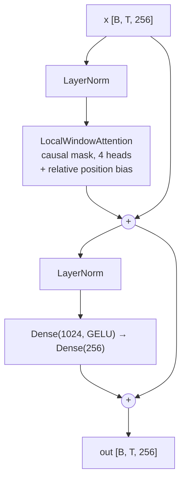

# Model Architecture

## MelGeneratorTraining (Training Wrapper)

```mermaid
graph TD
    subgraph MelGeneratorTraining
        Input["Input Mel<br/>[B, T, 100]"]

        subgraph LatentEncoder
            EC1["Conv1D(128, k=5, s=2, GELU)"]
            EC2["Conv1D(256, k=5, s=2, GELU)"]
            GAP["GlobalAveragePooling1D"]
            ED["Dense(256, GELU)"]
            ZMean["Dense(64) → z_mean"]
            ZLogvar["Dense(64) → z_logvar"]
            Reparam["Reparameterize<br/>z = μ + σ·ε"]
        end

        subgraph MelGenerator
            subgraph MelTokenizer["MelTokenizer (Encoder)"]
                TC0["Conv1D(178, k=3, s=2, causal) + LayerNorm + GELU"]
                TC1["Conv1D(256, k=3, s=2, causal) + LayerNorm + GELU"]
                TP["Dense(256)"]
            end

            ZP["Latent Projection<br/>Dense(64 → 256)"]
            Add(("+"))

            subgraph CausalConvs["Causal Conv Stack"]
                CC1["CausalConvBlock k=3, d=1, residual"]
                CC2["CausalConvBlock k=3, d=2, residual"]
                CC3["CausalConvBlock k=3, d=4, residual"]
                CC4["CausalConvBlock k=3, d=8, residual"]
                CC5["CausalConvBlock k=3, d=16, residual"]
            end

            subgraph TransformerStack["Transformer Stack"]
                T1["TransformerBlock<br/>4 heads, window=32"]
                T2["TransformerBlock<br/>4 heads, window=64"]
                T3["TransformerBlock<br/>4 heads, window=128"]
            end

            PH["Projection Head<br/>Dense(256)"]

            subgraph MelDetokenizer["MelDetokenizer (Decoder)"]
                DU0["UpSampling1D(2) + CausalConv1D(178, k=3) + LayerNorm + GELU"]
                DU1["UpSampling1D(2) + CausalConv1D(100, k=3) + LayerNorm + GELU"]
                DP["Dense(100)"]
            end
        end

        Output["Output Mel<br/>[B, T, 100]"]
    end

    Input --> EC1 --> EC2 --> GAP --> ED
    ED --> ZMean --> Reparam
    ED --> ZLogvar --> Reparam

    Input --> TC0 --> TC1 --> TP
    TP -->|"[B, T/4, 256]"| Add
    Reparam -->|"z [B,64]"| ZP -->|"broadcast [B,T/4,256]"| Add

    Add --> CC1 --> CC2 --> CC3 --> CC4 --> CC5
    CC5 --> T1 --> T2 --> T3
    T3 --> PH --> DU0 --> DU1 --> DP --> Output
```

## TransformerBlock Detail

## Key Dimensions

| Parameter | Value |
|---|---|
| N_MELS | 100 |
| D_MODEL | 256 |
| NUM_HEADS | 4 |
| LATENT_DIM | 64 |
| WINDOW_SIZES | [32, 64, 128] |
| CONV_DILATION_RATES | [1, 2, 4, 8, 16] |
| TOKEN_COMPRESSION_RATIO | 4 |
| TOKEN_NUM_CONV_LAYERS | 2 |
| SEQ_LEN | 512 |
| TOKEN_SEQ_LEN | 128 |
