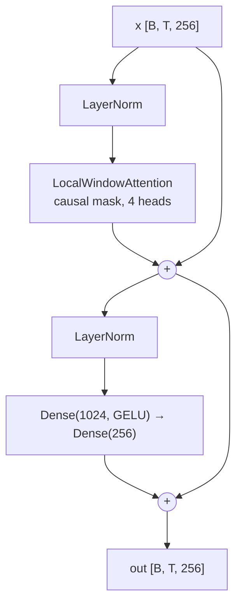

# Model Architecture

## MelGeneratorTraining (Training Wrapper)

```mermaid
graph TD
    subgraph MelGeneratorTraining
        Input["Input Mel<br/>[B, T/R, R×100]"]

        subgraph LatentEncoder
            EC1["Conv1D(128, k=5, s=2, GELU)"]
            EC2["Conv1D(256, k=5, s=2, GELU)"]
            GAP["GlobalAveragePooling1D"]
            ED["Dense(256, GELU)"]
            ZMean["Dense(128) → z_mean"]
            ZLogvar["Dense(128) → z_logvar"]
            Reparam["Reparameterize<br/>z = μ + σ·ε"]
        end

        subgraph MelGenerator
            IP["Input Projection<br/>Dense(R×100 → 256)"]
            ZP["Latent Projection<br/>Dense(128 → 256)"]
            Add(("+"))

            subgraph CausalConvs["Causal Conv Stack"]
                CC1["CausalConvBlock<br/>k=3, d=1, residual"]
                CC2["CausalConvBlock<br/>k=3, d=2, residual"]
            end

            subgraph TransformerStack["Transformer Stack"]
                T1["TransformerBlock<br/>4 heads, window=32"]
                T2["TransformerBlock<br/>4 heads, window=64"]
                T3["TransformerBlock<br/>4 heads, window=128"]
            end

            CH["CausalConvBlock (Head)<br/>k=3, d=4, residual"]
            OP["Output Projection<br/>Dense(256 → R×100)"]
        end

        Output["Output Mel<br/>[B, T/R, R×100]"]
    end

    Input --> EC1 --> EC2 --> GAP --> ED
    ED --> ZMean --> Reparam
    ED --> ZLogvar --> Reparam

    Input --> IP --> Add
    Reparam -->|"z [B,128]"| ZP -->|"broadcast [B,T,256]"| Add

    Add --> CC1 --> CC2
    CC2 --> T1 --> T2 --> T3
    T3 --> CH --> OP --> Output
```

## TransformerBlock Detail

## Key Dimensions

| Parameter | Value |
|---|---|
| N_MELS | 100 |
| REDUCTION_FACTOR (R) | 4 |
| GROUPED_MEL_DIM | 400 |
| D_MODEL | 256 |
| NUM_HEADS | 4 |
| LATENT_DIM | 128 |
| WINDOW_SIZES | [32, 64, 128] |
| CONV_DILATION_RATES | [1, 2, 4] |
| EFFECTIVE_SEQ_LEN | 128 |
