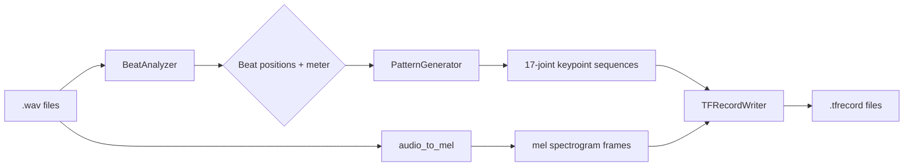

# Beat Signature Dataset Generator — Detailed Design

## Overview

A CLI tool that generates synthetic conducting gesture datasets from existing music files. Given a directory of `.wav` files, it:

1. Detects beats, downbeats, and time signature from each audio file
2. Generates synthetic full-upper-body conducting keypoint sequences aligned to the detected beats
3. Outputs paired (mel spectrogram, keypoint sequence) samples as TFRecord files

The synthetic keypoints follow canonical conducting patterns (2/4, 3/4, 4/4, etc.) in MoveNet Thunder 17-joint format, with configurable variation/noise for dataset diversity. Output is directly compatible with the existing body-point-module and music generation pipeline.

## Detailed Requirements

### Functional Requirements

**FR1: Audio Analysis**
- Accept any directory of `.wav` files as input
- Detect beat positions, downbeat positions, and tempo using BeatNet (offline mode)
- Estimate time signature (meter) from beat/downbeat structure
- Allow CLI override of detected time signature
- Log detected meter and confidence per file

**FR2: Conducting Pattern Generation**
- Support time signatures: 2/4, 3/4, 4/4 (required), 6/8, 5/4, 7/8 (stretch)
- Define canonical ictus waypoints for each time signature
- Interpolate smooth trajectories between waypoints using cubic splines
- Generate full upper body motion: both arms (mirrored), elbows (IK), shoulders, head nod, static lower body
- Output in MoveNet Thunder format: 17 keypoints, (y, x, confidence)

**FR3: Variation & Noise**
- Randomize gesture amplitude (±30%)
- Add timing jitter to ictus points (±8% of beat duration)
- Apply trajectory noise (Perlin or Gaussian perturbation)
- Vary interpolation style (legato/rounded vs staccato/sharp)
- Scale gesture size with optional dynamics parameter

**FR4: Output Generation**
- Produce TFRecord files containing paired samples
- Each sample: mel spectrogram frames + aligned keypoint frames
- Configurable frame rate (24, 30, 60 fps, default 30)
- Configurable sample duration (number of measures or seconds)
- Configurable number of samples per audio file (with different variation seeds)

**FR5: CLI Interface**
- `--input_dir`: directory of .wav files (required)
- `--output_dir`: directory for TFRecord output (required)
- `--fps`: keypoint frame rate (default: 30)
- `--time_signature`: override detected meter (e.g. "4/4")
- `--sample_duration`: duration per sample in seconds (default: 10)
- `--variations_per_file`: number of variation samples per audio file (default: 3)
- `--seed`: random seed for reproducibility

### Non-Functional Requirements

**NFR1: Performance** — Process files sequentially; no real-time requirement.

**NFR2: Reproducibility** — Deterministic output given same seed.

**NFR3: Compatibility** — Output keypoints in body-point-module normalized coordinate space (shoulder-centered, shoulder-width scaled). Mel spectrograms use same parameters as existing `audio_utils.py`.

## Architecture Overview



## Components and Interfaces

### 1. BeatAnalyzer

Wraps BeatNet to extract metric structure from audio.

```python
class BeatAnalyzer:
    def analyze(self, audio_path: str, time_signature_override: str = None) -> BeatInfo:
        """Returns beat positions, downbeat positions, tempo, and detected meter."""
```

```python
@dataclass
class BeatInfo:
    beat_times: np.ndarray       # seconds, all beat positions
    downbeat_times: np.ndarray   # seconds, beat-1 positions only
    tempo: float                 # BPM
    time_signature: tuple        # e.g. (4, 4)
```

### 2. PatternGenerator

Generates synthetic keypoint sequences from beat structure.

```python
class PatternGenerator:
    def generate(self, beat_info: BeatInfo, fps: int, duration: float,
                 seed: int = None) -> np.ndarray:
        """Returns keypoint sequence [num_frames, 17, 3] in (y, x, conf) format."""
```

Internally:
1. Look up canonical ictus waypoints for the time signature
2. Apply random variation (amplitude, timing, noise) based on seed
3. Interpolate smooth wrist trajectories at target fps using cubic splines
4. Derive elbow positions via 2-link IK from wrist + shoulder
5. Generate mirrored left arm
6. Add head nod on downbeats, keep lower body static
7. Format as [num_frames, 17, 3]

### 3. ConductingPattern

Defines canonical waypoints for each time signature.

```python
class ConductingPattern:
    """Canonical ictus waypoints in normalized coordinates (shoulder-centered, shoulder-width scaled)."""

    PATTERNS = {
        (2, 4): [(0.0, 1.0), (0.0, -0.5)],                              # down, up
        (3, 4): [(0.0, 1.0), (0.5, 0.3), (0.0, -0.5)],                  # down, right, up
        (4, 4): [(0.0, 1.0), (-0.5, 0.3), (0.5, 0.3), (0.0, -0.5)],     # down, left, right, up
        (6, 8): [(0.0, 1.0), (0.0, 0.7), (-0.4, 0.3), (0.4, 0.3), (0.4, 0.0), (0.0, -0.5)],
        (5, 4): [(0.0, 1.0), (-0.5, 0.3), (0.5, 0.3), (0.0, 0.5), (0.0, -0.5)],  # 3+2
        (7, 8): [(0.0, 1.0), (-0.5, 0.3), (0.5, 0.3), (0.0, -0.5),
                 (0.0, 0.8), (0.3, 0.3), (0.0, -0.5)],                   # 4+3
    }
```

Coordinates are (x, y) in normalized space. Converted to MoveNet (y, x) on output.

### 4. SkeletonBuilder

Maps wrist trajectory to full 17-joint skeleton.

```python
class SkeletonBuilder:
    def build_frame(self, right_wrist_xy: tuple, left_wrist_xy: tuple,
                    is_downbeat: bool) -> np.ndarray:
        """Returns [17, 3] keypoints in (y, x, confidence) format."""
```

Joint derivation:
- **Wrists (9, 10)**: from pattern trajectory
- **Elbows (7, 8)**: 2-link IK with fixed upper arm length
- **Shoulders (5, 6)**: base position + slight vertical shift proportional to arm raise
- **Nose (0)**: center + small downward nod on downbeat
- **Eyes (1, 2), Ears (3, 4)**: fixed offset from nose
- **Hips (11, 12)**: fixed position + tiny noise
- **Knees (13, 14), Ankles (15, 16)**: fixed position
- **Confidence**: 1.0 for all joints

### 5. DatasetWriter

Pairs mel spectrograms with keypoint sequences and writes TFRecords.

```python
class DatasetWriter:
    def write(self, output_dir: str, audio_path: str, mel: np.ndarray,
              keypoints: np.ndarray, beat_info: BeatInfo, metadata: dict):
        """Writes a single sample as a TFRecord example."""
```

TFRecord schema per example:
- `mel`: float32, shape [T_mel, 80] — mel spectrogram frames
- `keypoints`: float32, shape [T_kp, 17, 3] — keypoint sequence (y, x, conf)
- `time_signature`: int64, [numerator, denominator]
- `tempo`: float32
- `fps`: int64
- `source_file`: bytes (filename for provenance)

### 6. CLI Entry Point

```
python -m src.music_generation.generate_dataset \
  --input_dir ~/data/music/wav_files \
  --output_dir ./beat_dataset \
  --fps 30 \
  --sample_duration 10 \
  --variations_per_file 3 \
  --seed 42
```

Pipeline per file:
1. Load audio, compute mel spectrogram (reuse `audio_utils.audio_to_mel`)
2. Run BeatAnalyzer → BeatInfo
3. For each variation:
   a. PatternGenerator.generate() → keypoint sequence
   b. Slice mel + keypoints to sample_duration windows
   c. DatasetWriter.write()

## Data Models

### Keypoint Frame (MoveNet-compatible)
```python
# Shape: [17, 3] per frame
# Format: (y, x, confidence) per joint
# Coordinate space: shoulder-centered, shoulder-width normalized
# Confidence: 1.0 for all synthetic keypoints
```

### TFRecord Example
```python
feature_spec = {
    'mel': tf.io.FixedLenSequenceFeature([80], tf.float32),
    'keypoints': tf.io.FixedLenSequenceFeature([17 * 3], tf.float32),
    'time_signature': tf.io.FixedLenFeature([2], tf.int64),
    'tempo': tf.io.FixedLenFeature([], tf.float32),
    'fps': tf.io.FixedLenFeature([], tf.int64),
    'source_file': tf.io.FixedLenFeature([], tf.string),
}
```

## Error Handling

- **Beat detection failure**: Skip file, log warning with filename
- **Unsupported time signature detected**: Skip file or fall back to 4/4 if `--time_signature` not set
- **Audio too short**: Skip if shorter than `sample_duration`
- **No .wav files found**: Exit with clear error message

## Acceptance Criteria

**AC1: Beat Detection**
```
Given: A .wav file with clear rhythmic content
When: BeatAnalyzer processes the file
Then: Returns beat_times, downbeat_times, tempo, and time_signature
```

**AC2: Time Signature Override**
```
Given: --time_signature 3/4 is passed via CLI
When: Processing any audio file
Then: The override is used instead of auto-detected meter
```

**AC3: Pattern Generation**
```
Given: BeatInfo with time_signature (4, 4) and beat_times
When: PatternGenerator generates keypoints at 30 fps
Then: Output shape is [num_frames, 17, 3] with ictus points aligned to beat_times
```

**AC4: MoveNet Format Compliance**
```
Given: Generated keypoint frames
When: Inspecting any frame
Then: Shape is [17, 3], format is (y, x, confidence), coordinates are shoulder-normalized
```

**AC5: Variation**
```
Given: Same audio file processed with different seeds
When: Comparing two generated keypoint sequences
Then: Trajectories differ in amplitude, timing, and noise while following the same canonical pattern
```

**AC6: Reproducibility**
```
Given: Same input files, same --seed value
When: Running the tool twice
Then: Output TFRecords are identical
```

**AC7: TFRecord Output**
```
Given: Generated dataset
When: Loading with tf.data.TFRecordDataset and parsing
Then: mel and keypoints tensors have correct shapes and are temporally aligned
```

**AC8: CLI Usability**
```
Given: --input_dir with .wav files and --output_dir
When: Running the CLI
Then: TFRecord files are written to output_dir with progress logging
```

## Testing Strategy

### Unit Tests
- **BeatAnalyzer**: Mock BeatNet, verify BeatInfo construction from known beat arrays
- **ConductingPattern**: Verify waypoint counts match beat counts for each time signature
- **PatternGenerator**: Verify output shape, beat alignment (ictus frames near beat times), variation with different seeds
- **SkeletonBuilder**: Verify 17-joint output, IK produces valid elbow positions, mirroring symmetry
- **DatasetWriter**: Verify TFRecord is parseable and contains correct fields/shapes

### Integration Tests
- End-to-end: process a short .wav file → verify TFRecord output loads correctly
- Verify mel and keypoint temporal alignment (same duration)

## Appendices

### Appendix A: Technology Choices

| Component | Choice | Rationale |
|-----------|--------|-----------|
| Beat tracking | BeatNet (offline) | Joint beat/downbeat/meter detection |
| Fallback beat tracking | madmom DBN | Well-established, BeatNet depends on it |
| Mel spectrogram | Existing `audio_utils.py` | Pipeline compatibility |
| Spline interpolation | `scipy.interpolate.CubicSpline` | Smooth trajectories |
| Output format | TFRecord | Native TF pipeline integration |
| Noise | `numpy.random` | Simple, seedable |

### Appendix B: Canonical Conducting Pattern Sources

Conducting pattern geometry based on standard conducting pedagogy. Patterns define ictus waypoints; trajectories are interpolated between them.

- 2/4: down → up (vertical)
- 3/4: down → right → up (triangle)
- 4/4: down → left → right → up (cross)
- 6/8: compound — down with subdivisions → left → right with subdivisions → up
- 5/4: asymmetric — typically 3+2 grouping
- 7/8: asymmetric — typically 4+3 grouping

Source: "Music in Motion: A Conductor's Guide" (CC-BY-4.0)

### Appendix C: File Layout

```
src/music_generation/
├── generate_dataset.py      # CLI entry point
├── beat_analyzer.py         # BeatNet wrapper
├── conducting_patterns.py   # Canonical waypoints + PatternGenerator
├── skeleton_builder.py      # Wrist trajectory → full 17-joint skeleton
└── dataset_writer.py        # TFRecord serialization
```
