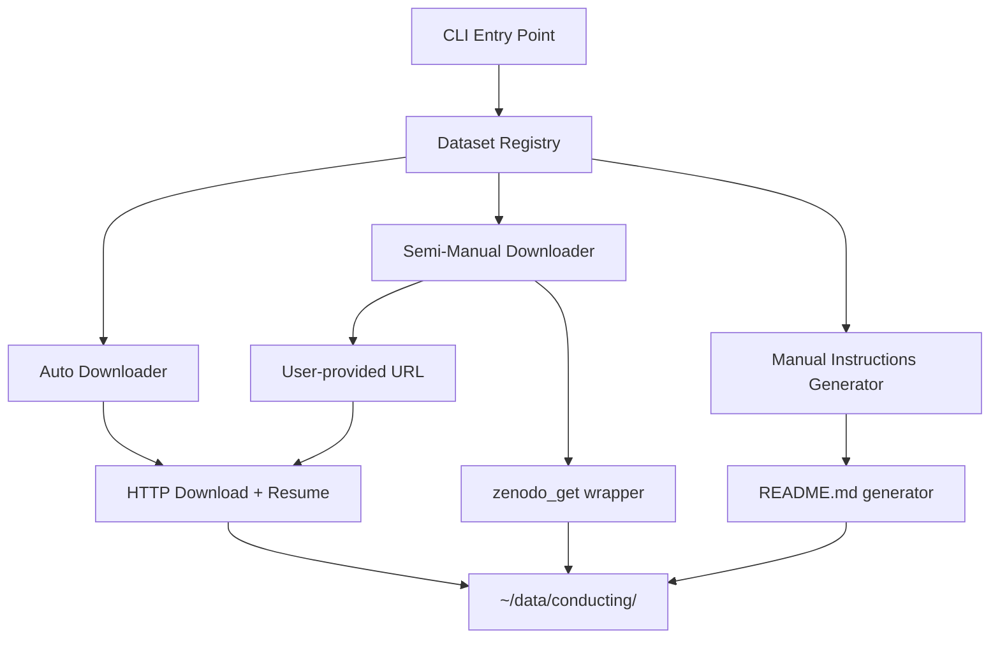

# Design: Dataset Download Tool

## Overview

A Python CLI tool that downloads conducting-related datasets to `~/data/conducting/`. It auto-downloads freely available datasets, assists with access-gated datasets once credentials are provided, and generates instructions for fully manual datasets. The tool is idempotent — safe to re-run without re-downloading completed files.

## Detailed Requirements

1. Download 6 datasets across 3 access tiers (auto, semi-manual, manual)
2. Store all data under `~/data/conducting/{dataset_name}/`
3. CLI with `--dataset` flag to select specific datasets, or `--all` for everything
4. Skip already-downloaded files; resume interrupted downloads where possible
5. Verify file integrity via checksums when available
6. Generate `~/data/conducting/README.md` with manual download instructions
7. No post-download processing — raw data only
8. Python, using `requests` and `zenodo_get`

## Architecture Overview



## Components and Interfaces

### 1. CLI Entry Point (`src/data/download_datasets.py`)

```python
# Invocation:
#   python -m src.data.download_datasets --data_dir ~/data/conducting --dataset phenicx edinburgh aist-plusplus
#   python -m src.data.download_datasets --data_dir ~/data/conducting --all
#   python -m src.data.download_datasets --data_dir ~/data/conducting --dataset mosa --zenodo-token TOKEN
#   python -m src.data.download_datasets --data_dir ~/data/conducting --dataset urmp --url URL

# Arguments:
#   --data_dir       Base directory (default: ~/data/conducting)
#   --dataset        One or more dataset names (phenicx, edinburgh, aist-plusplus, mosa, urmp, human36m)
#   --all            Download all datasets
#   --zenodo-token   Zenodo API token for restricted records (MOSA)
#   --url            User-provided download URL (for URMP after Google Form)
#   --dry-run        Show what would be downloaded without downloading
```

### 2. Dataset Registry (`src/data/datasets.py`)

Each dataset is a dataclass defining its download strategy:

```python
@dataclass
class DatasetConfig:
    name: str                    # e.g. "phenicx"
    display_name: str            # e.g. "PHENICX Conduct Dataset"
    target_dir: str              # subdirectory under data_dir
    access_tier: str             # "auto", "semi-manual", "manual"
    download_fn: str             # function name to call
    description: str             # for README generation
    urls: list[str]              # download URLs (auto tier)
    zenodo_record: str | None    # Zenodo record ID (semi-manual)
    manual_instructions: str     # instructions for manual/semi-manual steps
```

**Registry entries:**

| name | access_tier | source |
|---|---|---|
| phenicx | auto | RepoVizz/UPF direct links |
| edinburgh | auto | Edinburgh DataShare (DOI: 10.7488/ds/2223) |
| aist-plusplus | auto | Google AIST++ download page |
| mosa | semi-manual | Zenodo record 11393449 (restricted, 2.3 TB) |
| urmp | semi-manual | User-provided URL after Google Form |
| human36m | manual | Instructions only |

### 3. HTTP Downloader (`src/data/downloader.py`)

```python
def download_file(url: str, dest: Path, checksum: str | None = None) -> bool:
    """Download a file with resume support and optional checksum verification.
    
    - Skips if dest exists and checksum matches (or no checksum available and file exists)
    - Resumes partial downloads via Range header
    - Returns True if file was downloaded/verified, False on failure
    """

def download_files(urls: list[str], dest_dir: Path, checksums: dict | None = None) -> list[Path]:
    """Download multiple files to a directory."""
```

### 4. Dataset-Specific Download Functions (`src/data/datasets.py`)

```python
def download_phenicx(config: DatasetConfig, data_dir: Path) -> None:
    """Download PHENICX Conduct dataset from UPF/RepoVizz.
    
    3 sub-datasets:
    - performance/ (Beethoven 9th, Kinect mocap + RGB + audio)
    - spontaneous/ (25 participants × 3 fragments, Beethoven 3rd)
    - articulation/ (24 participants × legato/staccato × 3/4 and 4/4)
    """

def download_edinburgh(config: DatasetConfig, data_dir: Path) -> None:
    """Download Edinburgh conducting MoCap from DataShare.
    
    54 C3D files via DataShare zip download.
    URL pattern: https://datashare.ed.ac.uk/download/DS_10283_{id}.zip
    """

def download_aist_plusplus(config: DatasetConfig, data_dir: Path) -> None:
    """Download AIST++ from Google.
    
    3D keypoints, motion data, and optionally music from AIST Dance DB.
    """

def download_mosa(config: DatasetConfig, data_dir: Path, zenodo_token: str | None) -> None:
    """Download MOSA from Zenodo using zenodo_get.
    
    Requires Zenodo access token for restricted record.
    Record: 11393449, Size: ~2.3 TB
    """

def download_urmp(config: DatasetConfig, data_dir: Path, url: str | None) -> None:
    """Download URMP from user-provided URL.
    
    Size: ~12.5 GB. User must fill Google Form first.
    """

def generate_human36m_instructions(config: DatasetConfig, data_dir: Path) -> None:
    """Write manual instructions for Human3.6M to README."""
```

## Data Models

### Directory Structure

```
~/data/conducting/
├── phenicx/
│   ├── performance/       # Beethoven 9th concert recording
│   ├── spontaneous/       # 25 participants × 3 fragments
│   └── articulation/      # 24 participants × articulation study
├── edinburgh/             # 54 C3D motion capture files
├── aist-plusplus/         # AIST++ 3D dance motion + music
├── mosa/                  # MOSA Zenodo download (2.3 TB)
├── urmp/                  # URMP multi-instrument performances
├── human36m/              # (empty until manual download)
├── README.md              # Manual download instructions
└── .download_state.json   # Tracks download progress
```

### Download State (`.download_state.json`)

```json
{
  "phenicx": {"status": "complete", "timestamp": "2026-03-14T01:00:00Z"},
  "edinburgh": {"status": "complete", "timestamp": "2026-03-14T01:05:00Z"},
  "aist-plusplus": {"status": "in_progress", "files_done": 3, "files_total": 5},
  "mosa": {"status": "pending_access", "note": "Zenodo access request required"},
  "urmp": {"status": "pending_url", "note": "Google Form not yet submitted"},
  "human36m": {"status": "manual", "note": "See README.md"}
}
```

## Error Handling

- **Network failures:** Retry up to 3 times with exponential backoff. Partial files preserved for resume.
- **Checksum mismatch:** Delete corrupted file, re-download. Log warning.
- **Missing credentials:** Print clear message about what's needed (Zenodo token, URMP URL). Don't fail other datasets.
- **Disk space:** Check available space before large downloads (MOSA 2.3 TB). Warn if insufficient.
- **Missing zenodo_get:** Catch ImportError, print install instructions (`pip install zenodo-get`).
- **HTTP 403/404:** Log error, mark dataset as failed in state, continue with other datasets.

## Acceptance Criteria

**Given** the user runs `python -m src.data.download_datasets --all --data_dir ~/data/conducting`
**When** auto-download datasets are available
**Then** PHENICX, Edinburgh, and AIST++ are downloaded to their respective subdirectories

**Given** the user runs with `--dataset mosa --zenodo-token TOKEN`
**When** the Zenodo access has been granted
**Then** MOSA is downloaded via zenodo_get to `~/data/conducting/mosa/`

**Given** the user runs with `--dataset urmp --url URL`
**When** a valid URMP download URL is provided
**Then** URMP is downloaded to `~/data/conducting/urmp/`

**Given** the user runs with `--dataset human36m`
**Then** manual instructions are printed to stdout and written to README.md

**Given** a download is interrupted and re-run
**When** partial files exist
**Then** download resumes from where it left off (no re-download of completed files)

**Given** the user runs with `--dry-run`
**Then** no files are downloaded; the tool prints what would be downloaded with estimated sizes

**Given** insufficient disk space for MOSA (2.3 TB)
**When** the user attempts to download
**Then** a warning is printed before starting

## Testing Strategy

- Unit tests for `download_file` resume logic (mock HTTP server with Range support)
- Unit tests for checksum verification (known good/bad files)
- Unit tests for dataset registry (all datasets registered, configs valid)
- Integration test for CLI argument parsing
- Integration test for `.download_state.json` read/write
- Mock-based tests for each dataset download function (no real network calls)

## Appendices

### Technology Choices

| Tool | Purpose | Why |
|---|---|---|
| `requests` | HTTP downloads | Resume via Range headers, widely available |
| `zenodo_get` | Zenodo record downloads | Purpose-built, handles multi-file records, checksums |
| `argparse` | CLI | Standard library, no extra deps |
| `dataclasses` | Dataset configs | Clean, minimal |

### Research Findings Summary

- **DeepDance** was not found as a public dataset; replaced with **AIST++** (Google, 5.2 hrs, 1408 sequences, CC BY 4.0)
- **PHENICX** and **Edinburgh** turned out to be openly downloadable despite initial assumption of gated access
- **MOSA** is 2.3 TB — largest dataset by far; restricted Zenodo access
- **URMP** requires Google Form but is otherwise straightforward (12.5 GB)
- **Human3.6M** is truly gated behind academic license

### Alternative Approaches Considered

- **Shell script instead of Python:** Rejected — doesn't fit project conventions, harder to make idempotent
- **Parallel downloads:** Not included in v1 — adds complexity, most datasets are single large archives. Could add later.
- **Automatic format conversion:** Deferred to separate spec per requirements
