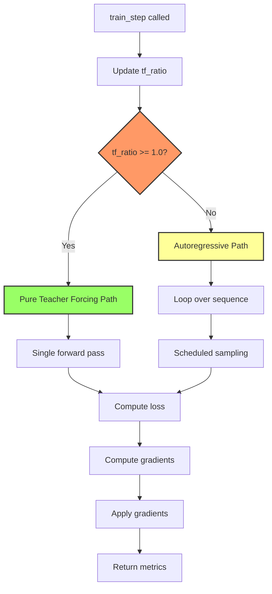

# Design: Fix Autoregressive Training Bug

## Overview

Fix the `OperatorNotAllowedInGraphError` in `train_step()` by replacing Python conditional with TensorFlow's graph-compatible `tf.cond`. The bug prevents training from starting due to using a symbolic `tf.Variable` in a Python `if` statement.

## Detailed Requirements

### Bug Description
- **Error:** `OperatorNotAllowedInGraphError: Using a symbolic tf.Tensor as a Python bool is not allowed`
- **Location:** `src/music_generation/train.py`, line 179 in `MelGeneratorTraining.train_step()`
- **Root cause:** `self.tf_ratio` is a `tf.Variable` (symbolic tensor) used in Python `if` statement during graph execution

### Expected Behavior
- When `tf_ratio >= 1.0 - 1e-6`: Use pure teacher forcing (parallel training, memory efficient)
- When `tf_ratio < 1.0 - 1e-6`: Use autoregressive training with scheduled sampling

### Constraints
- Minimal code changes
- Maintain existing functionality
- Keep memory efficiency of parallel path

## Architecture Overview



**Problem:** Node C (the conditional) uses Python `if` which cannot handle symbolic tensors in graph mode.

## Components and Interfaces

### Modified Component: `MelGeneratorTraining.train_step()`

**Current problematic code (line 179):**
```python
if self.tf_ratio >= 1.0 - 1e-6:
    # Pure teacher forcing path
    ...
else:
    # Autoregressive path
    ...
```

**Fixed code:**
```python
def pure_teacher_forcing():
    # Pure teacher forcing path (existing code)
    ...
    return {"loss": loss, "grad_norm": grad_norm, "tf_ratio": self.tf_ratio_metric.result()}

def autoregressive_training():
    # Autoregressive path (existing code)
    ...
    return {"loss": loss, "grad_norm": grad_norm, "tf_ratio": self.tf_ratio_metric.result()}

# TensorFlow conditional - graph compatible
return tf.cond(
    self.tf_ratio >= 1.0 - 1e-6,
    pure_teacher_forcing,
    autoregressive_training
)
```

### Key Changes

1. **Extract conditional branches into functions:**
   - `pure_teacher_forcing()`: Encapsulates lines 180-195 (teacher forcing logic)
   - `autoregressive_training()`: Encapsulates lines 197-246 (autoregressive logic)

2. **Replace Python `if` with `tf.cond`:**
   - `tf.cond(predicate, true_fn, false_fn)` is graph-compatible
   - Handles symbolic tensors correctly
   - Both branches must return same structure

3. **No changes to:**
   - Teacher forcing schedule logic
   - Loss computation
   - Gradient computation
   - Metrics tracking

## Data Models

No data model changes required. The fix is purely control flow.

## Error Handling

### Existing Error Handling (preserved)
```python
tf.cond(
    tf.math.logical_or(tf.math.is_nan(loss), tf.math.is_inf(loss)),
    lambda: tf.print("⚠️  WARNING: NaN/Inf loss detected!"),
    lambda: tf.constant(0)
)
```

This pattern already uses `tf.cond` correctly and will remain unchanged in both branches.

### New Error Handling
None required - the fix resolves the error by using proper TensorFlow control flow.

## Acceptance Criteria

```gherkin
Given the training script with autoregressive implementation
When I run "python3 -m src.music_generation.train --data_dir ~/data/music/musicnet/train_data --checkpoint_dir ~/models/conducting/mel_checkpoints --epochs 50 --batch_size 4 --lr 0.00005"
Then the command should complete without errors
And training should start successfully
And the first epoch should begin processing batches
And metrics should be logged (loss, grad_norm, tf_ratio)
And the training should run for at least one full epoch

Given the training command runs without arguments
When I run "python3 -m src.music_generation.train"
Then it should use default parameters and run successfully

Given tf_ratio is 1.0 (initial state)
When train_step is called
Then pure teacher forcing path should execute
And the entire sequence should be processed in parallel

Given tf_ratio is 0.5 (mid-training)
When train_step is called
Then autoregressive path should execute
And scheduled sampling should mix ground truth and predictions

Given tf_ratio transitions from >= 1.0 to < 1.0
When train_step is called across multiple steps
Then the conditional should switch from teacher forcing to autoregressive
And no errors should occur during the transition
```

## Testing Strategy

### Manual Verification
1. Run training command with small dataset
2. Verify training starts and completes first batch
3. Check logs for tf_ratio values
4. Confirm no OperatorNotAllowedInGraphError

### Functional Tests
```python
def test_train_step_with_high_tf_ratio():
    """Test pure teacher forcing path when tf_ratio >= 1.0"""
    model = MelGeneratorTraining(base_model, initial_tf_ratio=1.0)
    # Verify no errors and correct path execution

def test_train_step_with_low_tf_ratio():
    """Test autoregressive path when tf_ratio < 1.0"""
    model = MelGeneratorTraining(base_model, initial_tf_ratio=0.5)
    # Verify no errors and correct path execution

def test_tf_cond_returns_consistent_structure():
    """Verify both branches return same dictionary structure"""
    # Ensure {"loss": ..., "grad_norm": ..., "tf_ratio": ...}
```

### Integration Test
- Run full training for 2-3 epochs
- Verify tf_ratio decays correctly
- Confirm transition between paths is smooth
- Check memory usage remains stable

## Appendices

### Technology Choices

**TensorFlow Control Flow: `tf.cond`**
- Graph-compatible conditional execution
- Required for symbolic tensor predicates
- Both branches must return same structure/types
- Alternative considered: `tf.where` - not suitable for complex branching logic

### Research Findings

**Why Python `if` fails in graph mode:**
- TensorFlow builds a static computation graph
- Python `if` evaluates at graph construction time
- `tf.Variable` values are only known at execution time
- `tf.cond` defers evaluation to execution time

**Memory efficiency note:**
- Pure teacher forcing path (parallel) is memory efficient
- Autoregressive path grows sequence incrementally
- Future optimization: investigate memory-efficient implementation from `/Users/davidkeeler/code/conducting`

### Alternative Approaches

1. **Use `@tf.function` with autograph:** Would require decorating `train_step`, potentially more invasive
2. **Convert to eager execution:** Defeats purpose of graph optimization
3. **Restructure as two separate methods:** More code changes, less maintainable

**Selected approach:** `tf.cond` - minimal changes, graph-compatible, clear intent.

### Known Limitations

- Both branches must have identical return signatures
- Debugging inside `tf.cond` can be harder than Python `if`
- Future work: Address memory efficiency in autoregressive path (separate spec)
