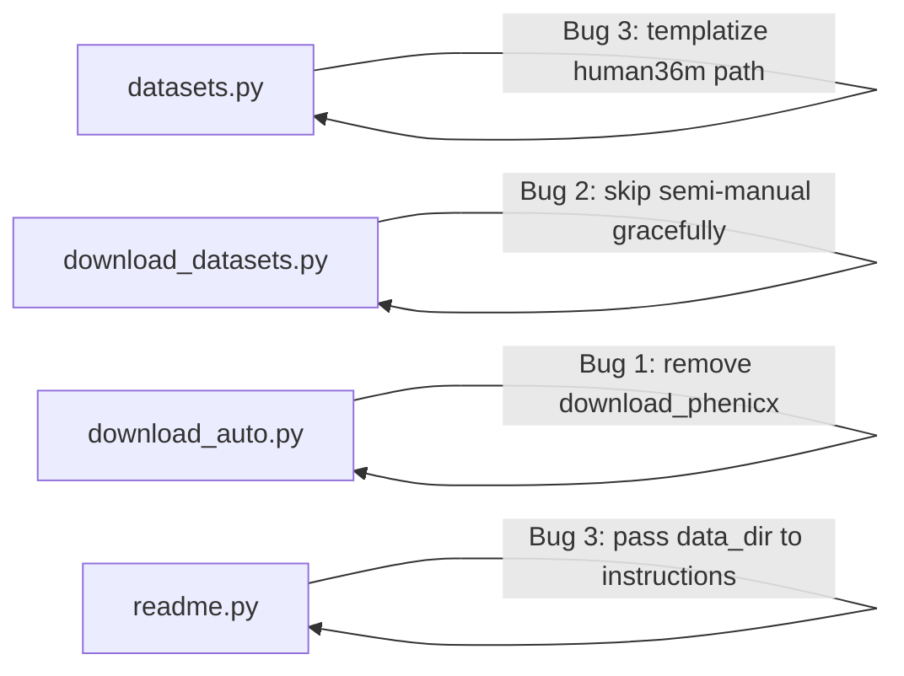

# Design: Debug Dataset Download Tool

## Overview

Fix 4 bugs in the dataset download tool (`src/data/`) discovered during first run with `--all --data_dir ~/data/music`.

## Detailed Requirements

1. PHENICX dataset's hosting platform (RepoVizz) is dead — reclassify from "auto" to "manual" and remove scraping code
2. Running `--all` without MOSA/URMP credentials should warn and skip, not `[FAIL]`
3. Human3.6M manual instructions contain hardcoded `~/data/conducting/` — should use actual `data_dir`
4. Manual testing only — no unit tests

## Architecture Overview

No architectural changes. All fixes are localized edits to existing files:

## Components and Interfaces

### Bug 1: Reclassify PHENICX to Manual

**File: `src/data/datasets.py`**
- Change `access_tier` from `"auto"` to `"manual"`
- Remove `urls` list (no longer downloadable)
- Update `manual_instructions` to direct users to contact MTG/UPF since RepoVizz is down

**File: `src/data/download_auto.py`**
- Remove `download_phenicx()` function entirely

**File: `src/data/download_datasets.py`**
- Remove the `phenicx` branch from the download dispatch block (it will now be handled by the `human36m`-style manual path)

### Bug 2: Graceful Skip for Semi-Manual Without Credentials

**File: `src/data/download_datasets.py`**
- In the download loop, before calling `download_mosa`/`download_urmp`, check if credentials are missing
- If missing: print instructions as a `[SKIP]` (not `[FAIL]`), don't update state, `continue`
- Remove the `validate_args()` warnings at the top — they're redundant with the per-dataset skip logic

### Bug 3: Fix Hardcoded Path in Human3.6M Instructions

**File: `src/data/datasets.py`**
- Change Human3.6M `manual_instructions` to use a `{data_dir}` placeholder in the extract path

**File: `src/data/readme.py`**
- In `generate_instructions()`: format `manual_instructions` with actual `data_dir` before printing
- In `generate_readme()`: format `manual_instructions` with actual `data_dir` before writing

**File: `src/data/download_datasets.py`**
- Pass `data_dir` to `generate_instructions()` call

## Data Models

No changes to data models or state tracking.

## Error Handling

- Semi-manual datasets without credentials: `[SKIP]` with instructions, no state change, no exception
- PHENICX: now manual tier, handled same as Human3.6M (print instructions, mark complete)

## Acceptance Criteria

**Given** `python -m src.data.download_datasets --all --data_dir ~/data/music`
**When** no MOSA/URMP credentials provided
**Then** MOSA and URMP show `[SKIP]` with instructions (not `[FAIL]`), other datasets proceed normally

**Given** `python -m src.data.download_datasets --dataset phenicx --data_dir ~/data/music`
**Then** instructions are printed explaining RepoVizz is down and how to contact UPF for access

**Given** `python -m src.data.download_datasets --dataset human36m --data_dir ~/data/music`
**Then** instructions say "Extract to ~/data/music/human36m/" (not `~/data/conducting/`)

**Given** `python -m src.data.download_datasets --all --data_dir ~/data/music`
**Then** the generated README.md at `~/data/music/README.md` shows correct paths for all datasets

## Testing Strategy

Manual testing only:
1. Run `--all --data_dir ~/data/music` — verify no `[FAIL]` for MOSA/URMP/PHENICX
2. Run `--dataset human36m --data_dir ~/data/music` — verify correct path in output
3. Check generated README.md for correct paths
4. Run `--dry-run --all` — verify PHENICX shows as MANUAL not AUTO

## Appendices

### Research Summary

- RepoVizz platform (`repovizz.upf.edu`) returns 404 — confirmed dead
- UPF dataset page is accessible but blocks requests without User-Agent header (moot since we're removing auto-download)
- No alternative download source found for PHENICX data
- See `research/phenicx-availability.md` for details
