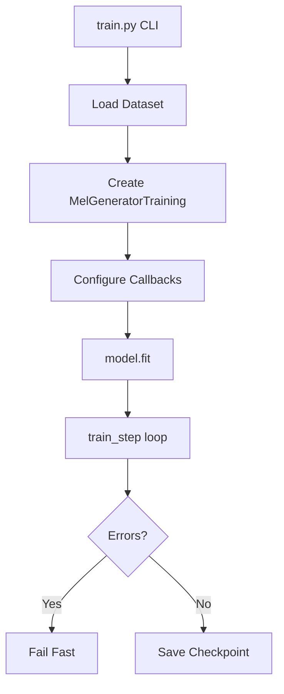

# Design: Debug Training

## Overview

Ensure the TensorFlow music generation training pipeline runs reliably without crashes. Focus on fixing immediate runtime issues and validating basic training stability.

## Detailed Requirements

### Functional Requirements
1. Training must complete at least one full epoch without crashes
2. All TensorFlow graph execution errors must be resolved
3. Loss values must be computed and logged correctly
4. Model checkpoints must be saved successfully
5. Training metrics must be displayed during training

### Non-Functional Requirements
1. Standard fail-fast error handling (no special recovery logic)
2. Clear error messages when failures occur
3. Minimal changes to existing training code
4. Compatible with existing command-line interface

## Architecture Overview

The training system consists of:
- **train.py**: Main training script with CLI argument parsing
- **MelGeneratorTraining**: Custom Keras Model wrapper with train_step override
- **MelGenerator**: Core transformer-based model
- **Dataset pipeline**: tf.data.Dataset for loading mel spectrograms
- **Callbacks**: Checkpointing and logging



## Components and Interfaces

### 1. train_step Method (MelGeneratorTraining)

**Current Issue**: Using `tf.Tensor` as Python boolean in graph mode

**Fix Required**:
```python
# BEFORE (causes error)
if tf.math.is_nan(loss) or tf.math.is_inf(loss):
    tf.print("WARNING: NaN/Inf loss detected!")

# AFTER (graph-compatible)
tf.cond(
    tf.math.logical_or(tf.math.is_nan(loss), tf.math.is_inf(loss)),
    lambda: tf.print("⚠️  WARNING: NaN/Inf loss detected!"),
    lambda: tf.constant(0)
)
```

**Interface**:
- Input: `(x, y)` tuple of mel spectrogram tensors
- Output: `{"loss": scalar_tensor}`
- Side effects: Updates model weights via optimizer

### 2. Dataset Pipeline

**Validation Needed**:
- Verify shapes: `[batch_size, seq_len, 80]`
- Check for NaN/Inf in input data
- Ensure proper batching and shuffling

### 3. Model Initialization

**Validation Needed**:
- Model builds correctly on first batch
- All layers have expected output shapes
- Parameter count is reasonable

### 4. Checkpoint Saving

**Requirements**:
- Save after each epoch
- Include optimizer state
- Use proper file naming convention

## Data Models

### Input Data
```python
x: tf.Tensor  # shape: [batch_size, seq_len, 80]
y: tf.Tensor  # shape: [batch_size, seq_len, 80] (shifted by 1 frame)
```

### Training State
```python
{
    "epoch": int,
    "step": int,
    "loss": float,
    "teacher_forcing_ratio": float,
    "learning_rate": float
}
```

## Error Handling

### Graph Execution Errors
- **Problem**: Using symbolic tensors as Python booleans
- **Solution**: Use `tf.cond`, `tf.while_loop`, or other graph-compatible control flow
- **Detection**: Occurs during model.fit() execution
- **Recovery**: Fix code and restart training

### Shape Mismatches
- **Problem**: Incompatible tensor shapes in operations
- **Solution**: Add `tf.debugging.assert_equal` checks
- **Detection**: TensorFlow will raise InvalidArgumentError
- **Recovery**: Fix data pipeline or model architecture

### NaN/Inf Losses
- **Problem**: Numerical instability during training
- **Solution**: Log warning but let training continue (will naturally fail if persistent)
- **Detection**: Check loss value in train_step
- **Recovery**: Adjust learning rate or check data normalization

## Acceptance Criteria

```gherkin
Given the training script is invoked with valid arguments
When training runs for one complete epoch
Then no runtime errors should occur
And loss values should be finite numbers
And at least one checkpoint should be saved
And training metrics should be displayed

Given a TensorFlow graph execution error occurs
When the error is related to symbolic tensor usage
Then the code should use graph-compatible operations
And training should proceed without the error

Given the model processes a batch
When the batch contains valid mel spectrogram data
Then predictions should have the same shape as inputs
And loss should be computed successfully
And gradients should be applied to model weights
```

## Testing Strategy

### Manual Testing
1. Run training command with small batch size (4)
2. Verify training starts and completes first epoch
3. Check checkpoint files are created
4. Inspect console output for errors

### Validation Checks
1. Verify no TensorFlow graph execution errors
2. Confirm loss values are logged each step
3. Ensure checkpoint directory is created
4. Validate model summary shows correct architecture

### Success Metrics
- Training runs for at least 1 epoch without crashes
- Loss values are finite (not NaN/Inf)
- Checkpoints are saved successfully
- No Python/TensorFlow exceptions

## Appendices

### Technology Choices

**TensorFlow/Keras**: Required for this project (porting from PyTorch)
- Graph execution mode requires special control flow operations
- Custom training loops need `@tf.function` compatibility
- Use `tf.cond`, `tf.while_loop` instead of Python control flow

**Teacher Forcing**: Autoregressive training technique
- Gradually reduces reliance on ground truth during training
- Implemented via `teacher_forcing_ratio` parameter
- Decays over training steps

### Alternative Approaches

**Eager Execution**: Could decorate train_step with `@tf.function(run_eagerly=True)`
- Pros: Allows Python control flow
- Cons: Slower training, not recommended for production

**Remove NaN Detection**: Could skip the warning entirely
- Pros: Simpler code
- Cons: Harder to debug numerical issues

### Known Limitations

- Model architecture is fixed (cannot be changed without retraining)
- Dataset must fit in memory or use proper tf.data pipeline
- GPU memory constraints limit batch size
- Teacher forcing schedule is predetermined
