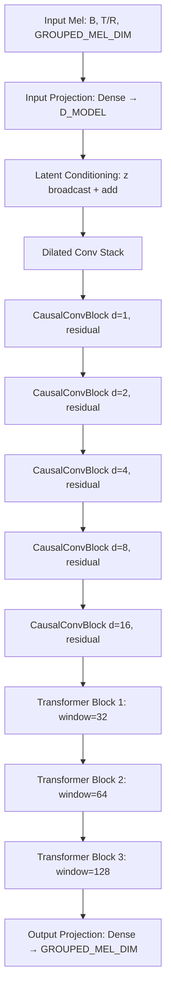

# Design: Deeper Dilated Causal Conv Refactor

## Overview

Refactor the MelGenerator's convolution stack from a hardcoded 3-layer setup to a flexible, config-driven dilated causal architecture. This increases the receptive field from ~15 frames (~160 ms) to ~63 frames (~670 ms) while preserving strict causality, residual connections, and all other model components.

## Detailed Requirements

- Replace hardcoded `conv1`, `conv2`, `conv_head` with a dynamic list built from `CONV_DILATION_RATES`
- Default dilation rates: `[1, 2, 4, 8, 16]` (5 layers)
- Arbitrary rates supported — model builds from whatever config contains
- `D_MODEL` remains 128 (model is ~1.3M params, can absorb extra layers)
- All conv layers placed before the transformer stack (no post-transformer conv)
- Transformer blocks, latent conditioning, input/output projections, training logic unchanged
- No hyperparameter changes

## Architecture Overview



### Before (current)

```
input_proj → z_inject → conv1(d=1) → conv2(d=2) → transformer×3 → conv_head(d=4) → output_proj
Receptive field: 1 + 2*(1+2+4) = 15 frames (~160 ms)
```

### After (proposed)

```
input_proj → z_inject → conv(d=1) → conv(d=2) → conv(d=4) → conv(d=8) → conv(d=16) → transformer×3 → output_proj
Receptive field: 1 + 2*(1+2+4+8+16) = 63 frames (~672 ms)
```

## Components and Interfaces

### Config Changes (`config.py`)

| Constant | Current | New |
|---|---|---|
| `CONV_DILATION_RATES` | `[1, 2, 4]` | `[1, 2, 4, 8, 16]` |

Comment updated to reflect the new default and receptive field calculation.

### Model Changes (`model.py`)

**MelGenerator.__init__:**
- Remove: `self.conv1`, `self.conv2`, `self.conv_head`
- Add: `self.conv_layers` — list of `CausalConvBlock` instances, one per dilation rate
- Update: receptive field logging to use `sum(CONV_DILATION_RATES)` instead of hardcoded `d1+d2+d3`
- Remove: dilation rate padding/truncation logic and associated warnings

**MelGenerator.call():**
- Remove: `self.conv1(x)`, `self.conv2(x)`, `self.conv_head(x)` calls
- Add: loop over `self.conv_layers`
- Conv loop placed before transformer stack (no conv after transformers)

**MelGenerator docstring:**
- Update architecture description to reflect dynamic conv stack

### Unchanged Components
- `CausalConvBlock` and `CausalConv1D` in `layers.py` — no changes needed
- `TransformerBlock` and `LocalWindowAttention` — unchanged
- `LatentEncoder` — unchanged
- `generate()` method — unchanged (calls `self.call()` which uses the new conv loop)
- All training logic, dataset pipeline, vocoder, inference — unchanged

## Data Models

No changes. Input/output shapes remain:
- Input: `[B, T/R, GROUPED_MEL_DIM]`
- Output: `[B, T/R, GROUPED_MEL_DIM]`

Internal hidden dimension remains `[B, T/R, D_MODEL=128]` throughout the conv and transformer stacks.

## Error Handling

No new error handling needed. The conv stack builds dynamically from config — an empty `CONV_DILATION_RATES` list simply means no conv layers (valid, though unusual).

## Acceptance Criteria

**Given** `CONV_DILATION_RATES = [1, 2, 4, 8, 16]` in config
**When** MelGenerator is instantiated
**Then** `self.conv_layers` contains 5 `CausalConvBlock` instances with dilation rates 1, 2, 4, 8, 16

**Given** a MelGenerator with 5 dilated conv layers
**When** `call()` is invoked with input shape `[B, 128, 400]`
**Then** output shape is `[B, 128, 400]` and all conv layers are applied before transformer blocks

**Given** `CONV_DILATION_RATES = [1, 2, 4, 8, 16]`
**When** receptive field is logged during init
**Then** log shows 63 frames and ~672.0 ms

**Given** any arbitrary `CONV_DILATION_RATES` list (e.g., `[1, 3, 9]`)
**When** MelGenerator is instantiated
**Then** conv stack matches the provided rates with no errors or warnings

**Given** the refactored model
**When** `generate()` is called with a seed mel
**Then** autoregressive generation works identically (output shape and causality preserved)

## Testing Strategy

- Verify model instantiation with default and custom dilation rates
- Verify output shape matches input shape through forward pass
- Verify receptive field logging output
- Verify `generate()` produces expected output shape
- Compare parameter count before/after to confirm reasonable increase

## Appendices

### Parameter Impact

Each `CausalConvBlock(128, kernel_size=3)` adds:
- Conv1D: 3 × 128 × 128 + 128 = 49,280 params
- LayerNorm: 2 × 128 = 256 params
- Total per block: ~49,536 params

Going from 3 → 5 blocks adds ~99K params (~7.6% increase on 1.3M model).

### Receptive Field Formula

For kernel_size=3 with dilation rates `D`:
```
receptive_field_frames = 1 + 2 * sum(D)
receptive_field_ms = receptive_field_frames * (FRAME_STEP / SAMPLE_RATE) * 1000
```

| Config | Frames | Duration |
|---|---|---|
| `[1, 2, 4]` (current) | 15 | ~160 ms |
| `[1, 2, 4, 8, 16]` (proposed) | 63 | ~672 ms |

### Alternative Approaches Considered

- Reducing `D_MODEL` to offset parameter increase — rejected, model is small enough at 1.3M
- Splitting conv layers pre/post transformer — rejected, all convs go before transformers for simplicity
