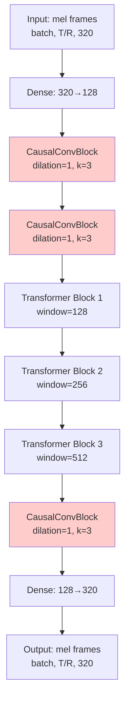
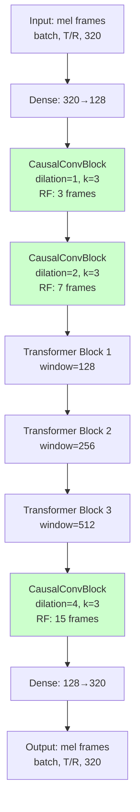

# Dilated Causal Convolutions — Detailed Design

## Overview

This design implements dilated causal convolutions in the MelGenerator model to increase the temporal receptive field from ~58ms to ~174ms without adding parameters. The implementation adds a configurable `CONV_DILATION_RATES` parameter to config.py and modifies the MelGenerator initialization to apply progressive dilation rates [1, 2, 4] to the three convolution layers.

## Detailed Requirements

### Functional Requirements

1. **Configurable Dilation Rates**: Add `CONV_DILATION_RATES` list parameter to config.py with default value [1, 2, 4]
2. **MelGenerator Modification**: Update MelGenerator.__init__() to read dilation rates from config and apply them to conv1, conv2, and conv_head layers
3. **Receptive Field Logging**: Log calculated receptive field (frames and milliseconds) at model initialization
4. **Error Handling**: Handle mismatched list lengths by using first N values and issuing warnings for missing/extra values
5. **Testing**: Provide unit tests for receptive field calculation and integration tests for model initialization

### Non-Functional Requirements

1. **Backward Compatibility**: Breaking change - requires retraining from scratch
2. **Training Script Impact**: No changes to train.py required
3. **Documentation**: Create model architecture diagram showing dilated convolution stack
4. **Success Criteria**: Code correctness - model initializes without errors, tests pass, dilation rates applied correctly

### Constraints

1. Changes apply to MelGenerator only (not other models using CausalConvBlock)
2. CausalConvBlock already supports dilation_rate parameter - no layer changes needed
3. Causal padding automatically accounts for dilation: `padding = (kernel_size - 1) * dilation_rate`

## Architecture Overview

### Current Architecture



**Current Receptive Field**: 5 frames (~58ms)

### Proposed Architecture



**New Receptive Field**: 15 frames (~174ms)

### Receptive Field Calculation

For a stack of dilated convolutions with kernel size k=3:

```
Layer 1 (d=1): RF = 3 frames
Layer 2 (d=2): RF = 3 + 2*(2) = 7 frames  
Layer 3 (d=4): RF = 7 + 2*(4) = 15 frames
```

General formula for stacked dilations:
```
RF = 1 + 2 * sum(dilations)
RF = 1 + 2 * (1 + 2 + 4) = 15 frames
```

Time conversion:
```
frame_duration = hop_length / sample_rate
                = 256 / 22050 = 11.6 ms
total_time = 15 * 11.6 ms = 174 ms
```

## Components and Interfaces

### 1. Configuration Module (config.py)

**New Parameter**:
```python
# Dilated Convolution Configuration
# Dilation rates for conv1, conv2, conv_head layers
# Progressive dilation increases receptive field: 1 + 2*sum(rates) frames
# Default [1, 2, 4] gives 15 frames (~174ms at 22.05kHz with hop=256)
CONV_DILATION_RATES = [1, 2, 4]
```

**Location**: Add after `WINDOW_SIZES` definition (line ~35)

### 2. Model Module (model.py)

**Modified Import**:
```python
from src.music_generation.config import (
    D_MODEL, NUM_HEADS, SEQ_LEN, N_MELS, WINDOW_SIZES,
    REDUCTION_FACTOR, GROUPED_MEL_DIM, EFFECTIVE_SEQ_LEN,
    CONV_DILATION_RATES, FRAME_STEP, SAMPLE_RATE  # Add these
)
```

**Modified MelGenerator.__init__()**:
```python
def __init__(self):
    super().__init__()
    
    # Get dilation rates (use first 3, pad with 1 if insufficient)
    dilations = list(CONV_DILATION_RATES) + [1, 1, 1]
    d1, d2, d3 = dilations[0], dilations[1], dilations[2]
    
    # Warn if list length mismatch
    if len(CONV_DILATION_RATES) < 3:
        import logging
        logging.warning(
            f"CONV_DILATION_RATES has {len(CONV_DILATION_RATES)} values, "
            f"expected 3. Padding with 1s: {[d1, d2, d3]}"
        )
    elif len(CONV_DILATION_RATES) > 3:
        import logging
        logging.warning(
            f"CONV_DILATION_RATES has {len(CONV_DILATION_RATES)} values, "
            f"expected 3. Using first 3: {[d1, d2, d3]}"
        )
    
    # Calculate and log receptive field
    receptive_field_frames = 1 + 2 * (d1 + d2 + d3)
    frame_duration_ms = (FRAME_STEP / SAMPLE_RATE) * 1000
    receptive_field_ms = receptive_field_frames * frame_duration_ms
    
    import logging
    logging.info(
        f"MelGenerator initialized with dilation rates [{d1}, {d2}, {d3}]"
    )
    logging.info(
        f"Total receptive field: {receptive_field_frames} frames "
        f"(~{receptive_field_ms:.1f} ms)"
    )
    
    # Input projection: GROUPED_MEL_DIM -> D_MODEL
    self.input_proj = tf.keras.layers.Dense(D_MODEL)
    
    # Causal conv layers with progressive dilation
    self.conv1 = CausalConvBlock(D_MODEL, kernel_size=3, dilation_rate=d1, residual=True)
    self.conv2 = CausalConvBlock(D_MODEL, kernel_size=3, dilation_rate=d2, residual=True)
    
    # Transformer stack with explicit layers and increasing window sizes
    self.transformer1 = TransformerBlock(D_MODEL, NUM_HEADS, window_size=WINDOW_SIZES[0])
    self.transformer2 = TransformerBlock(D_MODEL, NUM_HEADS, window_size=WINDOW_SIZES[1])
    self.transformer3 = TransformerBlock(D_MODEL, NUM_HEADS, window_size=WINDOW_SIZES[2])
    
    # Conv head with largest dilation
    self.conv_head = CausalConvBlock(D_MODEL, kernel_size=3, dilation_rate=d3, residual=True)
    
    # Output projection: D_MODEL -> GROUPED_MEL_DIM
    self.output_proj = tf.keras.layers.Dense(GROUPED_MEL_DIM)
```

**No changes to**:
- `call()` method - convolution layers called identically
- `generate()` method - autoregressive generation unchanged
- Other methods or classes

### 3. Testing Module (tests/test_dilated_convolutions.py)

**New Test File**: Create `tests/test_dilated_convolutions.py`

**Test Cases**:

1. **test_receptive_field_calculation**: Verify RF formula for various dilation configurations
2. **test_model_initialization_default**: Model initializes with default [1,2,4] dilations
3. **test_model_initialization_custom**: Model initializes with custom dilation rates
4. **test_dilation_list_too_short**: Warning issued when list has <3 elements
5. **test_dilation_list_too_long**: Warning issued when list has >3 elements
6. **test_output_shape_unchanged**: Model output shape matches input shape
7. **test_causality_preserved**: Output at time t doesn't depend on future inputs

## Data Models

No new data structures required. All changes use existing TensorFlow tensor formats:
- Input/Output: `[batch, seq_len, channels]`
- Configuration: Python list of integers

## Error Handling

### Configuration Errors

**Scenario**: `CONV_DILATION_RATES` has wrong length

**Behavior**:
- If length < 3: Use provided values, pad remaining with 1, log warning
- If length > 3: Use first 3 values, log warning
- If length == 0: Use [1, 1, 1], log warning

**Example Warnings**:
```
WARNING: CONV_DILATION_RATES has 2 values, expected 3. Padding with 1s: [1, 2, 1]
WARNING: CONV_DILATION_RATES has 5 values, expected 3. Using first 3: [1, 2, 4]
```

### Runtime Errors

**Scenario**: Invalid dilation rate (non-positive integer)

**Behavior**: TensorFlow Conv1D will raise ValueError during layer construction

**Mitigation**: Document that dilation rates must be positive integers

## Acceptance Criteria

Given a MelGenerator model with dilated convolutions  
When the model is initialized with `CONV_DILATION_RATES = [1, 2, 4]`  
Then the model should:
1. Initialize without errors
2. Log "MelGenerator initialized with dilation rates [1, 2, 4]"
3. Log "Total receptive field: 15 frames (~174.0 ms)"
4. Apply dilation_rate=1 to conv1
5. Apply dilation_rate=2 to conv2
6. Apply dilation_rate=4 to conv_head

Given a MelGenerator model  
When forward pass is called with input shape [B, T, 320]  
Then output shape should be [B, T, 320]

Given a MelGenerator model  
When `CONV_DILATION_RATES = [1, 2]` (too short)  
Then model should initialize with dilations [1, 2, 1] and log warning

Given a MelGenerator model  
When `CONV_DILATION_RATES = [1, 2, 4, 8, 16]` (too long)  
Then model should initialize with dilations [1, 2, 4] and log warning

Given a test suite for dilated convolutions  
When all tests are run  
Then all tests should pass

## Testing Strategy

### Unit Tests

**File**: `tests/test_dilated_convolutions.py`

**Test Coverage**:
1. Receptive field calculation formula
2. Model initialization with various configurations
3. Warning generation for mismatched list lengths
4. Output shape preservation
5. Causality verification

**Test Framework**: pytest with TensorFlow test utilities

**Execution**: `pytest tests/test_dilated_convolutions.py -v`

### Integration Tests

**Scope**: Verify model works end-to-end with dilated convolutions

**Test Cases**:
1. Model can be instantiated
2. Model can perform forward pass
3. Model can perform autoregressive generation
4. Model can be saved and loaded

**Execution**: Include in existing test suite (`pytest tests/`)

### Manual Verification

**Steps**:
1. Run training script with default config
2. Verify log messages show correct receptive field
3. Verify training completes without errors
4. Verify generated audio has no obvious artifacts

## Appendices

### Appendix A: Technology Choices

**TensorFlow/Keras**: Existing framework, no changes needed

**Logging**: Python standard library `logging` module for warnings and info messages

**Testing**: pytest for unit/integration tests

### Appendix B: Research Findings

**Dilated Convolutions**: Well-established technique from WaveNet (van den Oord et al., 2016)

**Receptive Field Formula**: For kernel size k and dilation d, effective kernel size is `k + (k-1)*(d-1) = 1 + (k-1)*d`

**Causal Padding**: Left padding of `(k-1)*d` ensures output at time t only depends on inputs ≤ t

**Performance Impact**: Dilated convolutions have same computational cost as regular convolutions (same number of operations, just different input sampling)

### Appendix C: Alternative Approaches

**Alternative 1: Increase Kernel Size**
- Pros: Simple, no dilation needed
- Cons: Increases parameters quadratically, less efficient

**Alternative 2: Add More Convolution Layers**
- Pros: Gradual receptive field growth
- Cons: Increases depth, more parameters, slower training

**Alternative 3: Use Strided Convolutions**
- Pros: Reduces sequence length, faster processing
- Cons: Loses temporal resolution, not suitable for autoregressive generation

**Selected Approach: Dilated Convolutions**
- Best trade-off: large receptive field, no parameter increase, maintains temporal resolution

### Appendix D: Receptive Field Comparison

| Configuration | RF (frames) | RF (ms) | Parameters |
|---------------|-------------|---------|------------|
| [1, 1, 1] (current) | 5 | 58 | Baseline |
| [1, 2, 4] (proposed) | 15 | 174 | Baseline |
| [2, 4, 8] (aggressive) | 29 | 337 | Baseline |
| [1, 1, 1] + k=5 | 9 | 104 | +78% |

The proposed [1, 2, 4] configuration provides 3x receptive field increase with zero parameter overhead.
