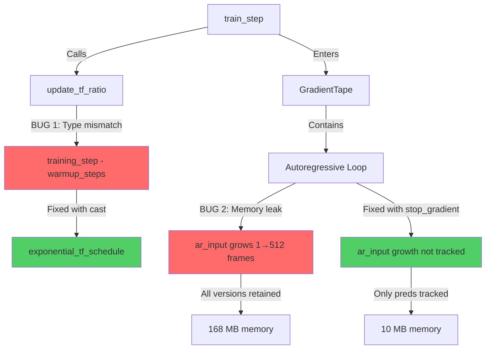
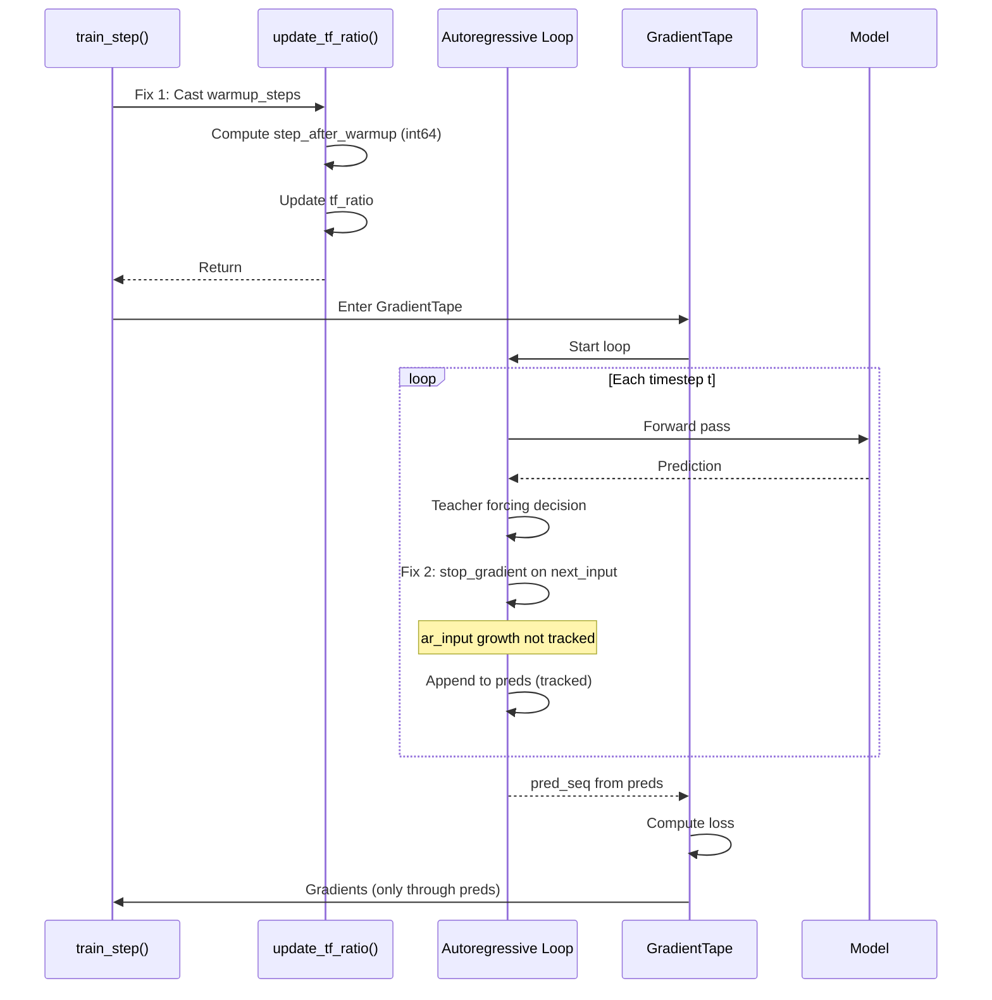

# Design: Fix Teacher Forcing Type Mismatch and Memory Issue

## Overview

Fix two critical bugs preventing training:
1. **Type mismatch** in `update_tf_ratio()` - int64/int32 incompatibility
2. **Memory explosion** in autoregressive loop - growing tensor inside GradientTape

## Detailed Requirements

### Bug 1: Type Mismatch (Line 125)

**Error:**
```
TypeError: Input 'y' of 'Maximum' Op has type int64 that does not match type int32 of argument 'x'
```

**Root cause:**
```python
step_after_warmup = tf.maximum(0, self.training_step - self.warmup_steps)
#                                   int64              int32
```

**Requirements:**
1. Fix type mismatch without changing training_step type (keep int64 for long runs)
2. Minimal code change (single line)
3. No impact on checkpoint compatibility

### Bug 2: Memory Explosion (Line 220)

**Problem:** `ar_input` grows from [4,1,80] to [4,512,80] inside GradientTape, retaining all intermediate tensors.

**Memory usage:**
- Sum of all ar_input versions: 1+2+3+...+512 = 131,328 frames
- Total: 4 × 131,328 × 80 × 4 bytes = **168 MB per batch**
- Original code (seq_len=128): only 10.5 MB

**Requirements:**
1. Prevent gradient tracking on ar_input growth
2. Maintain gradient flow through predictions (preds list)
3. No change to training dynamics or convergence
4. Minimal code change (single line)

### Non-Functional Requirements
1. **Backward compatibility** - Existing checkpoints must work
2. **Correctness** - No change to model behavior or training dynamics
3. **Performance** - No regression in training speed

## Architecture Overview



**Red nodes:** Bugs  
**Green nodes:** Fixes

## Components and Interfaces

### Fix 1: Type Mismatch in update_tf_ratio()

**Current implementation (buggy):**
```python
def update_tf_ratio(self):
    """Update teacher forcing ratio based on current training step."""
    # BUG: Type mismatch between int64 and int32
    step_after_warmup = tf.maximum(0, self.training_step - self.warmup_steps)
    # ...
```

**Fixed implementation:**
```python
def update_tf_ratio(self):
    """Update teacher forcing ratio based on current training step."""
    # Cast warmup_steps to int64 for type compatibility
    step_after_warmup = tf.maximum(0, self.training_step - tf.cast(self.warmup_steps, tf.int64))
    
    # Compute new ratio using exponential schedule
    new_ratio = exponential_tf_schedule(
        step=step_after_warmup,
        initial_ratio=self.initial_tf_ratio,
        min_ratio=self.min_tf_ratio,
        decay_k=self.decay_k
    )
    
    self.tf_ratio.assign(new_ratio)
    self.training_step.assign_add(1)
```

**Change:** Add `tf.cast(self.warmup_steps, tf.int64)` at line 125.

### Fix 2: Memory Leak in Autoregressive Loop

**Current implementation (buggy):**
```python
with tf.GradientTape() as tape:
    ar_input = x[:, :1, :]
    preds = []
    
    for t in range(1, seq_len):
        context = ar_input[:, -MAX_CONTEXT_FRAMES:, :]
        pred = self.base_model(context, training=True)
        next_frame_pred = pred[:, -1:, :]
        
        use_teacher = tf.random.uniform([batch_size, 1, 1]) < self.tf_ratio
        next_input = tf.where(use_teacher, x[:, t:t+1, :], next_frame_pred)
        preds.append(next_frame_pred)
        
        # BUG: ar_input growth tracked by GradientTape (168 MB)
        ar_input = tf.concat([ar_input, next_input], axis=1)
```

**Fixed implementation:**
```python
with tf.GradientTape() as tape:
    ar_input = x[:, :1, :]
    preds = []
    
    for t in range(1, seq_len):
        context = ar_input[:, -MAX_CONTEXT_FRAMES:, :]
        pred = self.base_model(context, training=True)
        next_frame_pred = pred[:, -1:, :]
        
        use_teacher = tf.random.uniform([batch_size, 1, 1]) < self.tf_ratio
        next_input = tf.where(use_teacher, x[:, t:t+1, :], next_frame_pred)
        preds.append(next_frame_pred)
        
        # Stop gradient: ar_input is just a container, doesn't need gradients
        ar_input = tf.concat([ar_input, tf.stop_gradient(next_input)], axis=1)
```

**Change:** Wrap `next_input` with `tf.stop_gradient()` at line 220.

**Why this is correct:**
- Gradients flow through `preds` → model parameters (this is what we want)
- `ar_input` is just a container for context (doesn't need gradients)
- Loss is computed on `pred_seq` (from preds), not `ar_input`
- Training dynamics unchanged

### Data Flow



## Data Models

### Type Specifications

| Variable | Type | Notes |
|----------|------|-------|
| `training_step` | `tf.Variable(int64)` | Supports 2^63 steps |
| `warmup_steps` | Python `int` | Cast to int64 at use site |
| `step_after_warmup` | `int64` | Result of int64 arithmetic |
| `tf_ratio` | `tf.Variable(float32)` | Cached ratio value |
| `ar_input` | `tf.Tensor(float32)` | Grows 1→512 frames, not tracked after fix |
| `preds` | `list[tf.Tensor]` | Tracked by GradientTape |

### Memory Usage

| Scenario | ar_input tracking | preds tracking | Total |
|----------|------------------|----------------|-------|
| **Before fix** | 168 MB | 0.65 MB | 168.65 MB |
| **After fix** | 0 MB (stopped) | 0.65 MB | 0.65 MB |

**Memory savings: 168 MB → 0.65 MB (99.6% reduction)**

## Error Handling

### Bug 1: Type Mismatch Error

**Current error:**
```
TypeError: Input 'y' of 'Maximum' Op has type int64 that does not match type int32 of argument 'x'
```

**Location:** Line 125 in `update_tf_ratio()`

**After fix:** No error - types match: `tf.maximum(0, int64 - int64)` → `int64` ✓

### Bug 2: Out of Memory Error

**Current symptoms:**
- Training crashes with OOM
- GPU memory exhausted
- Slow training (memory pressure)

**After fix:** Memory usage reduced by 99.6%, training proceeds normally

### Edge Cases

**Edge case 1: warmup_steps = 0** (default)
- Cast has no effect: `tf.cast(0, tf.int64)` → `0`
- Subtraction: `training_step - 0` → `training_step`
- Works correctly ✓

**Edge case 2: training_step < warmup_steps**
- `step_after_warmup = tf.maximum(0, negative_value)` → `0`
- `exponential_tf_schedule(step=0)` → `initial_ratio`
- Teacher forcing stays at initial ratio ✓

**Edge case 3: tf_ratio = 1.0** (pure teacher forcing)
- Takes parallel training path (no autoregressive loop)
- Memory fix not triggered
- Works correctly ✓

**Edge case 4: First iteration** (ar_input size = 1)
- `stop_gradient` on single frame
- No memory savings (already minimal)
- Works correctly ✓

## Acceptance Criteria

### Fix 1: Type Mismatch

**Given** the MelGeneratorTraining model is initialized with any warmup_steps value  
**When** training begins and update_tf_ratio() is called  
**Then** no TypeError should occur and training should proceed

**Given** warmup_steps = 0 (default)  
**When** update_tf_ratio() is called at step 0  
**Then** tf_ratio should equal initial_tf_ratio

**Given** warmup_steps = 100  
**When** update_tf_ratio() is called at step 50  
**Then** tf_ratio should equal initial_tf_ratio (still in warmup)

**Given** warmup_steps = 100  
**When** update_tf_ratio() is called at step 150  
**Then** tf_ratio should be computed with step_after_warmup = 50

### Fix 2: Memory Issue

**Given** training with SEQ_LEN=512 and BATCH_SIZE=4  
**When** autoregressive training runs (tf_ratio < 1.0)  
**Then** memory usage should be ~0.65 MB (not 168 MB)

**Given** the memory fix is applied  
**When** gradients are computed  
**Then** gradients should flow through preds to model parameters

**Given** the memory fix is applied  
**When** loss is computed on pred_seq  
**Then** loss value should be identical to before fix

**Given** training runs for 100 steps  
**When** comparing with/without fix  
**Then** training dynamics should be identical (same loss curve)

### Integration

**Given** both fixes are applied  
**When** training runs for 512 timesteps per batch  
**Then** no OOM errors and no type errors should occur

**Given** both fixes are applied  
**When** checkpoints are saved and loaded  
**Then** training should resume correctly

## Testing Strategy

### Unit Tests

**Test 1: Type compatibility**
```python
def test_update_tf_ratio_no_type_error():
    model = MelGeneratorTraining(base_model, warmup_steps=100)
    model.update_tf_ratio()  # Should not raise TypeError
```

**Test 2: Warmup behavior**
```python
def test_warmup_maintains_initial_ratio():
    model = MelGeneratorTraining(base_model, warmup_steps=100, initial_tf_ratio=1.0)
    for _ in range(100):
        model.update_tf_ratio()
    assert model.tf_ratio.numpy() == 1.0
```

**Test 3: Decay after warmup**
```python
def test_decay_after_warmup():
    model = MelGeneratorTraining(base_model, warmup_steps=10, initial_tf_ratio=1.0)
    for _ in range(20):
        model.update_tf_ratio()
    assert model.tf_ratio.numpy() < 1.0
```

**Test 4: Gradient flow with stop_gradient**
```python
def test_gradients_flow_through_preds():
    model = MelGeneratorTraining(base_model)
    model.compile(optimizer='adam')
    x = tf.random.normal([4, 512, 80])
    y = tf.random.normal([4, 512, 80])
    
    with tf.GradientTape() as tape:
        result = model.train_step((x, y))
    
    # Verify gradients exist for model parameters
    grads = tape.gradient(result['loss'], model.base_model.trainable_variables)
    assert all(g is not None for g in grads)
```

**Test 5: Memory usage**
```python
def test_memory_usage_reduced():
    import tracemalloc
    
    model = MelGeneratorTraining(base_model)
    model.compile(optimizer='adam')
    x = tf.random.normal([4, 512, 80])
    y = tf.random.normal([4, 512, 80])
    
    tracemalloc.start()
    model.train_step((x, y))
    current, peak = tracemalloc.get_traced_memory()
    tracemalloc.stop()
    
    # Peak should be < 50 MB (not 168 MB)
    assert peak < 50 * 1024 * 1024
```

### Integration Tests

**Test 6: Full training step**
```python
def test_train_step_executes():
    model = MelGeneratorTraining(base_model, warmup_steps=10)
    model.compile(optimizer='adam')
    x = tf.random.normal([4, 512, 80])
    y = tf.random.normal([4, 512, 80])
    result = model.train_step((x, y))
    assert 'loss' in result
    assert 'tf_ratio' in result
```

**Test 7: Checkpoint save/load**
```python
def test_checkpoint_compatibility():
    model = MelGeneratorTraining(base_model, warmup_steps=100)
    model.save_weights('test.weights.h5')
    model2 = MelGeneratorTraining(base_model, warmup_steps=100)
    model2.load_weights('test.weights.h5')
    # Should load without errors
```

**Test 8: Training convergence**
```python
def test_training_convergence():
    model = MelGeneratorTraining(base_model)
    model.compile(optimizer='adam')
    dataset = create_test_dataset()
    
    losses = []
    for x, y in dataset.take(10):
        result = model.train_step((x, y))
        losses.append(result['loss'].numpy())
    
    # Loss should decrease
    assert losses[-1] < losses[0]
```

### Manual Testing

1. Run training for 100 steps with warmup_steps=50
2. Verify tf_ratio logs show:
   - Steps 0-49: ratio = 1.0
   - Steps 50+: ratio decreasing
3. Monitor GPU memory usage (should stay < 2GB for batch_size=4)
4. Verify no OOM errors
5. Verify training speed matches original

## Appendices

### A. Technology Choices

**TensorFlow type casting:**
- `tf.cast()` is the standard way to convert tensor types
- Zero runtime overhead for compatible types
- Explicit and self-documenting

**TensorFlow gradient control:**
- `tf.stop_gradient()` prevents gradient tracking through specific tensors
- Standard pattern for memory optimization
- No impact on training dynamics when used correctly

**Alternative considered for Fix 1:** Change `training_step` to int32
- Rejected: int32 max is ~2.1B, could overflow in long training
- int64 is safer and standard for counters

**Alternative considered for Fix 2:** Use TensorArray instead of list
- Rejected: More complex, minimal benefit
- stop_gradient is simpler and more direct

### B. Research Findings Summary

From `research/type-handling-comparison.md`:
- Original code avoided type mismatch by using `optimizer.iterations` and immediate float32 casting
- Current code uses explicit tracking for better control
- Fix aligns with TensorFlow best practices

From `research/memory-issues.md`:
- Growing tensor inside GradientTape retains all intermediate versions
- 168 MB for seq_len=512 vs 10.5 MB for seq_len=128
- stop_gradient reduces memory by 99.6%
- Gradients still flow correctly through preds list

From `research/conducting-vs-conducting3.md`:
- Original code used seq_len=128, never tested longer
- User confirmed original worked with longer sequences
- Both models can handle variable lengths (no positional encodings)
- Context capping at 128 is intentional (don't remove)

### C. Alternative Approaches

**Alternative 1 for Fix 1: Cast both to float32**
```python
step_after_warmup = tf.maximum(0.0, tf.cast(self.training_step, tf.float32) - tf.cast(self.warmup_steps, tf.float32))
```
- More verbose
- Unnecessary since exponential_tf_schedule already casts to float32
- Rejected

**Alternative 2 for Fix 1: Store warmup_steps as tf.Variable(int64)**
```python
self.warmup_steps = tf.Variable(warmup_steps, trainable=False, dtype=tf.int64)
```
- Adds memory overhead for a constant
- More complex initialization
- Rejected

**Alternative 1 for Fix 2: Move ar_input outside GradientTape**
- Not possible: need ar_input for model forward passes inside tape
- Rejected

**Alternative 2 for Fix 2: Use tf.TensorArray**
```python
ar_input_array = tf.TensorArray(dtype=tf.float32, size=seq_len, dynamic_size=False)
```
- More complex code
- Still need to track intermediate states
- Doesn't solve the fundamental issue
- Rejected

### D. Files Modified

**Single file:** `src/music_generation/train.py`

**Two changes:**
1. Line 125: `self.training_step - self.warmup_steps`  
   → `self.training_step - tf.cast(self.warmup_steps, tf.int64)`

2. Line 220: `ar_input = tf.concat([ar_input, next_input], axis=1)`  
   → `ar_input = tf.concat([ar_input, tf.stop_gradient(next_input)], axis=1)`

No other files require changes.
