# Research: Growing Context Performance Analysis

## Why Growing Context is Faster

### Fixed Window Approach (Broken)
```python
for t in range(1, seq_len):  # seq_len = 512
    context = ar_input[:, -MAX_CONTEXT_FRAMES:, :]  # Always 128 frames
    pred = model(context)  # Process 128 frames every iteration
```

**Computational cost:**
- Every iteration: Process 128 frames
- Total iterations: 511
- Total frame processing: 128 × 511 = 65,408 frame operations

### Growing Context Approach (Original & Current)
```python
ar_input = x[:, :1, :]  # Start with 1 frame
for t in range(1, seq_len):
    context = ar_input[:, -MAX_CONTEXT_FRAMES:, :]  # Cap at 128
    pred = model(context)
    ar_input = tf.concat([ar_input, next_input], axis=1)  # Grows
```

**Computational cost:**
- Iteration 1: Process 1 frame
- Iteration 2: Process 2 frames
- ...
- Iteration 128: Process 128 frames
- Iterations 129-511: Process 128 frames each

**Total frame processing:**
- First 128 iterations: 1 + 2 + 3 + ... + 128 = 8,256 frames
- Remaining 383 iterations: 128 × 383 = 49,024 frames
- **Total: 57,280 frame operations**

**Speedup: 65,408 / 57,280 = 1.14x (14% faster)**

---

## Memory Characteristics

### Growing Context Memory Usage

**ar_input tensor growth:**
- Starts: `[batch=4, 1, 80]` = 320 float32 values = 1.28 KB
- After 128 steps: `[4, 128, 80]` = 40,960 values = 163.84 KB
- After 512 steps: `[4, 512, 80]` = 163,840 values = 655.36 KB

**Context slicing cost:**
```python
context = ar_input[:, -MAX_CONTEXT_FRAMES:, :]
```
- This is a **view operation** (no memory copy)
- O(1) time complexity
- No additional memory allocation

**Concatenation cost:**
```python
ar_input = tf.concat([ar_input, next_input], axis=1)
```
- Creates new tensor (memory copy)
- Cost grows linearly with ar_input size
- But happens on GPU (fast)

**Trade-off analysis:**
- Concat cost: O(t) per iteration where t is current timestep
- Model forward pass cost: O(min(t, 128)) per iteration
- For t < 128: Concat is negligible compared to model forward pass
- For t >= 128: Concat is ~4x the size of model input, but still fast on GPU

---

## Why Original Code Doesn't Explicitly Cap

Looking at the original implementation:
```python
ar_input = tf.concat([ar_input, next_input], axis=1)
```

No explicit capping! Why does this work?

**Hypothesis 1: Model has internal context limits**
- Transformer positional encodings typically have max length
- Model likely trained with max sequence length
- Passing longer sequences doesn't break, just ignores extra positions

**Hypothesis 2: Training sequences are short**
- Original code uses `seq_len = 128` in training
- Never exceeds reasonable context window
- No need to cap

**Current implementation difference:**
- Uses `SEQ_LEN = 512` (4x longer)
- Explicit capping at 128 prevents memory issues
- Maintains same performance characteristics for first 128 steps

---

## Verification: Current Implementation Matches Original

### Original Pattern
```python
ar_input = x[:, :1, :]
for t in range(1, seq_len):
    pred = self.base_model(ar_input, training=True)[:, -1:, :]
    # ... teacher forcing logic ...
    ar_input = tf.concat([ar_input, next_input], axis=1)
```

### Current Pattern
```python
ar_input = x[:, :1, :]
for t in range(1, seq_len):
    context = ar_input[:, -MAX_CONTEXT_FRAMES:, :]
    pred = self.base_model(context, training=True)
    next_frame_pred = pred[:, -1:, :]
    # ... teacher forcing logic ...
    ar_input = tf.concat([ar_input, next_input], axis=1)
```

**Differences:**
1. Current adds explicit context capping (safety for longer sequences)
2. Current extracts `next_frame_pred` separately (clearer code)

**Similarities:**
1. Both start with 1 frame
2. Both grow ar_input unbounded
3. Both use same teacher forcing logic
4. Both concat new frames to ar_input

**Conclusion:** Current implementation correctly matches original's growing context approach, with added safety for longer sequences.

---

## Performance Diagram

```mermaid
graph LR
    A[Iteration 1] -->|Process 1 frame| B[Iteration 2]
    B -->|Process 2 frames| C[Iteration 3]
    C -->|Process 3 frames| D[...]
    D --> E[Iteration 128]
    E -->|Process 128 frames| F[Iteration 129]
    F -->|Process 128 frames| G[...]
    G --> H[Iteration 512]
    
    style A fill:#90EE90
    style B fill:#90EE90
    style C fill:#90EE90
    style E fill:#FFD700
    style F fill:#FFD700
    style H fill:#FFD700
```



**Green zone (1-128):** Growing context, increasing computation
**Yellow zone (129-512):** Capped context, constant computation

This creates a natural "warmup" effect where the model gradually sees more context, which may improve training stability.
