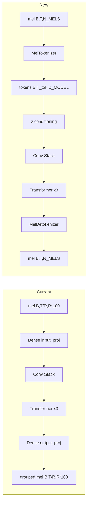

# Design — Learned Continuous Mel Tokens

## Overview

Replace the fixed reduction-factor frame grouping in the mel spectrogram generator with a learned tokenizer/detokenizer architecture. Instead of manually concatenating `R` mel frames into `[B, T/R, R*N_MELS]` tensors, a causal convolutional tokenizer compresses mel spectrograms into a latent token sequence `[B, T_tokens, D_MODEL]`, and a causal convolutional detokenizer reconstructs full-resolution mel output. The transformer and conv stack operate entirely in token space.

This makes the compression learned rather than hand-designed, simplifies the data pipeline (no reshape logic), and creates a cleaner architecture for future extensions.

## Detailed Requirements

Consolidated from requirements clarification (Q1–Q9):

1. **Configurable compression ratio** — default 4x (matching current `REDUCTION_FACTOR`), controlled by a new `TOKEN_COMPRESSION_RATIO` config parameter. The number of strided conv layers and their strides are derived from this value.
2. **Strictly causal tokenizer** — each token depends only on past/current mel frames. Uses causal (left-padded) strided Conv1D layers.
3. **Strictly causal detokenizer** — each output mel frame depends only on current/past tokens. Uses `tf.repeat` upsampling followed by causal Conv1D.
4. **Joint end-to-end training** — tokenizer, transformer, and detokenizer train together with a single MSE reconstruction loss. No separate pre-training phase initially.
5. **Token-space scheduled sampling** — teacher forcing mixing happens in token space. Ground-truth tokens (from tokenizing ground truth mel) are mixed with predicted tokens (transformer output).
6. **Dataset yields raw mel** — `[SEQ_LEN, N_MELS]` sequences with `SEQ_LEN` divisible by compression ratio. No grouping or reshaping in the data pipeline.
7. **LatentEncoder unchanged** — architecture stays the same, receives `[B, T, N_MELS]` input. Docstrings updated.
8. **Clean config removal** — `REDUCTION_FACTOR`, `GROUPED_MEL_DIM`, `EFFECTIVE_SEQ_LEN` removed entirely from `config.py`.
9. **Preserve existing layers** — `TransformerBlock`, `CausalConvBlock`, `CausalConv1D`, `LocalWindowAttention` remain unchanged.

## Architecture Overview



**Data flow (new):**

```
Training:
  input_mel [B, SEQ_LEN, N_MELS]
    → MelTokenizer → [B, SEQ_LEN/C, D_MODEL]     (C = compression ratio)
    → + z_embed
    → CausalConvStack → [B, SEQ_LEN/C, D_MODEL]
    → TransformerBlocks → [B, SEQ_LEN/C, D_MODEL]
    → MelDetokenizer → [B, SEQ_LEN, N_MELS]
    → MSE loss vs target_mel

Generation:
  seed_mel [seed_len, N_MELS]
    → MelTokenizer → [1, seed_tokens, D_MODEL]
    → autoregressive loop:
        context_tokens → conv+transformer → next_token [1, 1, D_MODEL]
        append to context
    → MelDetokenizer(all_tokens) → [num_frames, N_MELS]
```

## Components and Interfaces

### 1. Config Changes (`config.py`)

**Remove:**
- `REDUCTION_FACTOR = 4`
- `EFFECTIVE_SEQ_LEN = SEQ_LEN // REDUCTION_FACTOR`
- `GROUPED_MEL_DIM = N_MELS * REDUCTION_FACTOR`

**Add:**
```python
# Learned tokenizer compression ratio (replaces REDUCTION_FACTOR)
# Controls temporal downsampling: T_tokens = T / TOKEN_COMPRESSION_RATIO
# Implemented as successive stride-2 causal convolutions
# e.g., 4 = two stride-2 layers, 8 = three stride-2 layers
TOKEN_COMPRESSION_RATIO = 4

# Derived: number of stride-2 conv layers in tokenizer/detokenizer
# log2(4) = 2 layers
import math
TOKEN_NUM_CONV_LAYERS = int(math.log2(TOKEN_COMPRESSION_RATIO))

# Token sequence length (replaces EFFECTIVE_SEQ_LEN)
TOKEN_SEQ_LEN = SEQ_LEN // TOKEN_COMPRESSION_RATIO  # 512 // 4 = 128
```

**Update:**
- `WINDOW_SIZES` comment to reference `TOKEN_SEQ_LEN` instead of `REDUCTION_FACTOR`

### 2. MelTokenizer (`model.py`)

Causal strided Conv1D encoder that compresses mel spectrograms to token sequences.

```
Input:  [B, T, N_MELS]
Output: [B, T // TOKEN_COMPRESSION_RATIO, D_MODEL]
```

**Architecture:**
- `TOKEN_NUM_CONV_LAYERS` successive blocks, each:
  - Causal left-padding of `kernel_size - 1` samples
  - `Conv1D(filters, kernel_size=3, stride=2, padding='valid')`
  - `LayerNormalization`
  - `GELU` activation
- Final `Dense(D_MODEL)` projection

Filter progression: `N_MELS → D_MODEL//2 → D_MODEL` (for 2 layers). For deeper stacks, intermediate filters interpolate linearly.

**Causality:** Each strided conv is left-padded with `(kernel_size - 1)` zeros before applying `padding='valid'` with `stride=2`. This ensures token at position `t` only sees mel frames at positions `≤ 2t+1` (the causal receptive field of a stride-2 kernel-3 conv).

### 3. MelDetokenizer (`model.py`)

Causal upsampling decoder that reconstructs mel spectrograms from tokens.

```
Input:  [B, T_tokens, D_MODEL]
Output: [B, T_tokens * TOKEN_COMPRESSION_RATIO, N_MELS]
```

**Architecture:**
- `TOKEN_NUM_CONV_LAYERS` successive blocks, each:
  - `tf.repeat(x, repeats=2, axis=1)` — nearest-neighbor upsample 2x
  - Causal `Conv1D(filters, kernel_size=3)` with left-padding (using `CausalConv1D`)
  - `LayerNormalization`
  - `GELU` activation
- Final `Dense(N_MELS)` projection

Filter progression: `D_MODEL → D_MODEL//2 → N_MELS` (mirrors tokenizer). The final Dense handles the last projection.

**Causality:** `tf.repeat` duplicates each token in-place (no future information). The subsequent `CausalConv1D` (left-padded) ensures each output frame only depends on current/past upsampled values.

### 4. MelGenerator (`model.py`)

Updated forward pass — tokenizer replaces `input_proj`, detokenizer replaces `output_proj`.

```python
class MelGenerator(tf.keras.Model):
    def __init__(self):
        # self.tokenizer = MelTokenizer()
        # self.conv_layers = [CausalConvBlock(...) for d in CONV_DILATION_RATES]  # unchanged
        # self.transformer1/2/3 = TransformerBlock(...)  # unchanged
        # self.detokenizer = MelDetokenizer()
        # self.z_proj = Dense(D_MODEL)  # unchanged

    def call(self, mel, z=None, training=False):
        # mel: [B, T, N_MELS]
        # tokens = self.tokenizer(mel)           # [B, T_tok, D_MODEL]
        # tokens = tokens + z_embed              # latent conditioning in token space
        # tokens = conv_stack(tokens)            # [B, T_tok, D_MODEL]
        # tokens = transformer_stack(tokens)     # [B, T_tok, D_MODEL]
        # output_mel = self.detokenizer(tokens)  # [B, T, N_MELS]
        # return output_mel
```

**Removed:** `self.input_proj`, `self.output_proj`

**Key invariant:** The conv stack and transformers operate on `[B, TOKEN_SEQ_LEN, D_MODEL]` — same shape as before (was `[B, EFFECTIVE_SEQ_LEN, D_MODEL]`). With default compression ratio 4, `TOKEN_SEQ_LEN = 128 = EFFECTIVE_SEQ_LEN`. Window sizes remain compatible.

### 5. MelGenerator.generate()

Autoregressive generation in token space:

```
1. Tokenize seed_mel → seed_tokens [1, seed_tok_len, D_MODEL]
2. Loop for num_token_steps:
   a. Truncate context to TOKEN_SEQ_LEN tokens
   b. Forward pass → get last token prediction
   c. Apply temperature noise
   d. Append to context
3. Detokenize all generated tokens → mel [num_frames, N_MELS]
4. Truncate to exact num_frames
```

**Changes from current:**
- No `REDUCTION_FACTOR` truncation/reshape of seed
- Seed must be divisible by `TOKEN_COMPRESSION_RATIO` (truncate if needed)
- `num_steps = ceil(num_frames / TOKEN_COMPRESSION_RATIO)`
- Autoregression produces one `D_MODEL`-dimensional token per step (not a grouped mel vector)
- Final detokenization converts entire token sequence to mel at once

**Context window:** Sliding window of `TOKEN_SEQ_LEN` tokens (same as current `EFFECTIVE_SEQ_LEN`).

### 6. Updated Training (`train.py`)

#### MelGeneratorTraining changes:

**`_pure_teacher_forcing(x, y)`:**
```
Old:
  preds = model(x)                    # [B, T/R, GROUPED_MEL_DIM]
  reshape to [B, T/R, R, N_MELS]
  MSE on reshaped frames

New:
  preds = model(x)                    # [B, T, N_MELS]
  preds_shifted = preds[:, :-1, :]    # [B, T-1, N_MELS]
  targets_shifted = y[:, 1:, :]       # [B, T-1, N_MELS]
  mel_loss = MSE(preds_shifted, targets_shifted)
```

No reshape. Direct MSE on `[B, T-1, N_MELS]` tensors.

**`_parallel_scheduled_sampling(x, y)`:**

Scheduled sampling now operates in token space:

```
Pass 1 (no gradients):
  gt_tokens = model.tokenizer(x)           # [B, T_tok, D_MODEL]
  preds_pass1 = model(x)                   # [B, T, N_MELS]
  pred_tokens = model.tokenizer(preds_pass1)  # [B, T_tok, D_MODEL]

  # Mix in token space
  use_teacher = random([B, T_tok, 1]) < tf_ratio
  pred_tokens_shifted = concat([gt_tokens[:, :1], pred_tokens[:, :-1]], axis=1)
  mixed_tokens = where(use_teacher, gt_tokens, pred_tokens_shifted)

Pass 2 (with gradients):
  # Run conv+transformer+detokenizer on mixed tokens
  x_mixed = model.detokenizer(mixed_tokens)  # back to mel for encoder
  z, z_mean, z_logvar = latent_encoder(x_mixed)
  
  # Re-tokenize mixed input and run through model core
  tokens = mixed_tokens + z_embed
  tokens = conv_stack(tokens)
  tokens = transformer_stack(tokens)
  preds = model.detokenizer(tokens)          # [B, T, N_MELS]
  
  mel_loss = MSE(preds[:, :-1], y[:, 1:])
```

This requires exposing the model's internal pipeline (tokenizer → core → detokenizer) as callable sub-steps. We add a helper method `MelGenerator.forward_from_tokens(tokens, z, training)` that runs the conv stack, transformers, and detokenizer on pre-tokenized input.

**Shape assertion update:**
```python
# Old
tf.debugging.assert_equal(tf.shape(x)[2], GROUPED_MEL_DIM)
# New
tf.debugging.assert_equal(tf.shape(x)[2], N_MELS)
```

### 7. Dataset Pipeline (`dataset.py`)

**Changes:**
- Remove imports of `REDUCTION_FACTOR`, `GROUPED_MEL_DIM`, `EFFECTIVE_SEQ_LEN`
- Import `TOKEN_COMPRESSION_RATIO` (only for divisibility truncation)
- Generator yields `[SEQ_LEN, N_MELS]` pairs directly — no reshape to grouped frames
- Output signature: `(SEQ_LEN, N_MELS)` instead of `(EFFECTIVE_SEQ_LEN, GROUPED_MEL_DIM)`
- Stride for sequence extraction uses `SEQ_LEN // 2` instead of `EFFECTIVE_SEQ_LEN // 2`

```python
def _generator(self):
    for file_idx in self.file_indices:
        mel = self._load_or_compute_mel(audio_file)
        mel_length = mel.shape[0]

        # Truncate to be divisible by TOKEN_COMPRESSION_RATIO
        truncated_length = mel_length - (mel_length % TOKEN_COMPRESSION_RATIO)
        if truncated_length == 0:
            continue
        mel = mel[:truncated_length]

        if mel.shape[0] <= SEQ_LEN:
            continue

        stride = SEQ_LEN // 2
        for start in range(0, mel.shape[0] - SEQ_LEN, stride):
            input_mel = mel[start:start + SEQ_LEN]       # [SEQ_LEN, N_MELS]
            target_mel = mel[start + 1:start + SEQ_LEN + 1]  # [SEQ_LEN, N_MELS]
            yield input_mel.numpy(), target_mel.numpy()
```

### 8. LatentEncoder (`model.py`)

**No architecture changes.** Update docstring only:

```python
def call(self, mel, training=False):
    """Encode mel sequence to z, z_mean, z_logvar.

    Args:
        mel: [B, T, N_MELS]  (raw mel spectrogram)

    Returns:
        (z, z_mean, z_logvar) each [B, latent_dim]
    """
```

### 9. Inference (`inference.py`)

**MusicGenerationModel.generate()** — no changes needed. It already calls `self.mel_generator.generate(seed_mel, num_frames, ...)` and expects `[num_frames, N_MELS]` output. The internal change from grouped-frame to token autoregression is encapsulated in `MelGenerator.generate()`.

**MusicGenerationModel.from_checkpoints()** — no changes needed. Still instantiates `MelGenerator()` and loads weights.

## Data Models

### Tensor Shapes (default TOKEN_COMPRESSION_RATIO=4, SEQ_LEN=512, N_MELS=100, D_MODEL=256)

| Stage | Old Shape | New Shape |
|-------|-----------|-----------|
| Dataset output | `[B, 128, 400]` | `[B, 512, 100]` |
| After tokenizer | N/A | `[B, 128, 256]` |
| Conv/Transformer | `[B, 128, 256]` | `[B, 128, 256]` (same) |
| After detokenizer | N/A | `[B, 512, 100]` |
| Model output | `[B, 128, 400]` | `[B, 512, 100]` |
| Loss computation | `[B, 127, 4, 100]` reshaped | `[B, 511, 100]` direct |

### Config Parameters

| Parameter | Old | New |
|-----------|-----|-----|
| `REDUCTION_FACTOR` | `4` | removed |
| `GROUPED_MEL_DIM` | `400` | removed |
| `EFFECTIVE_SEQ_LEN` | `128` | removed |
| `TOKEN_COMPRESSION_RATIO` | N/A | `4` (configurable) |
| `TOKEN_NUM_CONV_LAYERS` | N/A | `2` (derived) |
| `TOKEN_SEQ_LEN` | N/A | `128` (derived) |

## Error Handling

- **Non-power-of-2 compression ratio:** `TOKEN_NUM_CONV_LAYERS = int(math.log2(TOKEN_COMPRESSION_RATIO))` — add assertion that `TOKEN_COMPRESSION_RATIO` is a power of 2 in config.
- **Seed too short for tokenizer:** In `generate()`, if seed mel length < `TOKEN_COMPRESSION_RATIO`, pad with zeros (same pattern as current code).
- **Sequence length not divisible:** Dataset truncates; `generate()` truncates seed. Both enforce divisibility before tokenization.
- **Checkpoint incompatibility:** Existing checkpoints trained with grouped frames won't load into the new architecture. The `from_checkpoints` auto-resume should catch `ValueError` and log a warning (already handled in `train.py`).

## Acceptance Criteria

### AC1: Tokenizer produces correct shapes
- **Given** a mel spectrogram batch `[B, T, N_MELS]` where `T` is divisible by `TOKEN_COMPRESSION_RATIO`
- **When** passed through `MelTokenizer`
- **Then** output shape is `[B, T // TOKEN_COMPRESSION_RATIO, D_MODEL]`

### AC2: Detokenizer produces correct shapes
- **Given** a token batch `[B, T_tok, D_MODEL]`
- **When** passed through `MelDetokenizer`
- **Then** output shape is `[B, T_tok * TOKEN_COMPRESSION_RATIO, N_MELS]`

### AC3: Tokenizer is strictly causal
- **Given** two mel inputs identical up to frame `t` but different after
- **When** tokenized
- **Then** tokens at positions `≤ t // TOKEN_COMPRESSION_RATIO` are identical

### AC4: Detokenizer is strictly causal
- **Given** two token sequences identical up to position `k` but different after
- **When** detokenized
- **Then** mel frames at positions `≤ k * TOKEN_COMPRESSION_RATIO + (TOKEN_COMPRESSION_RATIO - 1)` are identical

### AC5: End-to-end forward pass
- **Given** `MelGenerator` with tokenizer/detokenizer
- **When** called with `[B, SEQ_LEN, N_MELS]` input
- **Then** output shape is `[B, SEQ_LEN, N_MELS]`

### AC6: Training runs without error
- **Given** the updated `MelGeneratorTraining` and dataset
- **When** `model.fit()` is called for 1 epoch
- **Then** training completes, loss decreases, checkpoint saves successfully

### AC7: Generation produces correct output
- **Given** a trained `MelGenerator` and seed mel `[seed_len, N_MELS]`
- **When** `generate(seed_mel, num_frames=500)` is called
- **Then** output shape is `[500, N_MELS]`

### AC8: No grouped mel references remain
- **Given** the refactored codebase
- **When** searching for `GROUPED_MEL_DIM`, `REDUCTION_FACTOR`, or grouped reshape logic
- **Then** zero matches found

### AC9: Configurable compression ratio
- **Given** `TOKEN_COMPRESSION_RATIO = 8` in config
- **When** model is instantiated and trained
- **Then** tokenizer uses 3 stride-2 layers, token sequence is `SEQ_LEN // 8`, training succeeds

### AC10: Scheduled sampling in token space
- **Given** `tf_ratio < 0.99` during training
- **When** `_parallel_scheduled_sampling` runs
- **Then** mixing occurs in token space `[B, T_tok, D_MODEL]`, not mel space

## Testing Strategy

- **Unit tests:** Verify `MelTokenizer` and `MelDetokenizer` output shapes for various compression ratios (1, 2, 4, 8)
- **Causality tests:** Feed two inputs that diverge at frame `t`, verify outputs match before the causal boundary
- **Round-trip test:** `detokenizer(tokenizer(mel))` produces same shape as input (not necessarily same values — it's learned)
- **Integration test:** Full forward pass through `MelGenerator` with random input, verify output shape
- **Training smoke test:** Run 5 training steps, verify loss is finite and decreasing
- **Generation test:** Run `generate()` with a random seed, verify output shape and no NaN values
- **Config test:** Instantiate model with `TOKEN_COMPRESSION_RATIO=8`, verify all shapes are consistent

## Appendices

### A. Technology Choices

- **Causal strided Conv1D:** Reuses the existing `CausalConv1D` pattern (left-padding + valid conv) but adds stride parameter. Proven pattern already in the codebase.
- **`tf.repeat` upsampling:** Chosen over `Conv1DTranspose` to avoid checkerboard artifacts and causal padding complexity. `tf.repeat(x, repeats=2, axis=1)` is a clean nearest-neighbor upsample.
- **Joint training:** Chosen over pre-training for simplicity. The tokenizer learns representations optimized for the downstream transformer, not just reconstruction.

### B. Files Modified

| File | Change |
|------|--------|
| `config.py` | Remove `REDUCTION_FACTOR`, `GROUPED_MEL_DIM`, `EFFECTIVE_SEQ_LEN`. Add `TOKEN_COMPRESSION_RATIO`, `TOKEN_NUM_CONV_LAYERS`, `TOKEN_SEQ_LEN`. |
| `model.py` | Add `MelTokenizer`, `MelDetokenizer`. Rewrite `MelGenerator.__init__`, `call`, `generate`. Add `forward_from_tokens` helper. Update `LatentEncoder` docstring. |
| `train.py` | Remove grouped-frame reshape in loss. Update scheduled sampling to token space. Update shape assertions. Remove `GROUPED_MEL_DIM` import. |
| `dataset.py` | Remove grouped-frame reshape. Yield `[SEQ_LEN, N_MELS]` pairs. Update output signature. |
| `inference.py` | No changes (API is encapsulated). |
| `layers.py` | No changes. |

### C. Alternative Approaches Considered

1. **Discrete tokenization (VQ-VAE style):** Would enable codebook-based generation but adds complexity (commitment loss, codebook collapse). Explicitly excluded per requirements.
2. **Conv1DTranspose for detokenizer:** Simpler code but checkerboard artifacts and causal padding issues in TF. Rejected in favor of `tf.repeat` + Conv1D.
3. **Non-causal tokenizer:** Would allow symmetric receptive fields but breaks the strict causality invariant. Rejected.
4. **Pre-trained tokenizer:** Better token quality but adds a training phase. Deferred — can be added later if joint training produces poor tokens.
