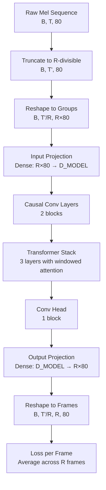

# Mel Frame Reduction Factor - Detailed Design

## Overview

This design implements a **reduction factor** (R) for the mel spectrogram generator, enabling the model to predict multiple consecutive mel frames per autoregressive step instead of a single frame. This technique reduces sequence length, accelerates training, improves convergence stability, and decreases error accumulation during generation.

The implementation modifies the model architecture, dataset pipeline, training loop, and inference generation to operate on grouped frames while maintaining consistency between input and output representations.

## Detailed Requirements

### Core Requirements

1. **Configurable Reduction Factor**: Add `REDUCTION_FACTOR` parameter to `config.py` with default value R=4
2. **Dataset Preprocessing**: Truncate mel sequences to be evenly divisible by R (discard remainder frames)
3. **Model Architecture**: Update both input embedding and output projection layers to handle R×N_MELS dimensions
4. **Teacher Forcing**: Feed R ground truth frames at each training step (consistent with reduction factor)
5. **Inference Generation**: Use all R predicted frames as context for next prediction
6. **Loss Computation**: Compute loss independently for each of the R frames and average
7. **Validation Metrics**: Compute metrics on grouped frames (matches training representation)
8. **No Backward Compatibility**: Require retraining from scratch (no checkpoint conversion)
9. **No Error Handling**: Allow any positive integer for R; let TensorFlow handle dimension errors
10. **Minimal Documentation**: Inline code comments only

### Technical Constraints

- Maintain causal structure throughout the model
- Preserve existing teacher forcing schedule (exponential decay)
- Keep memory footprint manageable (reduced sequence length helps)
- Support both training and inference modes

## Architecture Overview



### Data Flow

**Training:**
```
Input:  [B, T, 80] → Truncate → [B, T', 80] where T' = (T // R) * R
        → Reshape → [B, T'/R, R*80]
        → Model → [B, T'/R, R*80]
        → Reshape → [B, T'/R, R, 80]
Target: Same transformation applied to ground truth
Loss:   Computed per frame, averaged across R frames
```

**Inference:**
```
Context: [context_len, 80] → Reshape → [context_len/R, R*80]
         → Model → [1, R*80]
         → Reshape → [R, 80]
         → Append all R frames to context
         → Repeat
```

## Components and Interfaces

### 1. Configuration (`config.py`)

**New Parameter:**
```python
# Reduction factor for multi-frame prediction
# R=1: predict single frame (original behavior)
# R=4: predict 4 frames per step (4x speedup, default)
REDUCTION_FACTOR = 4
```

**Derived Values:**
```python
# Effective sequence length after grouping
EFFECTIVE_SEQ_LEN = SEQ_LEN // REDUCTION_FACTOR  # 512 // 4 = 128

# Grouped mel dimension
GROUPED_MEL_DIM = N_MELS * REDUCTION_FACTOR  # 80 * 4 = 320
```

### 2. Dataset Pipeline (`dataset.py`)

**Modifications:**

**Function: `_prepare_sequence(mel)`**
- Truncate mel to be divisible by R: `mel = mel[:len(mel) - (len(mel) % R)]`
- Reshape to grouped frames: `[T, 80] → [T/R, R*80]`
- Create input/target pairs with 1-step offset

**Function: `create_dataset()`**
- Apply truncation and reshaping in the pipeline
- Update sequence length validation to use `EFFECTIVE_SEQ_LEN`

### 3. Model Architecture (`model.py`)

**Class: `MelGenerator`**

**Modified Layers:**

```python
# Input projection: R*N_MELS → D_MODEL
self.input_proj = tf.keras.layers.Dense(D_MODEL)

# Output projection: D_MODEL → R*N_MELS
self.output_proj = tf.keras.layers.Dense(GROUPED_MEL_DIM)
```

**Method: `call(mel, training=False)`**
- Input shape: `[B, T/R, R*80]`
- Output shape: `[B, T/R, R*80]`
- No changes to internal transformer/conv processing

**Method: `generate(seed_mel, num_frames, ...)`**
- Input `seed_mel`: `[seed_len, 80]` (individual frames)
- Reshape seed to grouped format: `[seed_len/R, R*80]`
- Each generation step produces R frames
- Reshape output back to individual frames: `[num_frames, 80]`
- Update context with all R predicted frames

**Implementation Details:**
```python
def generate(self, seed_mel, num_frames, temperature=1.0, top_p=0.9):
    """Generate num_frames individual mel frames.
    
    Args:
        seed_mel: [seed_len, 80] - individual frames
        num_frames: Total individual frames to generate
    
    Returns:
        [num_frames, 80] - individual frames
    """
    # Truncate seed to be divisible by R
    seed_len = seed_mel.shape[0]
    truncated_len = (seed_len // REDUCTION_FACTOR) * REDUCTION_FACTOR
    seed_mel = seed_mel[:truncated_len]
    
    # Reshape seed to grouped format: [seed_len/R, R*80]
    grouped_seed = tf.reshape(seed_mel, [-1, GROUPED_MEL_DIM])
    context = grouped_seed
    
    # Calculate number of generation steps (each produces R frames)
    num_steps = (num_frames + REDUCTION_FACTOR - 1) // REDUCTION_FACTOR
    
    generated = []
    for _ in range(num_steps):
        # Keep last EFFECTIVE_SEQ_LEN grouped frames
        if context.shape[0] > EFFECTIVE_SEQ_LEN:
            context = context[-EFFECTIVE_SEQ_LEN:]
        
        # Forward pass: [1, T/R, R*80] → [1, T/R, R*80]
        context_batch = tf.expand_dims(context, 0)
        output = self(context_batch, training=False)
        next_grouped = output[0, -1, :]  # [R*80]
        
        # Temperature scaling
        if temperature > 0.0:
            noise = tf.random.normal(tf.shape(next_grouped)) * temperature * 0.1
            next_grouped = next_grouped + noise
        
        # Append to context
        context = tf.concat([context, tf.expand_dims(next_grouped, 0)], axis=0)
        generated.append(next_grouped)
    
    # Reshape to individual frames: [num_steps, R*80] → [num_steps*R, 80]
    generated = tf.stack(generated, axis=0)  # [num_steps, R*80]
    generated = tf.reshape(generated, [-1, N_MELS])  # [num_steps*R, 80]
    
    # Truncate to exact num_frames
    return generated[:num_frames]
```

### 4. Training (`train.py`)

**Class: `MelGeneratorTraining`**

**Method: `train_step(data)`**
- Input/target shapes: `[B, T/R, R*80]`
- Forward pass produces: `[B, T/R, R*80]`
- Reshape predictions and targets for loss: `[B, T/R, R, 80]`
- Compute loss per frame, average across R dimension

**Loss Computation:**
```python
def train_step(self, data):
    input_mel, target_mel = data  # Both [B, T/R, R*80]
    
    with tf.GradientTape() as tape:
        # Forward pass
        pred_mel = self(input_mel, training=True)  # [B, T/R, R*80]
        
        # Reshape for per-frame loss
        # [B, T/R, R*80] → [B, T/R, R, 80]
        pred_frames = tf.reshape(pred_mel, [-1, EFFECTIVE_SEQ_LEN, REDUCTION_FACTOR, N_MELS])
        target_frames = tf.reshape(target_mel, [-1, EFFECTIVE_SEQ_LEN, REDUCTION_FACTOR, N_MELS])
        
        # Compute MSE per frame, average across R frames
        frame_losses = tf.reduce_mean(tf.square(pred_frames - target_frames), axis=-1)  # [B, T/R, R]
        loss = tf.reduce_mean(frame_losses)  # Average across all dimensions
    
    # Gradient update
    gradients = tape.gradient(loss, self.trainable_variables)
    self.optimizer.apply_gradients(zip(gradients, self.trainable_variables))
    
    # Update teacher forcing ratio
    self.update_tf_ratio()
    
    return {"loss": loss, "tf_ratio": self.tf_ratio}
```

**Teacher Forcing:**
- No changes to schedule logic (exponential decay remains)
- Input/target pairs naturally use R frames per step due to reshaping
- Model sees R ground truth frames at each position during training

### 5. Inference (`inference.py`)

**Class: `MusicGenerationModel`**

**Method: `generate(seed_mel, num_frames)`**
- Accepts seed as individual frames: `[seed_len, 80]`
- Calls `model.generate()` which handles grouping internally
- Returns individual frames: `[num_frames, 80]`
- No changes needed (model handles reshaping)

## Data Models

### Mel Spectrogram Representations

**Individual Frames (External API):**
```
Shape: [T, 80]
Used in: Audio loading, vocoder input, user-facing APIs
```

**Grouped Frames (Internal Model):**
```
Shape: [T/R, R*80]
Used in: Model forward pass, training, internal generation
```

**Conversion:**
```python
# Individual → Grouped
grouped = tf.reshape(individual, [-1, REDUCTION_FACTOR * N_MELS])

# Grouped → Individual
individual = tf.reshape(grouped, [-1, N_MELS])
```

## Error Handling

**No explicit error handling for invalid R values.** TensorFlow will raise dimension mismatch errors if:
- R is not a positive integer
- Sequence lengths are incompatible
- Model dimensions don't align

Users must ensure R is configured correctly before training.

## Acceptance Criteria

### Given a configured reduction factor R=4
**When** training the model on MusicNet dataset  
**Then** the effective sequence length should be 128 (512/4)  
**And** each training step should process 4 frames per position  
**And** training should converge faster than R=1 baseline

### Given a trained model with R=4
**When** generating 500 frames autoregressively  
**Then** the model should produce 125 generation steps (500/4)  
**And** each step should predict 4 consecutive frames  
**And** all 4 frames should be appended to context for next prediction

### Given a mel sequence of length 515
**When** preprocessing for R=4  
**Then** the sequence should be truncated to 512 frames  
**And** reshaped to [128, 320] for model input

### Given predictions and targets of shape [B, T/R, R*80]
**When** computing loss  
**Then** loss should be computed independently for each of R frames  
**And** averaged across all frames and batch

### Given a seed mel of 100 frames
**When** generating with R=4  
**Then** seed should be truncated to 96 frames (divisible by 4)  
**And** reshaped to [24, 320] for model context

## Testing Strategy

### Unit Tests

**Test: `test_reduction_factor_config`**
- Verify `REDUCTION_FACTOR` is defined in config
- Verify `GROUPED_MEL_DIM = N_MELS * REDUCTION_FACTOR`
- Verify `EFFECTIVE_SEQ_LEN = SEQ_LEN // REDUCTION_FACTOR`

**Test: `test_dataset_truncation`**
- Input: mel of length 515, R=4
- Expected: truncated to 512
- Verify no padding is added

**Test: `test_dataset_reshaping`**
- Input: mel of shape [512, 80], R=4
- Expected: reshaped to [128, 320]
- Verify values are preserved (flatten and compare)

**Test: `test_model_input_projection`**
- Input: [B, T/R, R*80]
- Expected: output shape [B, T/R, D_MODEL]
- Verify layer accepts GROUPED_MEL_DIM input

**Test: `test_model_output_projection`**
- Input: [B, T/R, D_MODEL]
- Expected: output shape [B, T/R, R*80]
- Verify layer produces GROUPED_MEL_DIM output

**Test: `test_model_forward_pass`**
- Input: [4, 128, 320] (B=4, T/R=128, R*80=320)
- Expected: output shape [4, 128, 320]
- Verify no shape errors

**Test: `test_loss_computation`**
- Input: pred [2, 128, 320], target [2, 128, 320]
- Reshape to [2, 128, 4, 80]
- Compute per-frame MSE, average
- Verify loss is scalar

**Test: `test_generation_seed_truncation`**
- Input: seed of 100 frames, R=4
- Expected: truncated to 96 frames
- Verify context shape [24, 320]

**Test: `test_generation_output_shape`**
- Input: seed [96, 80], num_frames=500, R=4
- Expected: output [500, 80]
- Verify 125 generation steps internally

**Test: `test_generation_context_update`**
- Generate 1 step with R=4
- Verify 4 frames are appended to context
- Verify context shape increases by 1 grouped frame

## Appendices

### A. Technology Choices

**TensorFlow/Keras:**
- Native support for dynamic reshaping via `tf.reshape`
- Efficient tensor operations for grouped processing
- Existing codebase uses TensorFlow 2.13+

**Reduction Factor R=4:**
- Balances speedup (4x) with prediction difficulty
- Common in speech synthesis (Tacotron2 uses R=2-5)
- Reduces 512-frame sequence to 128 tokens (manageable for transformer)

### B. Research Findings

**Tacotron2 Reduction Factor:**
- Uses R=2 or R=3 for speech synthesis
- Predicts multiple mel frames per decoder step
- Improves training stability and convergence speed

**Transformer Sequence Length:**
- Shorter sequences reduce quadratic attention complexity
- 128 tokens (vs 512) = 16x reduction in attention compute
- Enables larger batch sizes or deeper models

**Frame Grouping Trade-offs:**
- Larger R: faster training, less fine-grained control
- Smaller R: slower training, more precise predictions
- R=4 is a practical middle ground for music generation

### C. Alternative Approaches

**1. Padding Instead of Truncation**
- Pad sequences to be divisible by R
- Pros: No data loss
- Cons: Padding affects loss computation, requires masking
- Rejected: Truncation is simpler and data loss is minimal

**2. Asymmetric Input/Output**
- Keep input as single frames, predict R frames
- Pros: Simpler input processing
- Cons: Inconsistent representations, harder to reason about
- Rejected: Consistency is more important

**3. Hierarchical Prediction**
- Predict coarse features first, then refine
- Pros: Potentially better quality
- Cons: Much more complex, requires multiple models
- Rejected: Too complex for initial implementation

**4. Dynamic Reduction Factor**
- Vary R during training or based on content
- Pros: Adaptive to different musical contexts
- Cons: Complex scheduling, unclear benefits
- Rejected: Fixed R is simpler and sufficient

### D. Implementation Notes

**Memory Impact:**
- Sequence length: 512 → 128 (4x reduction)
- Attention memory: O(T²) → O((T/4)²) = 16x reduction
- Feature dimension: 80 → 320 (4x increase)
- Net memory savings in attention layers

**Backward Compatibility:**
- Models trained with different R values are incompatible
- Checkpoint format remains the same (layer names unchanged)
- Users must retrain from scratch when changing R

**Hyperparameter Tuning:**
- Learning rate may need adjustment (shorter sequences = different dynamics)
- Teacher forcing schedule may converge faster
- Batch size can potentially be increased due to memory savings
