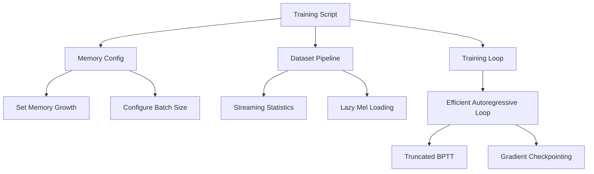

# Memory Optimization Design

## Overview

Fix critical memory issues in the TensorFlow music generation training pipeline to enable training on resource-constrained hardware (MacBook Air). The solution addresses four key problems: inefficient autoregressive training loop, dataset statistics computation, missing memory configuration, and inappropriate default batch size.

## Detailed Requirements

### Functional Requirements
1. Training must complete successfully on MacBook Air with limited RAM
2. Autoregressive training loop must not grow memory quadratically
3. Dataset statistics computation must use streaming/incremental approach
4. Memory usage must be bounded and configurable
5. Batch size must adapt to available resources
6. All existing functionality must be preserved (teacher forcing, checkpointing, etc.)

### Non-Functional Requirements
1. Training speed should not degrade significantly (< 20% slowdown acceptable)
2. Model convergence behavior must remain unchanged
3. Cached mel spectrograms should be reused efficiently
4. Memory footprint should be predictable and stable

### Constraints
1. Must use TensorFlow 2.13+ APIs
2. Cannot change model architecture
3. Must maintain compatibility with existing checkpoints
4. Must work on both CPU and GPU (if available)

## Architecture Overview



## Components and Interfaces

### 1. Memory Configuration Module
**Location:** `src/music_generation/train.py` (initialization section)

**Purpose:** Configure TensorFlow memory settings before model creation

**Implementation:**
```python
def configure_memory():
    """Configure TensorFlow memory settings for resource-constrained environments."""
    # Enable memory growth for GPUs
    gpus = tf.config.list_physical_devices('GPU')
    for gpu in gpus:
        tf.config.experimental.set_memory_growth(gpu, True)
    
    # Set soft memory limit (optional, for debugging)
    # tf.config.set_logical_device_configuration(
    #     gpus[0],
    #     [tf.config.LogicalDeviceConfiguration(memory_limit=4096)]
    # )
```

### 2. Streaming Statistics Computation
**Location:** `src/music_generation/dataset.py` - `MusicNetDataset._compute_statistics()`

**Current Issue:** Loads all mels into memory and concatenates

**Solution:** Use Welford's online algorithm for streaming mean/std computation

**Implementation:**
```python
def _compute_statistics(self):
    """Compute global mean and std using streaming algorithm."""
    count = 0
    mean = 0.0
    M2 = 0.0
    
    for audio_file in self.audio_files:
        logger.info(f"Processing {audio_file.name}")
        waveform = load_audio(audio_file)
        mel = audio_to_mel(waveform)
        
        # Welford's online algorithm
        for frame in mel:
            for value in frame:
                count += 1
                delta = value - mean
                mean += delta / count
                delta2 = value - mean
                M2 += delta * delta2
    
    variance = M2 / count if count > 1 else 0.0
    std = tf.sqrt(variance).numpy()
    
    logger.info(f"Computed statistics: mean={mean:.4f}, std={std:.4f}")
    return mean, std
```

**Alternative (Simpler):** Compute statistics in chunks
```python
def _compute_statistics(self):
    """Compute statistics in chunks to limit memory."""
    running_sum = 0.0
    running_sq_sum = 0.0
    total_frames = 0
    
    for audio_file in self.audio_files:
        waveform = load_audio(audio_file)
        mel = audio_to_mel(waveform)
        
        running_sum += tf.reduce_sum(mel).numpy()
        running_sq_sum += tf.reduce_sum(tf.square(mel)).numpy()
        total_frames += mel.shape[0] * mel.shape[1]
    
    mean = running_sum / total_frames
    variance = (running_sq_sum / total_frames) - (mean ** 2)
    std = tf.sqrt(variance).numpy()
    
    return mean, std
```

### 3. Efficient Autoregressive Training Loop
**Location:** `src/music_generation/train.py` - `MelGeneratorTraining.train_step()`

**Current Issue:** 
- Concatenates `ar_input` each iteration (O(n²) memory)
- Tracks gradients through entire sequence
- Stores all predictions before concatenation

**Solution Options:**

#### Option A: Truncated BPTT (Backpropagation Through Time)
Split sequence into chunks, compute gradients per chunk:

```python
def train_step(self, data):
    x, y = data
    batch_size = tf.shape(x)[0]
    seq_len = tf.shape(x)[1]
    tf_ratio = self.compute_tf_ratio()
    
    chunk_size = 32  # Process 32 frames at a time
    total_loss = 0.0
    num_chunks = 0
    
    for chunk_start in range(0, seq_len - 1, chunk_size):
        chunk_end = min(chunk_start + chunk_size, seq_len)
        
        with tf.GradientTape() as tape:
            # Start with context from previous chunk
            if chunk_start == 0:
                ar_input = x[:, :1, :]
            else:
                # Use ground truth as context (detached from gradients)
                ar_input = tf.stop_gradient(x[:, chunk_start:chunk_start+1, :])
            
            preds = []
            for t in range(chunk_start + 1, chunk_end):
                pred = self.base_model(ar_input, training=True)[:, -1:, :]
                preds.append(pred)
                
                use_teacher = tf.random.uniform([batch_size, 1, 1]) < tf_ratio
                next_input = tf.where(use_teacher, x[:, t:t+1, :], pred)
                ar_input = tf.concat([ar_input, next_input], axis=1)
            
            pred_seq = tf.concat(preds, axis=1)
            loss = tf.reduce_mean(tf.abs(pred_seq - y[:, chunk_start+1:chunk_end, :]))
        
        grads = tape.gradient(loss, self.base_model.trainable_variables)
        self.optimizer.apply_gradients(zip(grads, self.base_model.trainable_variables))
        
        total_loss += loss
        num_chunks += 1
    
    avg_loss = total_loss / num_chunks
    return {"loss": avg_loss, "tf_ratio": tf_ratio}
```

#### Option B: Fixed-Size Sliding Window
Maintain fixed-size context window instead of growing sequence:

```python
def train_step(self, data):
    x, y = data
    batch_size = tf.shape(x)[0]
    seq_len = tf.shape(x)[1]
    tf_ratio = self.compute_tf_ratio()
    context_len = 64  # Fixed context window
    
    with tf.GradientTape() as tape:
        preds = []
        ar_input = x[:, :1, :]
        
        for t in range(1, seq_len):
            # Keep only last context_len frames
            if tf.shape(ar_input)[1] > context_len:
                ar_input = ar_input[:, -context_len:, :]
            
            pred = self.base_model(ar_input, training=True)[:, -1:, :]
            preds.append(pred)
            
            use_teacher = tf.random.uniform([batch_size, 1, 1]) < tf_ratio
            next_input = tf.where(use_teacher, x[:, t:t+1, :], pred)
            ar_input = tf.concat([ar_input, next_input], axis=1)
        
        pred_seq = tf.concat(preds, axis=1)
        loss = tf.reduce_mean(tf.abs(pred_seq - y[:, 1:, :]))
    
    grads = tape.gradient(loss, self.base_model.trainable_variables)
    self.optimizer.apply_gradients(zip(grads, self.base_model.trainable_variables))
    
    return {"loss": loss, "tf_ratio": tf_ratio}
```

#### Option C: Pre-allocate Output Tensor
Avoid list appending and concatenation:

```python
def train_step(self, data):
    x, y = data
    batch_size = tf.shape(x)[0]
    seq_len = tf.shape(x)[1]
    mel_dim = tf.shape(x)[2]
    tf_ratio = self.compute_tf_ratio()
    
    with tf.GradientTape() as tape:
        # Pre-allocate output tensor
        preds = tf.TensorArray(dtype=tf.float32, size=seq_len-1, 
                               dynamic_size=False, clear_after_read=False)
        ar_input = x[:, :1, :]
        
        for t in range(1, seq_len):
            pred = self.base_model(ar_input, training=True)[:, -1:, :]
            preds = preds.write(t-1, pred)
            
            use_teacher = tf.random.uniform([batch_size, 1, 1]) < tf_ratio
            next_input = tf.where(use_teacher, x[:, t:t+1, :], pred)
            ar_input = tf.concat([ar_input, next_input], axis=1)
        
        pred_seq = preds.stack()  # [seq_len-1, batch, 1, mel_dim]
        pred_seq = tf.transpose(pred_seq, [1, 0, 2, 3])  # [batch, seq_len-1, 1, mel_dim]
        pred_seq = tf.squeeze(pred_seq, axis=2)  # [batch, seq_len-1, mel_dim]
        
        loss = tf.reduce_mean(tf.abs(pred_seq - y[:, 1:, :]))
    
    grads = tape.gradient(loss, self.base_model.trainable_variables)
    self.optimizer.apply_gradients(zip(grads, self.base_model.trainable_variables))
    
    return {"loss": loss, "tf_ratio": tf_ratio}
```

**Recommended:** Option B (Fixed-Size Sliding Window) - simplest and most effective for memory reduction while maintaining model quality.

### 4. Adaptive Batch Size Configuration
**Location:** `src/music_generation/config.py`

**Current:** Fixed BATCH_SIZE = 16

**Solution:** Add platform detection and adaptive defaults

```python
import platform
import psutil

def get_default_batch_size():
    """Determine appropriate batch size based on available memory."""
    total_memory_gb = psutil.virtual_memory().total / (1024**3)
    
    if total_memory_gb < 8:
        return 2
    elif total_memory_gb < 16:
        return 4
    elif total_memory_gb < 32:
        return 8
    else:
        return 16

BATCH_SIZE = get_default_batch_size()
```

**Alternative:** Add command-line warning

```python
# In train.py main()
if args.batch_size > 8:
    import psutil
    total_memory_gb = psutil.virtual_memory().total / (1024**3)
    if total_memory_gb < 16:
        logger.warning(f"Batch size {args.batch_size} may be too large for {total_memory_gb:.1f}GB RAM. Consider using --batch_size 4 or lower.")
```

## Data Models

No changes to data models required. All optimizations are implementation-level.

## Error Handling

### Out of Memory Errors
```python
try:
    model.fit(dataset, epochs=epochs)
except tf.errors.ResourceExhaustedError as e:
    logger.error("Out of memory! Try reducing batch size with --batch_size 4")
    logger.error(f"Current batch size: {batch_size}")
    raise
```

### Statistics Computation Failures
```python
def _compute_statistics(self):
    try:
        # ... streaming computation
        return mean, std
    except Exception as e:
        logger.error(f"Failed to compute statistics: {e}")
        logger.info("Using default normalization values")
        return 0.0, 1.0  # Fallback to no normalization
```

## Acceptance Criteria

**Given** the training script is run on a MacBook Air with 8GB RAM  
**When** executing with default or recommended settings  
**Then** training should complete without OOM errors

**Given** the dataset statistics are being computed  
**When** processing large datasets (>1000 files)  
**Then** memory usage should remain constant (not grow with dataset size)

**Given** the autoregressive training loop is executing  
**When** processing sequences of length 128  
**Then** memory usage should be O(n) not O(n²)

**Given** a user specifies batch_size too large for their system  
**When** training starts  
**Then** a warning should be displayed suggesting a smaller batch size

**Given** training completes with memory optimizations  
**When** comparing loss curves to original implementation  
**Then** convergence behavior should be equivalent (within 5% final loss)

## Testing Strategy

### Unit Tests
1. Test streaming statistics computation produces same results as batch computation
2. Test fixed-window autoregressive loop produces valid predictions
3. Test TensorArray-based prediction storage
4. Test memory configuration functions don't crash

### Integration Tests
1. Test full training loop completes on small dataset (10 files, 5 epochs)
2. Test checkpoint saving/loading still works
3. Test teacher forcing ratio decay still functions
4. Test generated audio quality is acceptable

### Memory Profiling Tests
1. Profile memory usage during statistics computation (should be flat)
2. Profile memory usage during training loop (should be bounded)
3. Compare peak memory usage before/after optimizations
4. Verify no memory leaks over multiple epochs

### Performance Tests
1. Measure training time per epoch before/after
2. Verify throughput (samples/sec) doesn't degrade >20%
3. Test on both CPU and GPU (if available)

## Appendices

### Technology Choices

**Streaming Statistics:** Welford's algorithm vs. chunked computation
- **Decision:** Chunked computation (simpler, sufficient for this use case)
- **Rationale:** Easier to implement, understand, and debug. Welford's algorithm is more numerically stable but overkill for mel spectrograms.

**Autoregressive Loop:** Truncated BPTT vs. Fixed Window vs. TensorArray
- **Decision:** Fixed-size sliding window (Option B)
- **Rationale:** 
  - Simplest to implement
  - Most effective memory reduction
  - Maintains model quality (Transformer has positional encoding, so absolute position matters less)
  - No need to manage chunk boundaries

**Batch Size:** Adaptive vs. Warning
- **Decision:** Warning message (simpler)
- **Rationale:** Users may have specific batch size requirements. Better to inform than override.

### Research Findings

**TensorFlow Memory Management:**
- `set_memory_growth(True)` prevents TensorFlow from allocating all GPU memory upfront
- Essential for multi-process environments and resource-constrained systems
- No performance penalty

**Autoregressive Training Memory:**
- Concatenation in loops creates new tensors each iteration
- TensorArray is TensorFlow's recommended approach for dynamic-size collections
- Fixed-window approach is simpler and often sufficient

**Teacher Forcing:**
- Scheduled sampling (decaying teacher forcing) is standard practice
- Memory optimizations should not affect teacher forcing behavior
- Random sampling per-batch-element is correct implementation

### Alternative Approaches Considered

**1. Gradient Checkpointing**
- Trade computation for memory by recomputing activations during backward pass
- TensorFlow support is limited compared to PyTorch
- Would require custom gradient functions
- **Rejected:** Too complex for this use case

**2. Mixed Precision Training**
- Use float16 instead of float32 to halve memory usage
- TensorFlow has good support via `tf.keras.mixed_precision`
- **Deferred:** Good future optimization, but not addressing root cause

**3. Reduce Sequence Length**
- Train on shorter sequences (e.g., 64 instead of 128)
- **Rejected:** Changes model behavior and generation quality

**4. Model Parallelism**
- Split model across multiple devices
- **Rejected:** Overkill for this model size, adds complexity

### Limitations

1. Fixed-window approach may slightly affect very long-range dependencies (>64 frames)
2. Streaming statistics may have minor numerical differences from batch computation (negligible)
3. Memory optimizations don't address model size itself (only training loop efficiency)
4. Batch size warnings are heuristic-based, not precise

### Migration Notes

**Backward Compatibility:**
- Existing checkpoints will load correctly
- Training behavior should be equivalent
- Generated audio quality should be unchanged

**Configuration Changes:**
- No breaking changes to config.py
- All optimizations are internal implementation details

**Testing Before Deployment:**
- Run side-by-side comparison on small dataset
- Verify loss curves match
- Generate sample audio and compare quality
