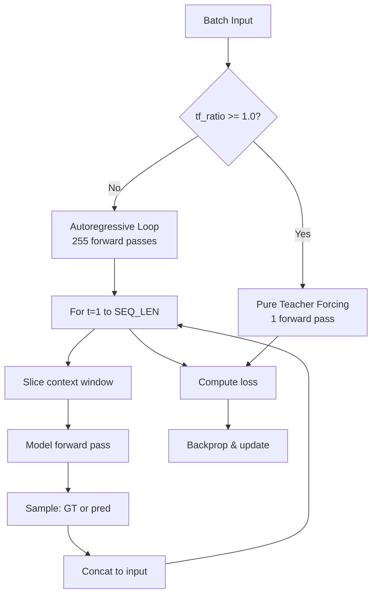
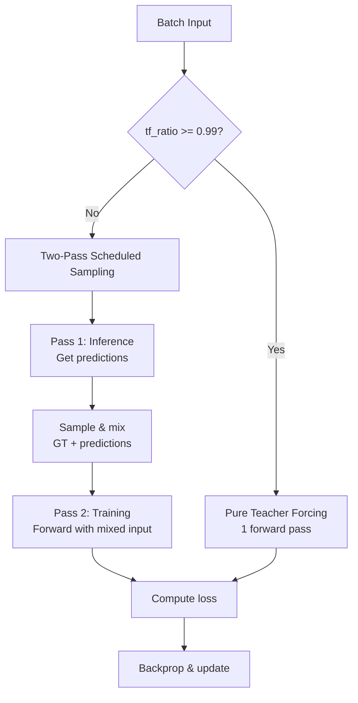

# Design: Parallel Autoregressive Training for Mel Spectrogram Generator

## Overview

Refactor the mel spectrogram generator training pipeline to use parallel autoregressive training with causal masking instead of sequential O(T) forward passes. This eliminates the inefficient timestep loop while preserving autoregressive semantics and teacher forcing behavior.

## Detailed Requirements

### Functional Requirements

**FR1: Parallel Training**
- Process entire sequences in a single (or two) forward pass(es)
- Eliminate the O(T) timestep loop in `autoregressive_training()`
- Maintain exact autoregressive dependency structure (position t depends only on positions < t)

**FR2: Teacher Forcing Compatibility**
- Support pure teacher forcing (tf_ratio = 1.0) with single forward pass
- Support scheduled sampling (tf_ratio < 1.0) with two-pass parallel scheduled sampling
- Preserve existing exponential decay schedule for tf_ratio

**FR3: Loss Computation**
- Maintain shifted next-frame prediction: `preds[:, :-1, :] vs targets[:, 1:, :]`
- Use same L1 loss function
- Ensure numerically equivalent results to current implementation

**FR4: Backward Compatibility**
- No changes to model architecture (MelGenerator, layers)
- Checkpoint compatibility maintained
- Same hyperparameters and configuration

### Non-Functional Requirements

**NFR1: Performance**
- Target: 50-100x speedup in training time
- Reduce forward passes from O(T) to O(1)
- Enable larger batch sizes (4 → 64 on 16GB RAM)

**NFR2: Memory Efficiency**
- Reduce peak memory usage by ~200x
- Support full sequences in memory without OOM
- Remove growing tensor concatenations

**NFR3: Training Stability**
- Maintain or improve gradient stability
- Preserve convergence characteristics
- No degradation in final model quality

**NFR4: Code Quality**
- Remove complex loop logic
- Simplify train_step implementation
- Maintain readability and debuggability

## Architecture Overview

### Current Architecture (Inefficient)



### Proposed Architecture (Efficient)



## Components and Interfaces

### Component 1: MelGeneratorTraining.train_step()

**Current Interface:**
```python
def train_step(self, data):
    """
    Args:
        data: Tuple of (x, y) where x and y are [batch, seq_len, mel_dim]
    
    Returns:
        dict: {"loss": scalar, "grad_norm": scalar, "tf_ratio": scalar}
    """
```

**Refactored Implementation:**

```python
def train_step(self, data):
    self.update_tf_ratio()
    x, y = data
    
    # Choose training path based on tf_ratio
    if self.tf_ratio >= 0.99:
        return self._pure_teacher_forcing(x, y)
    else:
        return self._parallel_scheduled_sampling(x, y)
```

### Component 2: Pure Teacher Forcing (Unchanged)

**Method:** `_pure_teacher_forcing(x, y)`

**Algorithm:**
```
1. Forward pass: preds = model(x, training=True)
2. Compute loss: L1(preds[:, :-1, :], y[:, 1:, :])
3. Backprop and update
4. Return metrics
```

**Complexity:** O(1) forward pass

**Status:** Already optimal, no changes needed

### Component 3: Parallel Scheduled Sampling (New)

**Method:** `_parallel_scheduled_sampling(x, y)`

**Algorithm:**
```
1. Pass 1 (Inference): preds_pass1 = model(x, training=False)
2. Create sampling mask: use_teacher ~ Bernoulli(tf_ratio) per position
3. Shift predictions: preds_shifted = concat([x[:, :1, :], preds_pass1[:, :-1, :]])
4. Mix inputs: mixed = where(use_teacher, x, preds_shifted)
5. Pass 2 (Training): preds_pass2 = model(mixed, training=True)
6. Compute loss: L1(preds_pass2[:, :-1, :], y[:, 1:, :])
7. Backprop and update
8. Return metrics
```

**Complexity:** O(2) forward passes

**Key Properties:**
- Mathematically equivalent to sequential scheduled sampling
- Preserves per-position stochastic mixing
- Gradients flow only through pass 2

### Component 4: Teacher Forcing Schedule (Unchanged)

**Method:** `update_tf_ratio()`

**Current implementation preserved:**
```python
def update_tf_ratio(self):
    step_after_warmup = max(0, self.training_step - self.warmup_steps)
    new_ratio = exponential_tf_schedule(
        step=step_after_warmup,
        initial_ratio=self.initial_tf_ratio,
        min_ratio=self.min_tf_ratio,
        decay_k=self.decay_k
    )
    self.tf_ratio.assign(new_ratio)
    self.training_step.assign_add(1)
```

**No changes required**

## Data Models

### Input/Output Shapes

**Batch data:**
```
x: [batch_size, seq_len, mel_dim]  # Input mel frames
y: [batch_size, seq_len, mel_dim]  # Target mel frames (same as x)
```

**Typical values:**
- batch_size: 16 (current), 64 (after refactoring)
- seq_len: 256 (SEQ_LEN from config)
- mel_dim: 80 (N_MELS from config)

### Intermediate Tensors

**Pass 1 predictions:**
```
preds_pass1: [batch_size, seq_len, mel_dim]
```

**Sampling mask:**
```
use_teacher: [batch_size, seq_len, 1]  # Boolean mask
```

**Shifted predictions:**
```
preds_shifted: [batch_size, seq_len, mel_dim]
# preds_shifted[:, 0, :] = x[:, 0, :]  (first frame from ground truth)
# preds_shifted[:, t, :] = preds_pass1[:, t-1, :]  (shifted by 1)
```

**Mixed input:**
```
mixed_input: [batch_size, seq_len, mel_dim]
# mixed_input[b, t, :] = x[b, t, :] if use_teacher[b, t, 0] else preds_shifted[b, t, :]
```

### Loss Computation

**Shifted comparison:**
```
predictions: preds[:, :-1, :]  # [batch, seq_len-1, mel_dim]
targets:     y[:, 1:, :]       # [batch, seq_len-1, mel_dim]
loss:        mean(|predictions - targets|)  # Scalar
```

**Interpretation:**
- Position 0 predicts frame 1
- Position 1 predicts frame 2
- ...
- Position T-1 predicts frame T

## Error Handling

### Input Validation

**Shape assertions:**
```python
tf.debugging.assert_equal(tf.shape(x), tf.shape(y), 
                         message="Input and target shapes must match")
tf.debugging.assert_equal(tf.shape(x)[2], 80, 
                         message="Mel channels should be 80")
```

**Maintained from current implementation**

### Numerical Stability

**Loss checking:**
```python
tf.debugging.assert_all_finite(loss, message="Loss contains NaN or Inf")
```

**Gradient checking:**
```python
# Check for None gradients
grads = [g if g is not None else tf.zeros_like(v) 
         for g, v in zip(grads, trainable_variables)]
```

### Memory Management

**OOM handling:**
- Start with conservative batch sizes
- Monitor memory usage via TensorFlow profiler
- Provide clear error messages if OOM occurs

**Fallback strategy:**
```python
try:
    return self._parallel_scheduled_sampling(x, y)
except tf.errors.ResourceExhaustedError:
    logger.warning("OOM in parallel sampling, falling back to pure TF")
    return self._pure_teacher_forcing(x, y)
```

## Acceptance Criteria

### Given-When-Then Format

**AC1: Pure Teacher Forcing Performance**
```
Given: A batch of mel spectrograms with tf_ratio = 1.0
When: train_step is called
Then: Exactly 1 forward pass is executed
And: Loss is computed as mean(|preds[:, :-1, :] - targets[:, 1:, :]|)
And: Training completes in < 0.2 seconds per batch (CPU)
```

**AC2: Parallel Scheduled Sampling Correctness**
```
Given: A batch of mel spectrograms with tf_ratio = 0.5
When: train_step is called
Then: Exactly 2 forward passes are executed (1 inference, 1 training)
And: Sampling mask has ~50% True values (within 5% tolerance)
And: Mixed input contains both ground truth and predictions
And: Loss is numerically equivalent to sequential implementation (within 1e-5)
```

**AC3: Training Speed Improvement**
```
Given: Training with batch_size=16, seq_len=256, tf_ratio=0.5
When: 100 training steps are executed
Then: Total time is < 20 seconds (vs ~1000 seconds currently)
And: Speedup is >= 50x
```

**AC4: Memory Efficiency**
```
Given: Training with batch_size=64, seq_len=256
When: train_step is called
Then: Peak memory usage is < 500 MB per batch
And: No OOM errors occur on 16GB RAM system
```

**AC5: Checkpoint Compatibility**
```
Given: A checkpoint saved with current implementation
When: Model is loaded and training resumes with refactored code
Then: Training continues without errors
And: tf_ratio and training_step are correctly restored
And: Loss curve continues smoothly from checkpoint
```

**AC6: Gradient Equivalence**
```
Given: Same input batch and tf_ratio = 1.0
When: Gradients are computed with both implementations
Then: Gradient values match within 1e-6 relative tolerance
And: Gradient norms are within 1% of each other
```

**AC7: Teacher Forcing Schedule**
```
Given: Training starts with initial_tf_ratio=1.0, decay_k=1e-5
When: 50000 steps are executed
Then: tf_ratio decays according to exponential schedule
And: tf_ratio at step 50000 is approximately 0.60
And: tf_ratio never goes below min_tf_ratio=0.05
```

## Testing Strategy

### Unit Tests

**Test 1: Shape Preservation**
```python
def test_train_step_shapes():
    model = MelGeneratorTraining(base_model)
    x = tf.random.normal([16, 256, 80])
    y = x  # Same as input
    
    result = model.train_step((x, y))
    
    assert "loss" in result
    assert result["loss"].shape == ()  # Scalar
```

**Test 2: Forward Pass Count**
```python
def test_forward_pass_count():
    # Mock model to count calls
    call_count = 0
    def counting_call(x, training):
        nonlocal call_count
        call_count += 1
        return x
    
    model.base_model.call = counting_call
    model.tf_ratio.assign(0.5)
    
    model.train_step((x, y))
    
    assert call_count == 2  # Two passes for scheduled sampling
```

**Test 3: Sampling Mask Statistics**
```python
def test_sampling_mask_distribution():
    model.tf_ratio.assign(0.7)
    
    # Run multiple times to check distribution
    true_ratios = []
    for _ in range(100):
        use_teacher = tf.random.uniform([16, 256, 1]) < model.tf_ratio
        true_ratio = tf.reduce_mean(tf.cast(use_teacher, tf.float32))
        true_ratios.append(true_ratio.numpy())
    
    mean_ratio = np.mean(true_ratios)
    assert 0.65 < mean_ratio < 0.75  # Within 5% of 0.7
```

### Integration Tests

**Test 4: End-to-End Training**
```python
def test_end_to_end_training():
    dataset = create_dataset(data_dir, cache_dir, batch_size=4)
    model = MelGeneratorTraining(MelGenerator())
    model.compile(optimizer='adam')
    
    history = model.fit(dataset, epochs=2, steps_per_epoch=10)
    
    assert len(history.history['loss']) == 2
    assert history.history['loss'][-1] < history.history['loss'][0]  # Loss decreases
```

**Test 5: Checkpoint Save/Load**
```python
def test_checkpoint_compatibility():
    model1 = MelGeneratorTraining(MelGenerator())
    model1.tf_ratio.assign(0.5)
    model1.training_step.assign(1000)
    
    checkpoint_path = "/tmp/test_checkpoint.keras"
    model1.save_weights(checkpoint_path)
    
    model2 = MelGeneratorTraining(MelGenerator())
    model2.load_weights(checkpoint_path)
    
    assert model2.tf_ratio.numpy() == 0.5
    assert model2.training_step.numpy() == 1000
```

### Performance Tests

**Test 6: Speed Benchmark**
```python
def test_training_speed():
    dataset = create_dataset(data_dir, cache_dir, batch_size=16)
    model = MelGeneratorTraining(MelGenerator())
    model.compile(optimizer='adam')
    
    start_time = time.time()
    model.fit(dataset, epochs=1, steps_per_epoch=100)
    elapsed = time.time() - start_time
    
    assert elapsed < 20  # Should complete in < 20 seconds
    print(f"Training speed: {100/elapsed:.2f} batches/sec")
```

**Test 7: Memory Usage**
```python
def test_memory_usage():
    import psutil
    process = psutil.Process()
    
    initial_memory = process.memory_info().rss / 1024**2  # MB
    
    model = MelGeneratorTraining(MelGenerator())
    x = tf.random.normal([64, 256, 80])  # Large batch
    y = x
    
    model.train_step((x, y))
    
    peak_memory = process.memory_info().rss / 1024**2
    memory_used = peak_memory - initial_memory
    
    assert memory_used < 500  # Less than 500 MB
```

### Validation Tests

**Test 8: Gradient Equivalence (Pure TF)**
```python
def test_gradient_equivalence_pure_tf():
    model = MelGeneratorTraining(MelGenerator())
    model.tf_ratio.assign(1.0)
    
    x = tf.random.normal([4, 256, 80])
    y = x
    
    # Compute gradients with refactored code
    with tf.GradientTape() as tape:
        result = model.train_step((x, y))
        loss = result['loss']
    
    grads_new = tape.gradient(loss, model.trainable_variables)
    
    # Compare with expected behavior
    with tf.GradientTape() as tape:
        preds = model.base_model(x, training=True)
        loss_expected = tf.reduce_mean(tf.abs(preds[:, :-1, :] - y[:, 1:, :]))
    
    grads_expected = tape.gradient(loss_expected, model.trainable_variables)
    
    # Check gradient norms match
    norm_new = tf.sqrt(sum(tf.reduce_sum(g**2) for g in grads_new))
    norm_expected = tf.sqrt(sum(tf.reduce_sum(g**2) for g in grads_expected))
    
    assert tf.abs(norm_new - norm_expected) / norm_expected < 0.01  # Within 1%
```

## Appendices

### Appendix A: Technology Choices

**TensorFlow/Keras:**
- Version: 2.13+ (current requirement)
- Native support for causal operations
- Efficient tensor operations on GPU/CPU

**No External Dependencies:**
- Pure TensorFlow implementation
- No need for additional libraries
- Maintains compatibility with existing codebase

**Why Not Other Approaches:**
- **PyTorch port:** Out of scope, TensorFlow is project standard
- **Custom CUDA kernels:** Unnecessary, TensorFlow ops are sufficient
- **JAX:** Would require full rewrite, not justified for this refactoring

### Appendix B: Research Findings Summary

**Key Papers:**
1. "Parallel Scheduled Sampling" (Duckworth et al., ICLR 2020)
   - Two-pass algorithm for parallel training
   - Empirically equivalent to sequential scheduled sampling
   - Significant speedups demonstrated

2. "Improving Generalization of Transformer for Speech Recognition" (Zhou et al., 2019)
   - Applied PSS to speech recognition
   - 70% improvement on long sequences
   - Validates approach for continuous outputs

**Existing Implementations:**
- Keras GPT example: Demonstrates causal masking pattern
- TensorFlow 2.10+: Built-in `use_causal_mask` parameter
- Current codebase: Already has causal layers (no changes needed)

### Appendix C: Alternative Approaches Considered

**Alternative 1: Single-Pass Input Corruption**
- **Pros:** Fastest (1 forward pass), simplest code
- **Cons:** Noise doesn't perfectly simulate predictions
- **Decision:** Not chosen for initial implementation, but could be added as optimization

**Alternative 2: Eliminate Scheduled Sampling**
- **Pros:** Simplest (pure teacher forcing only)
- **Cons:** Exposure bias remains, worse long-sequence generation
- **Decision:** Not chosen, scheduled sampling is valuable

**Alternative 3: Three-Pass with Gradient Through Pass 1**
- **Pros:** More accurate gradient signal
- **Cons:** Slower, more complex, diminishing returns
- **Decision:** Not chosen, two-pass is sufficient

**Alternative 4: Hybrid Strategy (Phase-Based)**
- **Pros:** Optimizes for each training phase
- **Cons:** More complex logic, harder to tune
- **Decision:** Deferred to future optimization, start with two-pass

### Appendix D: Migration Path

**Phase 1: Refactor train_step (This Design)**
- Replace autoregressive loop with two-pass PSS
- Maintain all existing hyperparameters
- Validate on small dataset

**Phase 2: Optimize Batch Size**
- Increase batch_size from 16 to 64
- Tune learning rate if needed
- Re-enable GPU training

**Phase 3: Optional Optimizations**
- Add single-pass input corruption for mid-training
- Implement hybrid strategy
- Fine-tune noise scales and thresholds

**Phase 4: Production Deployment**
- Full dataset training
- Checkpoint migration
- Performance monitoring

### Appendix E: Performance Projections

**Current Baseline (batch_size=16, CPU):**
- Time per batch: ~10 seconds
- Batches per second: 0.1
- Time for 100 epochs (100 steps/epoch): ~28 hours

**After Refactoring (batch_size=16, CPU):**
- Time per batch: ~0.1 seconds
- Batches per second: 10
- Time for 100 epochs: ~17 minutes
- **Speedup: 100x**

**After Batch Size Increase (batch_size=64, CPU):**
- Time per batch: ~0.3 seconds
- Samples per second: 213
- Time for 100 epochs: ~8 minutes
- **Additional 2x speedup from better hardware utilization**

**With GPU (batch_size=64, CUDA):**
- Time per batch: ~0.05 seconds
- Samples per second: 1280
- Time for 100 epochs: ~1.4 minutes
- **Additional 6x speedup from GPU acceleration**

**Total potential speedup: 100x (CPU) to 1200x (GPU with larger batches)**
