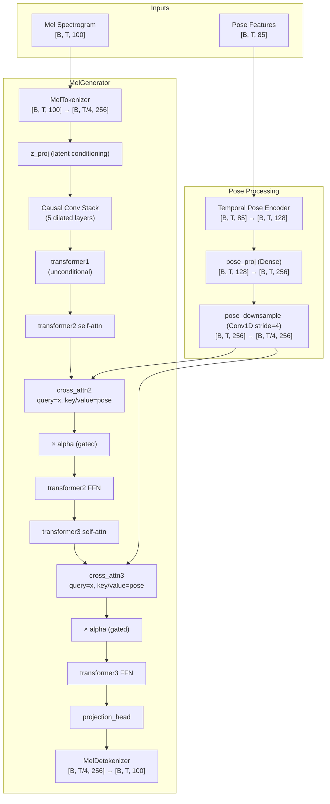

# Pose-Conditioned Training — Detailed Design

## Overview

Integrate pose (body point) conditioning into the MelGenerator so that audio generation can be guided by human motion. Pose is injected as a cross-attention conditioning signal in the mid/late transformer layers, gated by a learnable alpha parameter that ramps up over training.

Two deliverables:
1. **Model changes** — extend MelGenerator with optional pose cross-attention (backward compatible)
2. **New training script** (`train_pose.py`) — runs pose-conditioned training with alpha scheduling, conditioning dropout, and auto-detection of checkpoint type

The existing `train.py` and all audio-only tests remain unchanged.

## Detailed Requirements

### Data
- Pre-extracted pose sequences stored as `[T_frames, 85]` `.npy` files (FeatureBuilder output: x, y, dx, dy, conf × 17 joints)
- Resampled to mel frame rate (~93.75 fps at 24kHz/256 hop) during preprocessing
- Same directory as audio: `song1.wav` → `song1_pose.npy`
- Pose files are sliced to match mel sequence length (SEQ_LEN=512) in the dataset pipeline

### Pose Encoder
- Refactored `build_pose_encoder` outputs temporal sequence: `[B, T_pose, embedding_dim]`
- Per-frame MLP (TimeDistributed) + causal Conv1D, no last-timestep extraction
- Supports frozen and trainable modes via a flag

### Cross-Attention
- Injected into transformer2 and transformer3 only (transformer1 stays unconditional)
- Gated: `x = x + alpha * cross_attn(query=x, key=pose, value=pose)`
- Alpha scheduled via cosine ramp, configured per invocation
- Per-sample conditioning dropout: skip cross-attention entirely with probability p (default 0.15)

### Training Phases (separate script invocations)
- **Phase 2**: Load Phase 1 (audio-only) checkpoint, auto-init new layers, alpha 0.0→0.3, optionally freeze encoder + early layers
- **Phase 3**: Load Phase 2 checkpoint, alpha 0.3→1.0, unfreeze all, conditioning dropout active

### Checkpoint Compatibility
- Auto-detect missing keys when loading audio-only checkpoint
- New layers (cross-attention, pose_proj, pose encoder) initialized from scratch

### Losses
- Primary: mel reconstruction (MSE), same as existing
- Alignment losses (pose velocity ↔ spectral flux) implemented but not active

### Backward Compatibility
- `pose=None` default on all MelGenerator methods
- When pose is None, no cross-attention computation, identical behavior to current model

## Architecture Overview



## Components and Interfaces

### 1. Temporal Pose Encoder (`src/body_point_module/encoder.py`)

New function `build_temporal_pose_encoder`:

```python
def build_temporal_pose_encoder(input_dim=85, hidden_dim=256, output_dim=128):
    """[B, T, 85] → [B, T, 128]. TimeDistributed MLP + causal Conv1D."""
```

- Input: `[B, T, input_dim]` (variable-length)
- Per-frame MLP via TimeDistributed (reuses `build_mlp_encoder`)
- Causal Conv1D(filters=output_dim, kernel_size=3, padding='causal')
- Output: `[B, T, output_dim]` — full temporal sequence
- Uses `tf.keras.Input(shape=(None, input_dim))` for variable sequence length

### 2. Modified MelGenerator (`src/music_generation/model.py`)

New layers added to `__init__`:

```python
# Pose conditioning
self.pose_encoder = build_temporal_pose_encoder(input_dim=85, output_dim=POSE_EMBEDDING_DIM)
self.pose_proj = tf.keras.layers.Dense(D_MODEL, name='pose_proj')
self.pose_stride_conv = tf.keras.layers.Conv1D(
    D_MODEL, kernel_size=TOKEN_COMPRESSION_RATIO, 
    strides=TOKEN_COMPRESSION_RATIO, padding='same', name='pose_stride_conv'
)
self.pose_alpha = tf.Variable(0.0, trainable=False, dtype=tf.float32, name='pose_alpha')
```

Cross-attention lives inside TransformerBlock (see below). MelGenerator just passes pose through to the blocks that need it.

Modified signatures:

```python
def call(self, mel, z=None, pose=None, training=False)
def forward_tokens(self, tokens, z=None, pose_embedded=None, training=False)
def forward_from_tokens(self, tokens, z=None, pose_embedded=None, training=False)
def generate(self, seed_mel, num_frames, ..., pose=None)
```

Pose processing in `call()`:

```python
pose_embedded = None
if pose is not None:
    pose_embedded = self.pose_encoder(pose, training=training)
    pose_embedded = self.pose_proj(pose_embedded)
    pose_embedded = self.pose_stride_conv(pose_embedded)  # [B, T/4, D_MODEL]
```

Cross-attention in `forward_tokens()` (between self-attn and FFN of transformer2/transformer3):

```python
x = self.transformer1(x)

# transformer2 with cross-attention
x = self.transformer2(x, cross_attn_kv=pose_embedded, cross_attn_alpha=self.pose_alpha)

# transformer3 with cross-attention
x = self.transformer3(x, cross_attn_kv=pose_embedded, cross_attn_alpha=self.pose_alpha)
```

TransformerBlock is modified to accept optional cross-attention parameters. When `cross_attn_kv` is None, behavior is identical to current. transformer1 is called without cross-attention args as before.

### 3. Modified TransformerBlock (`src/music_generation/layers.py`)

Add optional cross-attention support:

```python
class TransformerBlock(tf.keras.layers.Layer):
    def __init__(self, d_model, num_heads, window_size=128, enable_cross_attn=False, **kwargs):
        ...
        if enable_cross_attn:
            self.cross_attn = tf.keras.layers.MultiHeadAttention(
                num_heads=num_heads, key_dim=d_model // num_heads, name='cross_attn'
            )
            self.cross_attn_norm = tf.keras.layers.LayerNormalization(name='cross_attn_norm')
        self.enable_cross_attn = enable_cross_attn

    def call(self, x, cross_attn_kv=None, cross_attn_alpha=None):
        # Self-attention with residual
        x = x + self.attn(self.norm1(x))

        # Cross-attention (only when layer was built with it AND kv is provided)
        if self.enable_cross_attn and cross_attn_kv is not None:
            alpha = cross_attn_alpha if cross_attn_alpha is not None else 1.0
            x = x + alpha * self.cross_attn(
                query=self.cross_attn_norm(x), key=cross_attn_kv, value=cross_attn_kv
            )

        # FFN with residual
        x = x + self.ffn(self.norm2(x))
        return x
```

- `enable_cross_attn=False` by default — transformer1 and any other usage is unchanged
- Cross-attention layers only instantiated when `enable_cross_attn=True`
- When `cross_attn_kv=None`, the block behaves identically to current (no overhead)
- `cross_attn_alpha` gates the contribution (0.0 = no effect)

In MelGenerator `__init__`, transformer2 and transformer3 are constructed with `enable_cross_attn=True`:

```python
self.transformer1 = TransformerBlock(D_MODEL, NUM_HEADS, window_size=WINDOW_SIZES[0], name='transformer_0')
self.transformer2 = TransformerBlock(D_MODEL, NUM_HEADS, window_size=WINDOW_SIZES[1], enable_cross_attn=True, name='transformer_1')
self.transformer3 = TransformerBlock(D_MODEL, NUM_HEADS, window_size=WINDOW_SIZES[2], enable_cross_attn=True, name='transformer_2')
```

### 4. Conditioning Dropout

Per-sample masking in the training wrapper, applied before passing pose to the model:

```python
# Per-sample dropout: zero out pose for some samples
if training and self.cond_dropout_rate > 0:
    mask = tf.random.uniform([batch_size, 1, 1]) > self.cond_dropout_rate
    pose = pose * tf.cast(mask, pose.dtype)  # zeroed samples → pose_embedded all zeros
```

When a sample's pose is zeroed before encoding, the cross-attention output is effectively zero (query attends to zero keys/values), equivalent to skipping it. This is simpler than per-sample alpha masking in graph mode.

Actually — per the requirement, we skip cross-attention entirely per-sample. So instead, we pass a `pose_mask` `[B]` boolean tensor into the model, and in `forward_tokens`:

```python
if pose_embedded is not None and pose_mask is not None:
    # [B, 1, 1] mask for broadcasting
    mask = tf.cast(pose_mask[:, None, None], pose_embedded.dtype)
    ca_out = self.cross_attn2(query=..., key=pose_embedded, value=pose_embedded)
    x = x + self.pose_alpha * ca_out * mask
```

### 5. Alpha Scheduling

Cosine ramp from `alpha_start` to `alpha_end` over `alpha_steps`:

```python
def cosine_alpha_schedule(step, alpha_start, alpha_end, total_steps):
    progress = tf.minimum(tf.cast(step, tf.float32) / tf.cast(total_steps, tf.float32), 1.0)
    return alpha_start + (alpha_end - alpha_start) * 0.5 * (1 - tf.cos(pi * progress))
```

Updated each training step in the training wrapper.

### 6. Pose-Conditioned Dataset (`src/music_generation/dataset.py`)

New function `create_pose_dataset` (or extend existing):

- Looks for `{stem}_pose.npy` alongside each `.wav`
- Loads pose `[T_frames, 85]`, slices to match mel sequence
- Returns `(input_mel, target_mel, pose)` triples
- Skips files without matching pose data (with warning)

Output signature:
```python
(
    tf.TensorSpec(shape=(SEQ_LEN, N_MELS), dtype=tf.float32),  # input mel
    tf.TensorSpec(shape=(SEQ_LEN, N_MELS), dtype=tf.float32),  # target mel
    tf.TensorSpec(shape=(SEQ_LEN, 85), dtype=tf.float32),       # pose features
)
```

### 7. Training Script (`src/music_generation/train_pose.py`)

CLI arguments:
```
--data_dir          Audio + pose data directory
--cache_dir         Mel cache directory
--checkpoint_dir    Output checkpoint directory
--resume            Checkpoint to load (Phase 1 or Phase 2)
--batch_size        Batch size (default: 4)
--epochs            Number of epochs
--lr                Learning rate (default: 1e-4)
--alpha_start       Starting alpha value (default: 0.0)
--alpha_end         Ending alpha value (default: 0.3)
--alpha_steps        Steps over which to ramp alpha (default: 100000)
--cond_dropout      Conditioning dropout rate (default: 0.0)
--freeze_encoder    Freeze pose encoder weights (flag)
--freeze_early      Freeze tokenizer + conv layers + transformer1 (flag)
```

Phase 2 example:
```bash
python -m src.music_generation.train_pose \
  --data_dir ~/data/music/musicnet/train_data \
  --resume ./checkpoints/mel_generator.keras \
  --alpha_start 0.0 --alpha_end 0.3 --alpha_steps 150000 \
  --freeze_encoder --freeze_early --epochs 50
```

Phase 3 example:
```bash
python -m src.music_generation.train_pose \
  --resume ./pose_checkpoints/mel_generator_pose.keras \
  --alpha_start 0.3 --alpha_end 1.0 --alpha_steps 200000 \
  --cond_dropout 0.15 --epochs 100
```

### 8. PoseConditionedTraining Wrapper (`src/music_generation/train_pose.py`)

Extends the training pattern from `MelGeneratorTraining`:

```python
class PoseConditionedTraining(tf.keras.Model):
    def __init__(self, base_model, alpha_start, alpha_end, alpha_steps,
                 cond_dropout_rate=0.0, freeze_encoder=False, ...):
```

- `train_step(data)` receives `(x, y, pose)` triples
- Updates alpha each step via cosine schedule
- Applies per-sample conditioning dropout mask
- Passes pose + mask through to base_model
- Same teacher forcing / scheduled sampling logic as MelGeneratorTraining
- Metrics: mel_loss, kl_loss, alpha, tf_ratio

### 9. Alignment Losses (`src/music_generation/losses.py`)

New loss classes, implemented but not wired into training:

```python
class PoseAudioAlignmentLoss(tf.keras.layers.Layer):
    """Pose velocity ↔ spectral flux alignment loss."""
    
    def call(self, pose_features, mel_spectrogram):
        # Compute pose velocity magnitude from pose features
        # Compute spectral flux from mel spectrogram
        # L1 or cosine similarity between the two temporal signals
```

```python
class OnsetAlignmentLoss(tf.keras.layers.Layer):
    """Pose acceleration ↔ audio onset strength alignment."""
    
    def call(self, pose_features, mel_spectrogram):
        # Compute pose acceleration (second derivative)
        # Compute onset strength from spectral difference
        # Correlation loss
```

### 10. Checkpoint Auto-Detection

When loading a checkpoint in `train_pose.py`:

```python
def load_checkpoint_with_autodetect(model, checkpoint_path):
    """Load checkpoint, auto-initializing missing layers."""
    try:
        model.load_weights(checkpoint_path)
    except (ValueError, KeyError):
        # Partial load: match by name, skip missing
        # New layers keep their random initialization
        ...
```

For `.keras` format: load the saved model, extract base_model weights by name, apply matching weights to the new model. Unmatched layers (cross-attention, pose encoder, pose_proj) stay at their initialized values.

## Data Models

### Pose Feature Vector (per frame)
```
[85] = 17 joints × 5 features (x, y, dx, dy, confidence)
```

### Pose File Format
```
{audio_stem}_pose.npy: numpy array, shape [T_frames, 85], float32
T_frames matches mel frame count for the corresponding audio
```

### Config Additions (`src/music_generation/config.py`)
```python
# Pose conditioning
POSE_FEATURE_DIM = 85
POSE_EMBEDDING_DIM = 128
POSE_COND_DROPOUT = 0.0  # default off, set per phase
```

## Error Handling

- Missing pose file for an audio file: skip with warning, don't crash training
- Pose sequence length mismatch with mel: truncate or pad to match, log warning
- Phase 1 checkpoint missing pose layers: auto-detect and initialize (not an error)
- NaN in pose features: clip or replace with zeros, log warning
- Empty pose directory: raise clear error before training starts

## Acceptance Criteria

### Model Changes
- **Given** a MelGenerator with no pose input, **when** `call(mel)` is invoked, **then** output is identical to the current model (no regression)
- **Given** a MelGenerator with pose input, **when** `call(mel, pose=pose_tensor)` is invoked, **then** output shape matches input mel shape `[B, T, N_MELS]`
- **Given** `pose_alpha=0.0`, **when** forward pass runs with pose, **then** output equals the no-pose output (cross-attention contribution is zero)
- **Given** `pose_alpha=1.0` and non-zero pose, **when** forward pass runs, **then** output differs from the no-pose output

### Pose Encoder
- **Given** pose features `[B, T, 85]`, **when** passed through temporal pose encoder, **then** output shape is `[B, T, 128]`
- **Given** `freeze_encoder=True`, **when** training runs, **then** pose encoder weights do not change

### Training Script
- **Given** a Phase 1 (audio-only) checkpoint, **when** `train_pose.py` loads it, **then** training starts without error, new layers initialized from scratch
- **Given** `--alpha_start 0.0 --alpha_end 0.3 --alpha_steps 100000`, **when** training runs for 100k steps, **then** alpha reaches approximately 0.3
- **Given** `--cond_dropout 0.15`, **when** a batch of 16 is processed, **then** approximately 2-3 samples have pose masked out

### Dataset
- **Given** audio files with matching `_pose.npy` files, **when** dataset is created, **then** it yields `(mel, mel, pose)` triples with correct shapes
- **Given** an audio file without a matching pose file, **when** dataset iterates, **then** that file is skipped with a logged warning

### Alignment Losses
- **Given** pose features and mel spectrogram, **when** `PoseAudioAlignmentLoss` is called, **then** it returns a scalar loss value
- **Given** constant pose (no motion), **when** alignment loss is computed, **then** loss is low (no motion = no expected spectral change)

## Testing Strategy

- Unit tests for `build_temporal_pose_encoder` (shape, variable length, gradient flow)
- Unit tests for MelGenerator with pose=None (regression: identical to current behavior)
- Unit tests for MelGenerator with pose (output shape, alpha=0 equivalence, alpha>0 difference)
- Unit tests for per-sample conditioning dropout mask
- Unit tests for cosine alpha schedule
- Unit tests for `create_pose_dataset` (shape, missing files, length mismatch)
- Unit tests for alignment loss functions (shape, gradient flow, edge cases)
- Integration test: single training step with pose data (no crash, loss decreases)
- Integration test: checkpoint save/load with pose layers
- Integration test: load Phase 1 checkpoint into pose-conditioned model

## Appendices

### Technology Choices
- `tf.keras.layers.MultiHeadAttention` for cross-attention (built-in, well-tested, supports query/key/value interface)
- Strided Conv1D for pose temporal downsampling (matches tokenizer pattern, learnable)
- Cosine schedule for alpha (smooth, no sharp transitions)

### Alternative Approaches Considered
- **Separate PoseConditionedMelGenerator subclass**: Rejected — duplicates code, harder to maintain. Optional pose parameter is cleaner.
- **Concatenate pose with tokens**: Rejected per knowledge base — cross-attention is more principled for conditioning.
- **Inject pose into all layers**: Rejected per knowledge base — over-conditioning early layers hurts stability.
- **Automatic phase switching in single run**: Rejected — separate invocations give more control, easier to debug and resume.
- **Pre-encoded pose embeddings**: Rejected — need trainable encoder option for Phase 3.
- **Zero-masking for conditioning dropout**: Simpler but not equivalent to skipping cross-attention. Using per-sample mask multiplication on cross-attention output instead.
- **Inline cross-attention in MelGenerator's forward_tokens**: Rejected — modifying TransformerBlock with `enable_cross_attn` flag keeps the block self-contained and avoids exposing block internals in the model.

### Key Constraints
- Do not concatenate pose with tokens directly
- Do not inject pose into transformer1 or convolutional layers
- Maintain causal structure throughout
- Do not increase transformer depth
- Existing audio-only tests must pass without modification
