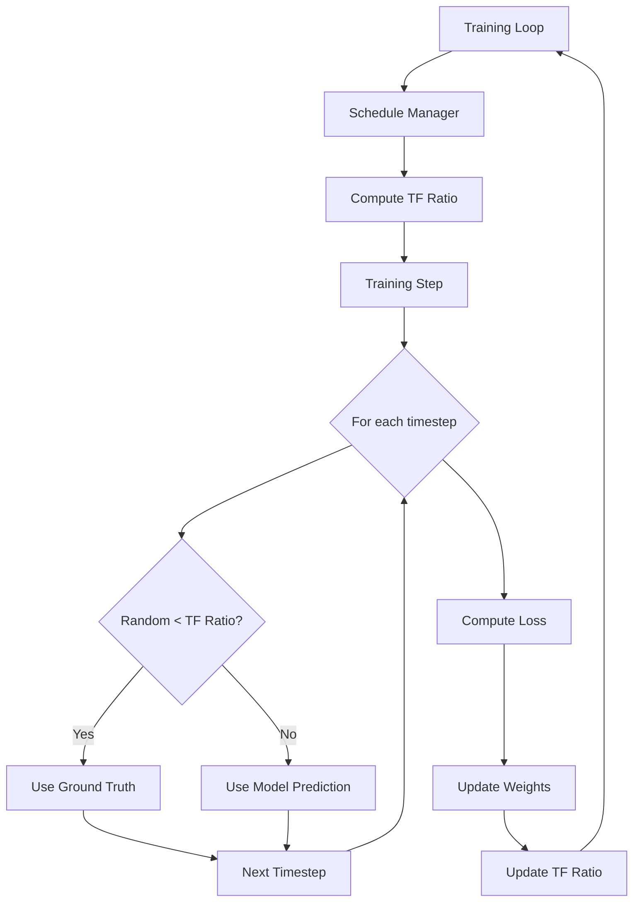

# Teacher Forcing Schedule Design

## Overview

Implement exponential decay scheduled sampling for the mel spectrogram generator to reduce exposure bias and improve autoregressive inference quality. The system will gradually transition from pure teacher forcing (ground truth inputs) to using model predictions during training.

## Detailed Requirements

### Functional Requirements

1. **Exponential Decay Schedule**
   - Implement exponential decay: `ε(step) = max(ε_min, ε_initial * exp(-k * step))`
   - Support configurable initial ratio, minimum ratio, and decay rate
   - Update ratio per training step (not per epoch)

2. **Scheduled Sampling During Training**
   - At each autoregressive timestep, probabilistically choose between ground truth and model prediction
   - Use teacher forcing with probability ε (current ratio)
   - Use model prediction with probability (1 - ε)
   - Ensure gradients flow through model predictions when used

3. **Configuration**
   - Add parameters to `config.py`: `initial_tf_ratio`, `min_tf_ratio`, `tf_decay_k`
   - Support disabling schedule (keep ratio at 1.0) for baseline comparison
   - Allow warmup period before decay starts

4. **Monitoring**
   - Track current teacher forcing ratio as a metric
   - Log ratio alongside training loss
   - Include ratio in checkpoint metadata

5. **Validation**
   - Evaluate with pure autoregressive generation (ratio = 0)
   - Compare validation loss with and without teacher forcing

### Non-Functional Requirements

1. **Performance**
   - Minimal computational overhead (< 5% training time increase)
   - No significant memory overhead
   - Maintain training throughput

2. **Compatibility**
   - Integrate with existing custom training loop in `train.py`
   - Preserve checkpoint compatibility (add new fields, don't break existing)
   - Work with existing data pipeline

3. **Maintainability**
   - Clean separation of schedule logic
   - Reusable schedule function
   - Clear configuration parameters

## Architecture Overview



## Components and Interfaces

### 1. Schedule Function

**Location:** `src/music_generation/train.py` or new `src/music_generation/schedules.py`

```python
def exponential_tf_schedule(
    step: int,
    initial_ratio: float = 1.0,
    min_ratio: float = 0.05,
    decay_k: float = 1e-5
) -> float:
    """
    Compute teacher forcing ratio using exponential decay.
    
    Args:
        step: Current training step
        initial_ratio: Starting ratio (default: 1.0)
        min_ratio: Minimum ratio floor (default: 0.05)
        decay_k: Decay rate (default: 1e-5)
    
    Returns:
        Current teacher forcing ratio (0-1)
    """
    ratio = initial_ratio * tf.exp(-decay_k * tf.cast(step, tf.float32))
    return tf.maximum(min_ratio, ratio)
```

### 2. Training Step Modification

**Location:** `src/music_generation/train.py` - modify `train_step` method

**Current behavior:** Always uses ground truth previous frames

**New behavior:** Probabilistically samples between ground truth and predictions

**CRITICAL MEMORY CONSIDERATIONS:**

1. **Avoid growing sequence concatenation** - `tf.concat([current_sequence, next_frame], axis=1)` creates new tensor each iteration, causing O(T²) memory growth
2. **Avoid Python loops with tf.cond** - Creates separate graph branches, high memory overhead
3. **Use fixed-size tensors** - Pre-allocate output tensors when possible
4. **Minimize tape scope** - Only track operations needed for gradients

**Memory-Efficient Implementation:**

```python
def train_step_with_scheduled_sampling(
    model,
    x_batch,
    y_batch,
    tf_ratio,
    optimizer,
    loss_fn
):
    """
    Memory-efficient training step with scheduled sampling.
    
    Args:
        model: MelGenerator model
        x_batch: Input mel frames [batch, context_len, 80]
        y_batch: Target mel frames [batch, target_len, 80]
        tf_ratio: Current teacher forcing ratio
        optimizer: Keras optimizer
        loss_fn: Loss function
    
    Returns:
        loss: Scalar loss value
    """
    batch_size = tf.shape(x_batch)[0]
    target_len = tf.shape(y_batch)[1]
    mel_dim = tf.shape(y_batch)[2]
    
    # Pre-generate sampling decisions (avoid per-step random calls)
    # Shape: [batch, target_len, 1]
    random_vals = tf.random.uniform([batch_size, target_len, 1])
    use_teacher_mask = tf.cast(random_vals < tf_ratio, y_batch.dtype)
    
    with tf.GradientTape() as tape:
        # Single forward pass with teacher forcing
        # Model expects: [batch, context_len + target_len, 80]
        full_input = tf.concat([x_batch, y_batch], axis=1)
        predictions = model(full_input, training=True)
        
        # Extract predictions for target frames
        # predictions shape: [batch, context_len + target_len, 80]
        target_predictions = predictions[:, -target_len:, :]
        
        # For scheduled sampling, we need autoregressive generation
        # Use model predictions as input for next steps
        # MEMORY EFFICIENT: Use sliding window, not growing concatenation
        
        if tf_ratio < 1.0:  # Only do autoregressive if not pure teacher forcing
            # Build mixed input sequence
            # Start with context
            context_len = tf.shape(x_batch)[1]
            
            # Pre-allocate full sequence buffer (fixed size)
            # Shape: [batch, context_len + target_len, 80]
            sequence_buffer = tf.concat([x_batch, tf.zeros_like(y_batch)], axis=1)
            
            # Generate autoregressively with scheduled sampling
            for t in range(target_len):
                # Slice current context window (avoid growing tensor)
                current_input = sequence_buffer[:, :context_len + t, :]
                
                # Predict next frame
                pred = model(current_input, training=True)
                next_frame_pred = pred[:, -1:, :]
                
                # Mix ground truth and prediction using pre-computed mask
                ground_truth_frame = y_batch[:, t:t+1, :]
                mask_t = use_teacher_mask[:, t:t+1, :]
                next_frame = mask_t * ground_truth_frame + (1 - mask_t) * next_frame_pred
                
                # Update buffer at position (avoid concat)
                indices = tf.constant([[context_len + t]])
                sequence_buffer = tf.tensor_scatter_nd_update(
                    sequence_buffer,
                    indices,
                    next_frame
                )
            
            # Re-run forward pass with mixed sequence to get final predictions
            target_predictions = model(sequence_buffer, training=True)[:, -target_len:, :]
        
        loss = loss_fn(y_batch, target_predictions)
    
    # Update weights
    gradients = tape.gradient(loss, model.trainable_variables)
    optimizer.apply_gradients(zip(gradients, model.trainable_variables))
    
    return loss
```

**Alternative: Vectorized Approach (Most Memory Efficient)**

If model supports it, use vectorized scheduled sampling:

```python
def train_step_vectorized_sampling(
    model,
    x_batch,
    y_batch,
    tf_ratio,
    optimizer,
    loss_fn
):
    """
    Vectorized scheduled sampling (most memory efficient).
    
    Limitation: Requires model to accept mixed sequences.
    """
    batch_size = tf.shape(x_batch)[0]
    target_len = tf.shape(y_batch)[1]
    
    # Pre-compute sampling mask
    random_vals = tf.random.uniform([batch_size, target_len, 1])
    use_teacher_mask = tf.cast(random_vals < tf_ratio, y_batch.dtype)
    
    with tf.GradientTape() as tape:
        # Forward pass with ground truth
        full_input_gt = tf.concat([x_batch, y_batch], axis=1)
        predictions_gt = model(full_input_gt, training=True)
        target_preds_gt = predictions_gt[:, -target_len:, :]
        
        if tf_ratio < 1.0:
            # Forward pass with predictions (shifted)
            # Use predictions as input for next step
            pred_input = tf.concat([
                x_batch,
                tf.concat([x_batch[:, -1:, :], target_preds_gt[:, :-1, :]], axis=1)
            ], axis=1)
            predictions_pred = model(pred_input, training=True)
            target_preds_pred = predictions_pred[:, -target_len:, :]
            
            # Mix predictions based on mask
            final_predictions = (use_teacher_mask * target_preds_gt + 
                               (1 - use_teacher_mask) * target_preds_pred)
        else:
            final_predictions = target_preds_gt
        
        loss = loss_fn(y_batch, final_predictions)
    
    gradients = tape.gradient(loss, model.trainable_variables)
    optimizer.apply_gradients(zip(gradients, model.trainable_variables))
    
    return loss
```

**Recommended Approach:**

Use **simplified autoregressive** with memory optimizations:

```python
def train_step_memory_efficient(
    model,
    x_batch,
    y_batch,
    tf_ratio,
    optimizer,
    loss_fn
):
    """
    Simplified memory-efficient scheduled sampling.
    
    Key optimizations:
    - Pre-allocate tensors
    - Use TensorArray for dynamic collection
    - Minimize tape scope
    """
    batch_size = tf.shape(x_batch)[0]
    target_len = tf.shape(y_batch)[1]
    
    with tf.GradientTape() as tape:
        if tf_ratio >= 1.0:
            # Pure teacher forcing - single forward pass
            full_input = tf.concat([x_batch, y_batch], axis=1)
            predictions = model(full_input, training=True)
            target_predictions = predictions[:, -target_len:, :]
        else:
            # Scheduled sampling - autoregressive generation
            # Use TensorArray for efficient dynamic collection
            predictions_ta = tf.TensorArray(
                dtype=y_batch.dtype,
                size=target_len,
                dynamic_size=False,
                clear_after_read=False
            )
            
            current_input = x_batch
            
            for t in tf.range(target_len):
                # Predict next frame
                pred = model(current_input, training=True)
                next_frame_pred = pred[:, -1:, :]
                predictions_ta = predictions_ta.write(t, next_frame_pred[:, 0, :])
                
                # Scheduled sampling decision
                use_teacher = tf.random.uniform([]) < tf_ratio
                ground_truth_frame = y_batch[:, t:t+1, :]
                
                next_frame = tf.cond(
                    use_teacher,
                    lambda: ground_truth_frame,
                    lambda: next_frame_pred
                )
                
                # Update input: keep only recent context (sliding window)
                # Avoid unbounded growth
                max_context = tf.shape(x_batch)[1]
                current_input = tf.concat([current_input, next_frame], axis=1)
                current_input = current_input[:, -max_context:, :]
            
            # Stack predictions
            target_predictions = tf.transpose(predictions_ta.stack(), [1, 0, 2])
        
        loss = loss_fn(y_batch, target_predictions)
    
    gradients = tape.gradient(loss, model.trainable_variables)
    optimizer.apply_gradients(zip(gradients, model.trainable_variables))
    
    return loss
```

### 3. Configuration Updates

**Location:** `src/music_generation/config.py`

Add new parameters:

```python
@dataclass
class TrainingConfig:
    # ... existing parameters ...
    
    # Teacher forcing schedule
    initial_tf_ratio: float = 1.0      # Start with pure teacher forcing
    min_tf_ratio: float = 0.05         # Minimum ratio (maintain some stability)
    tf_decay_k: float = 1e-5           # Decay rate (tune based on dataset)
    tf_warmup_steps: int = 0           # Steps before decay starts
```

### 4. Trainer Class Updates

**Location:** `src/music_generation/train.py`

Add to trainer initialization:

```python
class Trainer:
    def __init__(self, config):
        # ... existing initialization ...
        
        # Teacher forcing schedule
        self.tf_ratio = tf.Variable(
            config.initial_tf_ratio,
            trainable=False,
            dtype=tf.float32,
            name='tf_ratio'
        )
        self.initial_tf_ratio = config.initial_tf_ratio
        self.min_tf_ratio = config.min_tf_ratio
        self.tf_decay_k = config.tf_decay_k
        self.tf_warmup_steps = config.tf_warmup_steps
        
        # Metrics
        self.tf_ratio_metric = tf.keras.metrics.Mean(name='tf_ratio')
    
    def update_tf_ratio(self, step):
        """Update teacher forcing ratio based on current step."""
        if step < self.tf_warmup_steps:
            ratio = self.initial_tf_ratio
        else:
            effective_step = step - self.tf_warmup_steps
            ratio = exponential_tf_schedule(
                effective_step,
                self.initial_tf_ratio,
                self.min_tf_ratio,
                self.tf_decay_k
            )
        self.tf_ratio.assign(ratio)
        self.tf_ratio_metric.update_state(ratio)
```

## Data Models

### Configuration Schema

```python
{
    "initial_tf_ratio": 1.0,      # float, range [0, 1]
    "min_tf_ratio": 0.05,         # float, range [0, 1]
    "tf_decay_k": 1e-5,           # float, positive
    "tf_warmup_steps": 0          # int, non-negative
}
```

### Checkpoint Metadata

Add to checkpoint:

```python
{
    "tf_ratio": float,            # Current ratio at checkpoint time
    "training_step": int,         # Step number for schedule continuation
    "tf_schedule_config": {       # Schedule parameters
        "initial_tf_ratio": float,
        "min_tf_ratio": float,
        "tf_decay_k": float,
        "tf_warmup_steps": int
    }
}
```

## Error Handling

### Invalid Configuration

- **Invalid ratio values** (< 0 or > 1): Raise `ValueError` with clear message
- **Invalid decay rate** (≤ 0): Raise `ValueError`
- **min_ratio > initial_ratio**: Log warning, swap values

### Training Instability

- **Loss divergence**: Log warning if loss increases significantly after ratio decrease
- **NaN gradients**: Catch and log, suggest increasing min_ratio or decreasing decay_k
- **Checkpoint recovery**: Restore tf_ratio from checkpoint on resume

### Edge Cases

- **Step overflow**: Use tf.float32 for step to handle large values
- **Ratio precision**: Ensure ratio doesn't underflow below min_ratio
- **Warmup period**: Handle step < warmup_steps correctly

## Acceptance Criteria

### Given: Training configuration with scheduled sampling enabled
**When:** Training starts
**Then:** 
- Teacher forcing ratio initializes to `initial_tf_ratio`
- Ratio is logged in first training step
- Training proceeds without errors

### Given: Training in progress with scheduled sampling
**When:** Each training step completes
**Then:**
- Teacher forcing ratio decreases according to exponential schedule
- Ratio never falls below `min_tf_ratio`
- Ratio is logged alongside loss metrics

### Given: Training step with tf_ratio = 0.5
**When:** Autoregressive generation occurs
**Then:**
- Approximately 50% of timesteps use ground truth
- Approximately 50% of timesteps use model predictions
- Gradients flow through both paths

### Given: Training with tf_ratio = 0.0 (pure autoregressive)
**When:** Training step executes
**Then:**
- All timesteps use model predictions
- No ground truth frames used as input (only as targets)
- Training completes without errors

### Given: Checkpoint saved during training
**When:** Training resumes from checkpoint
**Then:**
- Teacher forcing ratio restored to checkpoint value
- Schedule continues from correct step
- Training proceeds smoothly

### Given: Validation evaluation
**When:** Validation step runs
**Then:**
- Uses pure autoregressive generation (tf_ratio = 0)
- Matches inference conditions
- Reports validation loss

### Given: Training with warmup period
**When:** Step < warmup_steps
**Then:**
- Teacher forcing ratio remains at `initial_tf_ratio`
- No decay occurs during warmup
- Decay starts after warmup completes

## Testing Strategy

### Unit Tests

1. **Schedule Function**
   - Test exponential decay formula
   - Verify min_ratio floor
   - Test edge cases (step=0, large steps)

2. **Configuration Validation**
   - Test valid configurations
   - Test invalid ratio ranges
   - Test parameter constraints

3. **Ratio Update Logic**
   - Test warmup period behavior
   - Test decay after warmup
   - Test ratio assignment

### Integration Tests

1. **Training Step**
   - Test with tf_ratio = 1.0 (pure teacher forcing)
   - Test with tf_ratio = 0.0 (pure autoregressive)
   - Test with tf_ratio = 0.5 (mixed)
   - Verify gradient flow

2. **Full Training Loop**
   - Train for multiple steps
   - Verify ratio decreases
   - Check loss convergence

3. **Checkpoint Save/Load**
   - Save checkpoint mid-training
   - Load and verify ratio restored
   - Continue training and verify schedule

### Manual Testing

1. **Training Stability**
   - Train with default parameters
   - Monitor loss curves
   - Check for divergence

2. **Hyperparameter Tuning**
   - Test different decay rates (1e-6, 1e-5, 1e-4)
   - Test different min_ratios (0.0, 0.05, 0.1)
   - Compare convergence speed

3. **Inference Quality**
   - Generate samples at different training stages
   - Compare quality with/without scheduled sampling
   - Evaluate long-term coherence

## Appendices

### A. Technology Choices

**Exponential Decay Schedule**
- Chosen over linear, inverse sigmoid, and step decay
- Rationale: Most widely used, simple to tune, smooth transition
- Trade-off: Requires tuning decay rate k

**Custom Training Loop**
- Chosen over TensorFlow Addons `ScheduledOutputTrainingSampler`
- Rationale: TF Addons in maintenance mode, better control, no extra dependencies
- Trade-off: More code to maintain

**Probabilistic Sampling**
- Chosen over deterministic schedules
- Rationale: Matches original scheduled sampling paper, better exploration
- Trade-off: Slight non-determinism (can be seeded)

### B. Research Findings Summary

**Exposure Bias Problem:**
- Train-test mismatch between teacher forcing and autoregressive inference
- Causes error accumulation and poor generation quality
- Well-documented in sequence generation literature

**Scheduled Sampling Solution:**
- Proposed by Bengio et al. (2015)
- Gradually transitions from teacher forcing to model predictions
- Empirically proven to improve autoregressive generation

**Schedule Types:**
- Exponential decay most common in practice
- Inverse sigmoid theoretically optimal but harder to tune
- Linear decay can be too abrupt

**Implementation Patterns:**
- Custom training loops provide most flexibility
- Probabilistic masking efficient for parallel frameworks
- Minimum ratio > 0 helps maintain stability

### C. Alternative Approaches Considered

**1. Inverse Sigmoid Schedule**
- Formula: `ε(i) = k / (k + exp(i / k))`
- Pros: Smooth S-curve, gentle at extremes
- Cons: More complex tuning, similar results to exponential
- Decision: Not chosen due to complexity

**2. Multiple Schedule Options**
- Support linear, exponential, inverse sigmoid
- Pros: Flexibility for experimentation
- Cons: More code, more configuration, unclear benefit
- Decision: Not chosen, focus on single best option

**3. TensorFlow Addons Integration**
- Use `tfa.seq2seq.ScheduledOutputTrainingSampler`
- Pros: Battle-tested, less code
- Cons: TF Addons deprecated, RNN-focused, extra dependency
- Decision: Not chosen due to maintenance concerns

**4. Adaptive Schedules**
- Adjust decay based on validation loss
- Pros: Automatic tuning
- Cons: Complex, unstable, hard to reproduce
- Decision: Not chosen, prefer fixed schedules

### D. Performance Analysis

**Computational Overhead:**
- Random number generation: O(batch_size × target_len)
- Conditional selection: O(batch_size × target_len × mel_dim)
- Expected overhead: < 5% of total training time

**Memory Overhead:**
- Teacher forcing ratio variable: 4 bytes
- Random values: batch_size × target_len × 4 bytes (temporary)
- TensorArray for predictions: batch_size × target_len × mel_dim × 4 bytes (reused)
- Negligible compared to model parameters and activations

**Training Speed Impact:**
- Pure teacher forcing: Can parallelize across timesteps
- Scheduled sampling: Sequential autoregressive generation required
- Expected slowdown: 10-20% depending on sequence length
- Trade-off: Better inference quality justifies slower training

**Memory Efficiency Patterns:**

**AVOID (Memory Inefficient):**
1. **Growing concatenation in loop:**
   ```python
   # BAD: O(T²) memory, creates new tensor each iteration
   for t in range(target_len):
       current_sequence = tf.concat([current_sequence, next_frame], axis=1)
   ```

2. **Python list accumulation:**
   ```python
   # BAD: Keeps all intermediate tensors in memory
   predictions = []
   for t in range(target_len):
       predictions.append(pred)
   predictions = tf.concat(predictions, axis=1)
   ```

3. **Multiple tf.cond branches in tape:**
   ```python
   # BAD: Creates duplicate graph branches, high memory
   with tf.GradientTape() as tape:
       for t in range(target_len):
           next_frame = tf.cond(use_teacher, lambda: gt, lambda: pred)
   ```

**USE (Memory Efficient):**
1. **TensorArray for dynamic collection:**
   ```python
   # GOOD: Fixed memory allocation, efficient writes
   predictions_ta = tf.TensorArray(dtype=tf.float32, size=target_len, dynamic_size=False)
   for t in range(target_len):
       predictions_ta = predictions_ta.write(t, pred)
   predictions = predictions_ta.stack()
   ```

2. **Sliding window (fixed context):**
   ```python
   # GOOD: Constant memory, discard old frames
   current_input = tf.concat([current_input, next_frame], axis=1)
   current_input = current_input[:, -max_context:, :]
   ```

3. **Pre-allocate tensors:**
   ```python
   # GOOD: Fixed size buffer, in-place updates
   sequence_buffer = tf.zeros([batch, context_len + target_len, mel_dim])
   sequence_buffer = tf.tensor_scatter_nd_update(sequence_buffer, indices, values)
   ```

4. **Conditional execution outside tape:**
   ```python
   # GOOD: Avoid branching in gradient computation
   if tf_ratio >= 1.0:
       # Pure teacher forcing path
   else:
       with tf.GradientTape() as tape:
           # Scheduled sampling path
   ```

**Recommended Implementation:**
- Use TensorArray for prediction collection
- Use sliding window for context (discard old frames)
- Short-circuit to single forward pass when tf_ratio = 1.0
- Pre-compute sampling decisions when possible

### E. Hyperparameter Tuning Guide

**Decay Rate (tf_decay_k):**
- Start with 1e-5 for datasets with ~100K steps
- Increase (1e-4) for smaller datasets or faster decay
- Decrease (1e-6) for larger datasets or slower decay
- Monitor: Ratio should reach ~0.1 by 50-75% of training

**Minimum Ratio (min_tf_ratio):**
- Start with 0.05 (5% teacher forcing)
- Increase to 0.1 if training becomes unstable
- Decrease to 0.0 for pure autoregressive if stable
- Monitor: Loss should not diverge as ratio decreases

**Warmup Steps (tf_warmup_steps):**
- Start with 0 (decay from beginning)
- Set to 5-10 epochs if initial training unstable
- Allows model to learn basics before exposure to predictions
- Monitor: Initial loss convergence

**Initial Ratio (initial_tf_ratio):**
- Keep at 1.0 (pure teacher forcing at start)
- Only change for ablation studies
- Starting lower may destabilize early training
