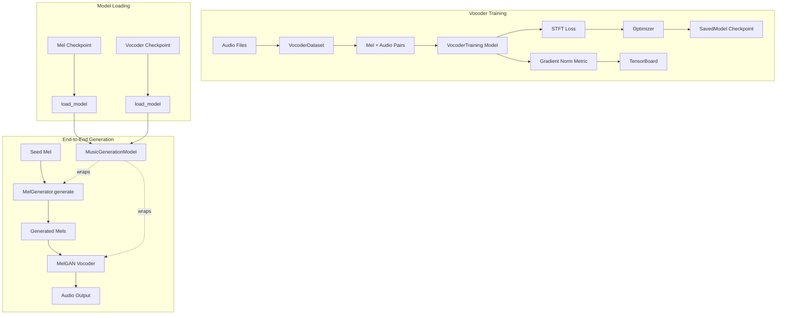

# Design Document: TensorFlow Pretrained Vocoder Finetuning

## Overview

Enhance the existing TensorFlow music generation implementation by adding three key features: (1) a Keras-style inference model class that combines MelGenerator and Vocoder for end-to-end generation, (2) gradient norm logging in the vocoder training loop, and (3) improved checkpoint management using SavedModel format. The implementation uses MelGAN from TensorFlowTTS as the pretrained vocoder.

## Detailed Requirements

### Functional Requirements

1. **Unified Inference Model**
   - Create `MusicGenerationModel` class combining MelGenerator + Vocoder
   - Support autoregressive mel generation followed by vocoding
   - Provide `from_checkpoints()` class method for easy loading
   - Verify mel dimension compatibility (80 bins) between models

2. **Gradient Norm Logging**
   - Add gradient norm as a custom metric in `VocoderTraining.train_step()`
   - Compute L2 norm of all gradients
   - Log to TensorBoard automatically via Keras metrics

3. **SavedModel Checkpoints**
   - Switch from `save_weights_only=True` to full model saving
   - Save complete model (architecture + weights + optimizer state)
   - Update `load_vocoder_from_checkpoint()` to load SavedModel format
   - Maintain checkpoint versioning with epoch numbers

4. **MelGAN Integration**
   - Use `TFAutoModel.from_pretrained("tensorspeech/tts-melgan-ljspeech-en")`
   - Handle shape conversion: MelGAN outputs `[batch, samples, 1]`
   - Keep existing `HiFiGANVocoder` wrapper class (rename is optional)

### Non-Functional Requirements

1. **Keras-native** - Use Keras patterns and conventions throughout
2. **Backward compatible** - Don't break existing training scripts
3. **Testable** - Unit tests for new components, smoke tests for training
4. **Minimal** - Only add what's needed, no extra features

## Architecture Overview



## Components and Interfaces

### 1. MusicGenerationModel (New)

**File:** `src/music_generation/inference.py`

**Purpose:** Unified interface for end-to-end music generation

```python
class MusicGenerationModel(tf.keras.Model):
    """End-to-end music generation combining MelGenerator and Vocoder.
    
    This model wraps a MelGenerator and Vocoder to provide a simple interface
    for generating audio from seed mel spectrograms.
    """
    
    def __init__(self, mel_generator, vocoder):
        """Initialize with mel generator and vocoder.
        
        Args:
            mel_generator: Trained MelGenerator model
            vocoder: Finetuned vocoder model (MelGAN)
        
        Raises:
            ValueError: If mel dimensions don't match (must be 80)
        """
        super().__init__()
        self.mel_generator = mel_generator
        self.vocoder = vocoder
        
        # Verify compatibility
        # MelGenerator outputs [batch, time, 80]
        # Vocoder expects [batch, time, 80]
        # This is a basic check - actual validation happens at runtime
    
    def call(self, inputs, training=False):
        """Standard forward pass (for compatibility).
        
        Args:
            inputs: Mel spectrogram [batch, time, 80]
            training: Whether in training mode
            
        Returns:
            Audio waveform [batch, samples]
        """
        mel = self.mel_generator(inputs, training=training)
        audio = self.vocoder(mel, training=training)
        return audio
    
    def generate(self, seed_mel, num_frames, temperature=1.0):
        """Generate audio from seed mel spectrogram.
        
        Args:
            seed_mel: Seed mel spectrogram [time, 80]
            num_frames: Number of mel frames to generate
            temperature: Sampling temperature for mel generation
            
        Returns:
            Generated audio waveform [samples]
        """
        # Generate mel frames autoregressively
        generated_mel = self.mel_generator.generate(
            seed_mel, 
            num_frames, 
            temperature
        )
        
        # Add batch dimension: [time, 80] -> [1, time, 80]
        mel_batch = tf.expand_dims(generated_mel, 0)
        
        # Convert to audio: [1, time, 80] -> [1, samples, 1]
        audio = self.vocoder(mel_batch, training=False)
        
        # Squeeze: [1, samples, 1] -> [samples]
        audio = tf.squeeze(audio)
        
        return audio
    
    @classmethod
    def from_checkpoints(cls, mel_checkpoint, vocoder_checkpoint):
        """Load from checkpoint files.
        
        Args:
            mel_checkpoint: Path to MelGenerator SavedModel
            vocoder_checkpoint: Path to Vocoder SavedModel
            
        Returns:
            MusicGenerationModel instance
        """
        mel_generator = tf.keras.models.load_model(mel_checkpoint)
        vocoder = tf.keras.models.load_model(vocoder_checkpoint)
        
        return cls(mel_generator, vocoder)
```

### 2. VocoderTraining (Enhanced)

**File:** `src/music_generation/train_vocoder.py`

**Changes:** Add gradient norm metric

```python
class VocoderTraining(tf.keras.Model):
    """Wrapper for vocoder training with custom train_step."""
    
    def __init__(self, generator, stft_loss):
        super().__init__()
        self.generator = generator
        self.stft_loss = stft_loss
        
        # Add gradient norm tracker
        self.grad_norm_tracker = tf.keras.metrics.Mean(name="grad_norm")
    
    def call(self, mel_spectrogram, training=False):
        return self.generator(mel_spectrogram, training=training)
    
    def train_step(self, data):
        mel, target_audio = data
        
        with tf.GradientTape() as tape:
            pred_audio = self.generator(mel, training=True)
            
            # Trim to same length
            min_len = tf.minimum(tf.shape(pred_audio)[-1], tf.shape(target_audio)[-1])
            pred_audio = pred_audio[..., :min_len]
            target_audio = target_audio[..., :min_len]
            
            loss = self.stft_loss(pred_audio, target_audio)
        
        # Compute gradients
        grads = tape.gradient(loss, self.generator.trainable_variables)
        
        # Compute gradient norm (L2 norm of all gradients)
        grad_norm = tf.sqrt(
            sum([tf.reduce_sum(g**2) for g in grads if g is not None])
        )
        
        # Update weights
        self.optimizer.apply_gradients(zip(grads, self.generator.trainable_variables))
        
        # Update metrics
        self.grad_norm_tracker.update_state(grad_norm)
        
        return {
            "loss": loss,
            "grad_norm": self.grad_norm_tracker.result()
        }
    
    @property
    def metrics(self):
        """List metrics for automatic reset between epochs."""
        return [self.grad_norm_tracker]
```

### 3. Checkpoint Management (Updated)

**File:** `src/music_generation/train_vocoder.py`

**Changes:** Use SavedModel format instead of weights-only

```python
def train_vocoder(generator, train_dataset, epochs, lr, checkpoint_dir):
    """Train vocoder with STFT loss.
    
    Args:
        generator: Pretrained MelGAN generator
        train_dataset: tf.data.Dataset for training
        epochs: Number of epochs
        lr: Learning rate
        checkpoint_dir: Directory to save checkpoints
    """
    stft_loss = losses.MultiResolutionSTFTLoss(
        fft_sizes=[512, 1024, 2048],
        hop_sizes=[128, 256, 512],
        win_sizes=[512, 1024, 2048]
    )
    
    training_model = VocoderTraining(generator, stft_loss)
    training_model.compile(optimizer=tf.keras.optimizers.Adam(learning_rate=lr))
    
    # Save full model (not just weights)
    checkpoint_path = Path(checkpoint_dir) / "checkpoint_epoch_{epoch:02d}"
    callbacks = [
        tf.keras.callbacks.ModelCheckpoint(
            str(checkpoint_path),
            save_weights_only=False,  # Changed from True
            save_freq='epoch'
        ),
        tf.keras.callbacks.TensorBoard(log_dir=str(Path(checkpoint_dir) / "logs"))
    ]
    
    training_model.fit(train_dataset, epochs=epochs, callbacks=callbacks)
```

**File:** `src/music_generation/vocoder.py`

**Changes:** Update loading function

```python
def load_vocoder_from_checkpoint(checkpoint_path: str) -> HiFiGANVocoder:
    """Load vocoder from finetuned checkpoint.
    
    Args:
        checkpoint_path: Path to SavedModel directory
        
    Returns:
        Loaded HiFiGANVocoder
    """
    # Load full model (SavedModel format)
    vocoder = tf.keras.models.load_model(checkpoint_path)
    return vocoder
```

### 4. MelGAN Loading (Updated)

**File:** `src/music_generation/vocoder.py`

**Changes:** Use TensorFlowTTS to load MelGAN

```python
def load_pretrained_vocoder(model_url: Optional[str] = None) -> HiFiGANVocoder:
    """Load pretrained MelGAN vocoder from TensorFlowTTS.
    
    Args:
        model_url: Ignored (kept for compatibility). Uses MelGAN by default.
        
    Returns:
        HiFiGANVocoder instance with pretrained MelGAN
    """
    from tensorflow_tts.inference import TFAutoModel
    
    # Load pretrained MelGAN
    melgan = TFAutoModel.from_pretrained("tensorspeech/tts-melgan-ljspeech-en")
    
    return HiFiGANVocoder(pretrained_model=melgan)
```

**File:** `src/music_generation/vocoder.py`

**Changes:** Update `HiFiGANVocoder.call()` to handle MelGAN output shape

```python
def call(self, mel_spectrogram, training=False):
    """Convert mel spectrogram to audio.
    
    Args:
        mel_spectrogram: Mel spectrogram [batch, time, mel_bins]
        training: Whether in training mode
        
    Returns:
        Audio waveform [batch, samples]
    """
    if self.generator is None:
        raise ValueError("No generator model loaded")
    
    # MelGAN expects [batch, time, 80]
    # Ensure correct shape
    if mel_spectrogram.shape[1] == 80:  # [batch, 80, time]
        mel_spectrogram = tf.transpose(mel_spectrogram, [0, 2, 1])
    
    # MelGAN inference returns [batch, samples, 1]
    audio = self.generator.inference(mel_spectrogram)
    
    # Squeeze channel dimension: [batch, samples, 1] -> [batch, samples]
    audio = tf.squeeze(audio, axis=-1)
    
    return audio
```

## Data Models

### Mel Spectrogram Flow

```
Seed Mel [time, 80]
    ↓ MelGenerator.generate()
Generated Mel [num_frames, 80]
    ↓ expand_dims
Mel Batch [1, num_frames, 80]
    ↓ Vocoder (MelGAN)
Audio [1, samples, 1]
    ↓ squeeze
Final Audio [samples]
```

### Training Data Flow

```
Audio File
    ↓ VocoderDataset
Audio Segment [segment_length]
    ↓ audio_to_mel_ljspeech
Mel [time, 80]
    ↓ batch
Training Batch: (mel [B, time, 80], audio [B, segment_length])
    ↓ VocoderTraining.train_step
Loss + Grad Norm
```

## Error Handling

### Inference Model
- **Checkpoint not found:** Raise `FileNotFoundError` with clear message
- **Shape mismatch:** Raise `ValueError` with expected vs actual shapes
- **Incompatible models:** Check mel dimensions at initialization

### Training
- **OOM error:** Let TensorFlow handle, suggest smaller batch size in docs
- **NaN loss:** TensorFlow will log warning, continue training
- **Gradient issues:** Gradient norm metric will show if gradients vanish/explode

## Acceptance Criteria

**Given** a trained MelGenerator and finetuned Vocoder  
**When** I create a MusicGenerationModel from checkpoints  
**Then** it should load both models successfully

**Given** a MusicGenerationModel instance  
**When** I call generate() with a seed mel  
**Then** it should produce audio waveform

**Given** vocoder training is running  
**When** I check TensorBoard logs  
**Then** I should see both loss and grad_norm metrics

**Given** a training run completes  
**When** I load a checkpoint  
**Then** it should load as a full SavedModel (not just weights)

**Given** the MelGenerator outputs 80 mel bins  
**When** I pass it to the Vocoder  
**Then** shapes should be compatible without errors

## Testing Strategy

### Unit Tests

**File:** `tests/test_inference.py` (new)

```python
def test_music_generation_model_init():
    """Test MusicGenerationModel initialization."""
    mel_gen = create_mock_mel_generator()
    vocoder = create_mock_vocoder()
    model = MusicGenerationModel(mel_gen, vocoder)
    assert model.mel_generator is mel_gen
    assert model.vocoder is vocoder

def test_music_generation_model_generate():
    """Test generate method with mock models."""
    # Mock models that return predictable outputs
    # Verify generate() calls both models correctly

def test_from_checkpoints_loads_models():
    """Test from_checkpoints class method."""
    # Create temporary checkpoints
    # Verify loading works
```

**File:** `tests/test_train_vocoder.py` (updated)

```python
def test_vocoder_training_has_grad_norm_metric():
    """Test gradient norm metric is tracked."""
    generator = create_mock_generator()
    stft_loss = create_mock_loss()
    model = VocoderTraining(generator, stft_loss)
    
    assert hasattr(model, 'grad_norm_tracker')
    assert 'grad_norm' in [m.name for m in model.metrics]

def test_train_step_returns_grad_norm():
    """Test train_step returns gradient norm."""
    # Run one train step
    # Verify output dict contains 'grad_norm' key
```

### Smoke Tests

**File:** `tests/test_training_smoke.py` (new)

```python
def test_vocoder_training_runs_one_epoch():
    """Smoke test: train vocoder for 1 epoch on tiny dataset."""
    # Create tiny dataset (2-3 samples)
    # Train for 1 epoch
    # Verify no errors

def test_checkpoint_saves_and_loads():
    """Smoke test: save and load checkpoint."""
    # Train for 1 step
    # Save checkpoint
    # Load checkpoint
    # Verify model works
```

## Implementation Notes

### Minimal Changes

- Keep existing `HiFiGANVocoder` class name (no rename needed)
- Don't modify `VocoderDataset` (already works)
- Don't change `audio_to_mel_ljspeech()` (already exists)
- Only add what's specified in requirements

### Dependencies

Add to `requirements.txt`:
```
TensorFlowTTS>=1.0.0
```

### File Changes Summary

- **New:** `src/music_generation/inference.py` - MusicGenerationModel class
- **Modified:** `src/music_generation/train_vocoder.py` - Add grad norm, SavedModel
- **Modified:** `src/music_generation/vocoder.py` - Update MelGAN loading and call()
- **New:** `tests/test_inference.py` - Unit tests for inference model
- **Modified:** `tests/test_train_vocoder.py` - Add grad norm tests
- **New:** `tests/test_training_smoke.py` - Smoke tests

## References

- PyTorch implementation: `/Users/davidkeeler/code/conducting2/specs/pretrained-vocoder-finetuning/`
- MelGAN model: https://huggingface.co/tensorspeech/tts-melgan-ljspeech-en
- Research findings: `specs/tf-pretrained-vocoder-finetuning/research/`
