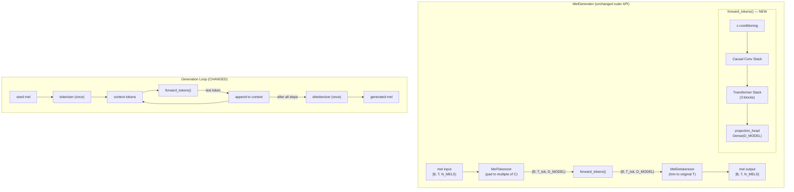
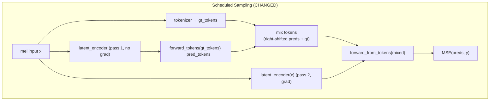

# Design: Token-Space Autoregressive Refactor

## Overview

Refactor the mel generator to be truly autoregressive in token space. The current implementation has correctness issues where generation and training perform unnecessary mel↔token roundtrips, introducing drift and train/inference mismatch. This refactor eliminates those roundtrips, simplifies loss computation, and improves the detokenizer's upsampling quality.

The model remains a single-level continuous-token autoregressive generator — no discrete quantization or hierarchical tokens.

## Detailed Requirements

### Critical Fixes

1. **New `forward_tokens()` method**: Run the transformer pipeline (z-conditioning → conv stack → transformer stack) and return token-space output `[B, T_tok, D_MODEL]` via a `Dense(D_MODEL)` projection head. This is the core primitive for autoregressive generation and scheduled sampling.

2. **Fix generation loop**: Replace the current `forward_from_tokens() → tokenizer(output_mel)` roundtrip with `forward_tokens()`. Append the projected token directly to context. Detokenize only once at the end.

3. **Fix scheduled sampling**: Replace `tokenizer(preds_pass1)` re-tokenization with `forward_tokens(gt_tokens)` to get predicted tokens natively. Keep the right-shift before mixing with ground truth tokens.

4. **Remove mel reconstruction in pass 2**: Remove `detokenizer(mixed_tokens)` call. Latent encoder receives original mel input `x` instead. Model runs `forward_from_tokens(mixed_tokens)` directly.

### Simplifications

5. **Simplify loss**: Remove temporal shifting (`preds[:, :-1, :] vs y[:, 1:, :]`). Loss becomes `MSE(preds, y)`.

6. **Change dataset**: `input == target` (same mel slice). The model's internal causality handles next-frame prediction. Remove the 1-frame shift in the generator.

7. **Remove dataset truncation**: Delete `truncated_length = mel_length - (mel_length % TOKEN_COMPRESSION_RATIO)`. Tokenizer pads input to next multiple of `TOKEN_COMPRESSION_RATIO`; detokenizer trims output to original length.

8. **Improve detokenizer upsampling**: Replace `tf.repeat(x, repeats=2, axis=1)` with `UpSampling1D(size=2)` + existing `CausalConv1D`. Functionally equivalent but proper Keras layer (serializable, visible in model summary).

### Test Updates

9. **Update mocks and add tests**: Update `SimpleMelGenerator` mocks in 3 test files to add `forward_tokens()` + projection head. Update loss assertions. Add new test cases verifying token-space autoregression and no re-tokenization.

## Architecture Overview





## Components and Interfaces

### MelTokenizer (modified)

```python
class MelTokenizer(tf.keras.layers.Layer):
    def call(self, x, training=False):
        """[B, T, N_MELS] -> [B, ceil(T/C), D_MODEL]
        
        Pads T to next multiple of TOKEN_COMPRESSION_RATIO before encoding.
        Stores original length for detokenizer trimming.
        """
```

Change: Pad input to next multiple of C. Store `original_T` as instance state or return it alongside tokens (prefer storing on instance for API simplicity, but note this is not graph-safe — see Data Models for the chosen approach).

### MelDetokenizer (modified)

```python
class MelDetokenizer(tf.keras.layers.Layer):
    def __init__(self, **kwargs):
        # Replace (conv, norm) tuples with (up, conv, norm) tuples
        # up = tf.keras.layers.UpSampling1D(size=2)
        # conv = CausalConv1D(filters[i], kernel_size=3)
        # norm = tf.keras.layers.LayerNormalization()

    def call(self, x, target_length=None, training=False):
        """[B, T_tok, D_MODEL] -> [B, T_tok*C, N_MELS] (or trimmed to target_length)
        
        Uses UpSampling1D + CausalConv1D instead of tf.repeat.
        If target_length is provided, trims output to that length.
        """
```

Changes:
- `UpSampling1D(size=2)` replaces `tf.repeat`
- New `target_length` parameter for trimming

### MelGenerator (modified)

```python
class MelGenerator(tf.keras.Model):
    def __init__(self):
        # ... existing layers ...
        self.projection_head = tf.keras.layers.Dense(D_MODEL)  # NEW
    
    def forward_tokens(self, tokens, z=None, training=False):
        """Token-space forward pass — stops before detokenizer.
        
        Args:
            tokens: [B, T_tok, D_MODEL]
            z: Optional [B, LATENT_DIM]
        Returns:
            [B, T_tok, D_MODEL] — projected token predictions
        """
    
    def forward_from_tokens(self, tokens, z=None, training=False):
        """Full forward pass from tokens to mel. Unchanged API.
        
        Internally calls forward_tokens() then detokenizer.
        """
    
    def call(self, mel, z=None, training=False):
        """Full forward pass from mel to mel. Unchanged API.
        
        Tokenizer now pads input; detokenizer trims output to original length.
        """
    
    def generate(self, seed_mel, num_frames, temperature=1.0, top_p=0.9, z=None):
        """Autoregressive generation using forward_tokens().
        
        No mel→token roundtrip. Detokenize once at the end.
        """
```

### MelGeneratorTraining (modified)

```python
class MelGeneratorTraining(tf.keras.Model):
    def _pure_teacher_forcing(self, x, y):
        """Loss: MSE(preds, y) — no shifting."""
    
    def _parallel_scheduled_sampling(self, x, y):
        """Pass 1: forward_tokens(gt_tokens) for pred_tokens (no re-tokenization).
        Pass 2: latent_encoder(x), forward_from_tokens(mixed_tokens).
        Loss: MSE(preds, y) — no shifting.
        """
```

### MusicNetDataset (modified)

```python
def _generator(self):
    # No truncation to TOKEN_COMPRESSION_RATIO multiples
    # yield (mel_slice, mel_slice) — input == target
```

### inference.py — UNCHANGED

`MusicGenerationModel.generate()` delegates to `MelGenerator.generate()` which still returns `[num_frames, N_MELS]`.

## Data Models

### Token shapes

| Tensor | Shape | Description |
|--------|-------|-------------|
| mel input | `[B, T, N_MELS]` | Raw mel spectrogram (T can be any length) |
| tokens | `[B, T_tok, D_MODEL]` | `T_tok = ceil(T / C)` after tokenizer padding |
| token predictions | `[B, T_tok, D_MODEL]` | Output of `forward_tokens()` via projection head |
| mel output | `[B, T, N_MELS]` | Detokenizer output, trimmed to original T |

### Padding/trimming strategy

The tokenizer and detokenizer need to coordinate on the original input length. Since TensorFlow graph mode doesn't support mutable instance state, the approach is:

- `MelGenerator.call()` computes `original_T = tf.shape(mel)[1]` before tokenizing, then passes `target_length=original_T` to the detokenizer
- `MelGenerator.forward_from_tokens()` does NOT trim (caller provides pre-padded tokens, expects `T_tok * C` output)
- `MelGenerator.generate()` handles its own trimming via `generated_mel[0, :num_frames]` (already present)

This keeps the tokenizer and detokenizer stateless and graph-safe.

## Error Handling

- **Non-divisible input lengths**: Tokenizer pads with zeros on the right. Detokenizer trims. No error raised.
- **Empty input**: If `T == 0`, tokenizer returns `[B, 0, D_MODEL]`. Detokenizer returns `[B, 0, N_MELS]`. No crash.
- **Seed shorter than C in generate()**: Existing zero-padding logic is retained.
- **Checkpoint compatibility**: Adding `projection_head` is a new layer — old checkpoints will initialize it randomly. This is acceptable since the projection head is small and trains quickly. A warning should be logged.

## Acceptance Criteria

### AC1: No re-tokenization in generation
- **Given** a trained MelGenerator
- **When** `generate(seed_mel, num_frames=100)` is called
- **Then** `tokenizer()` is called exactly once (on the seed), and `detokenizer()` is called exactly once (at the end). No intermediate mel→token conversions occur.

### AC2: No re-tokenization in scheduled sampling
- **Given** a MelGeneratorTraining instance with `tf_ratio < 0.99`
- **When** `train_step((x, y))` is called
- **Then** `tokenizer()` is called once (on ground truth `x`). Predicted tokens come from `forward_tokens()`, not from `tokenizer(model_output)`.

### AC3: No mel reconstruction in scheduled sampling pass 2
- **Given** a MelGeneratorTraining instance with `tf_ratio < 0.99`
- **When** `_parallel_scheduled_sampling(x, y)` is called
- **Then** `detokenizer()` is NOT called in the training logic. The latent encoder receives `x` directly.

### AC4: Loss has no temporal shift
- **Given** any training step
- **When** loss is computed
- **Then** it is `MSE(preds, y)` where `preds` and `y` have identical shapes. No `[:, :-1, :]` or `[:, 1:, :]` slicing.

### AC5: Dataset yields identical input and target
- **Given** the MusicNetDataset generator
- **When** it yields `(input_mel, target_mel)`
- **Then** `input_mel` and `target_mel` are the same tensor (same mel slice, no frame shift).

### AC6: Arbitrary input lengths supported
- **Given** a mel spectrogram with length T not divisible by TOKEN_COMPRESSION_RATIO
- **When** passed through `model(mel)` (full forward pass)
- **Then** output shape is `[B, T, N_MELS]` (same as input length).

### AC7: forward_tokens returns correct shape
- **Given** tokens of shape `[B, T_tok, D_MODEL]`
- **When** `forward_tokens(tokens)` is called
- **Then** output shape is `[B, T_tok, D_MODEL]`.

### AC8: Detokenizer uses learned upsampling
- **Given** the MelDetokenizer
- **When** inspecting its layers
- **Then** it contains `UpSampling1D` layers, not `tf.repeat` calls.

### AC9: Existing tests pass after mock updates
- **Given** updated mock classes with `forward_tokens()` and `projection_head`
- **When** `pytest tests/` is run
- **Then** all tests pass.

### AC10: New tests verify token-space correctness
- **Given** the new test cases
- **When** run
- **Then** they verify: (a) `forward_tokens()` output shape, (b) generation uses no intermediate tokenizer calls, (c) scheduled sampling uses `forward_tokens()` not re-tokenization.

## Testing Strategy

### Unit Tests (update existing)

| File | Changes |
|------|---------|
| `tests/test_train.py` | Add `forward_tokens()` + `projection_head` to `SimpleMelGenerator`. Remove `y[:, 1:, :]` shift from 4 loss lines. |
| `tests/test_parallel_training.py` | Add `forward_tokens()` + `projection_head` to `SimpleMelGenerator`. Update docstring. |
| `tests/test_scheduled_sampling.py` | Add `forward_tokens()` + `projection_head` to `SimpleMelGenerator`. Update re-tokenization assertions. |

### Unit Tests (new)

| File | Test | Verifies |
|------|------|----------|
| `tests/test_model.py` | `test_forward_tokens_shape` | AC7: output is `[B, T_tok, D_MODEL]` |
| `tests/test_model.py` | `test_arbitrary_input_length` | AC6: non-divisible T produces correct output shape |
| `tests/test_model.py` | `test_detokenizer_uses_upsampling` | AC8: `UpSampling1D` layers present |
| `tests/test_model.py` | `test_generation_no_retokenization` | AC1: mock tokenizer call count = 1 |
| `tests/test_train.py` | `test_scheduled_sampling_no_retokenization` | AC2: pred tokens from `forward_tokens()` |
| `tests/test_dataset.py` | `test_input_equals_target` | AC5: input and target are identical |

### Integration Tests (existing, should pass as-is)

- `test_causality_and_windows.py` — causality and determinism
- `test_inference.py` — end-to-end generation pipeline
- `test_dilated_convolutions.py` — generation with dilated convs
- `test_training_smoke.py` — full training loop smoke test

## Appendices

### A. Technology Choices

- **UpSampling1D + CausalConv1D** chosen over Conv1DTranspose to avoid checkerboard artifacts. `UpSampling1D` is functionally identical to `tf.repeat` but is a proper Keras layer. `CausalConv1D` already exists in `layers.py`.
- **Dense(D_MODEL) projection head** maps transformer hidden states back to token embedding space. Lightweight (D_MODEL² = 65,536 parameters).

### B. Research Findings

- **Tokenizer produces `ceil(T/4)` tokens** for non-divisible input lengths due to causal left-padding before stride-2 convolutions. Pad-on-encode + trim-on-decode validated for all tested lengths (T=10,13,15,12,16).
- **UpSampling1D preserves causality**: `output[t]` depends only on `input[t//2]`. Composition with CausalConv1D remains causal.
- **3 test mock classes** need updating across `test_train.py`, `test_parallel_training.py`, `test_scheduled_sampling.py`. 5 files using real `MelGenerator.generate()` should pass without changes.

### C. Alternative Approaches Considered

| Alternative | Why rejected |
|-------------|-------------|
| Token-space latent encoder | Adds a new component; using original mel input `x` is simpler and avoids roundtrip |
| No projection head (identity) | Transformer hidden states aren't necessarily in token embedding space; projection head is cheap |
| Keep dataset shift, remove loss shift only | Double-shift was a bug; cleaner to have `input == target` and let causality handle prediction |
| Conv1DTranspose for upsampling | Checkerboard artifacts; UpSampling1D + Conv1D is safer |

### D. Files Modified

| File | Type of change |
|------|---------------|
| `src/music_generation/model.py` | Add `projection_head`, `forward_tokens()`. Update `call()` (pad/trim), `forward_from_tokens()` (delegate to `forward_tokens()`), `generate()` (token-space loop). Update `MelTokenizer` (padding), `MelDetokenizer` (UpSampling1D, trimming). |
| `src/music_generation/train.py` | Update `_pure_teacher_forcing()` (loss), `_parallel_scheduled_sampling()` (forward_tokens, no detokenizer, latent encoder on x, loss). |
| `src/music_generation/dataset.py` | Remove truncation. Change target to `input == target`. |
| `tests/test_train.py` | Update mock, loss assertions, add new test. |
| `tests/test_parallel_training.py` | Update mock, docstring. |
| `tests/test_scheduled_sampling.py` | Update mock, re-tokenization logic. |
| `tests/test_model.py` | Add new test cases. |
| `tests/test_dataset.py` | Add input==target test. |
