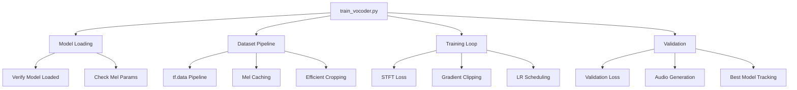

# Vocoder Training Debug and Enhancement Design

## Overview

Debug, validate, and enhance the vocoder training pipeline to ensure stable finetuning of pretrained HiFi-GAN/MelGAN on music data. Address potential issues in model loading, dataset pipeline, training loop, and checkpoint management.

## Detailed Requirements

### Functional Requirements
1. Pretrained vocoder must load successfully with clear error messages
2. Dataset pipeline must efficiently process music audio files
3. Training must converge with stable loss curves
4. Checkpoints must save/load correctly
5. Validation metrics must be computed each epoch
6. Audio samples must be generated during training for quality assessment
7. Mel spectrogram parameters must match vocoder expectations
8. Training must work on MacBook Air (memory-efficient)

### Non-Functional Requirements
1. Dataset pipeline should use native tf.data operations (not Python generators)
2. Training should be stable (no NaN/Inf issues)
3. Logging should be comprehensive (loss, metrics, audio samples)
4. Error messages should be actionable
5. Code should be maintainable and well-documented

### Constraints
1. Must use TensorFlow 2.13+ APIs
2. Must work with TensorFlowTTS pretrained models
3. Must maintain compatibility with inference pipeline
4. Cannot change pretrained model architecture

## Architecture Overview



## Components and Interfaces

### 1. Model Loading Validation
**Location:** `src/music_generation/train_vocoder.py` - `main()`

**Purpose:** Verify pretrained model loads correctly and check mel parameter compatibility

**Implementation:**
```python
def main():
    args = parse_args()
    
    # Load pretrained vocoder
    print("Loading pretrained vocoder...")
    vocoder_model = vocoder.load_pretrained_vocoder(args.model_name)
    
    if vocoder_model.generator is None:
        raise ValueError("Failed to load pretrained vocoder. Check model_name.")
    
    print(f"✓ Loaded generator: {type(vocoder_model.generator).__name__}")
    
    # Verify mel parameters match
    print("\nVerifying mel spectrogram parameters...")
    test_audio = tf.random.normal([8192])
    test_mel = audio_utils.audio_to_mel_ljspeech(test_audio)
    print(f"  Mel shape: {test_mel.shape}")
    print(f"  Expected mel_bins: 80")
    
    if test_mel.shape[-1] != 80:
        raise ValueError(f"Mel bins mismatch: got {test_mel.shape[-1]}, expected 80")
    
    # Test forward pass
    print("\nTesting forward pass...")
    test_mel_batch = tf.expand_dims(test_mel, 0)
    test_output = vocoder_model.generator(test_mel_batch, training=False)
    print(f"  Input mel: {test_mel_batch.shape}")
    print(f"  Output audio: {test_output.shape}")
    print("✓ Forward pass successful\n")
    
    # Continue with training...
```

### 2. Efficient Dataset Pipeline
**Location:** `src/music_generation/vocoder.py` - `VocoderDataset`

**Current Issue:** Uses Python generator, slow random cropping, no caching

**Solution:** Rewrite using native tf.data operations

**Implementation:**
```python
class VocoderDataset:
    """Efficient dataset for vocoder finetuning."""
    
    def __init__(self, data_dir: str, cache_dir: str, segment_length: int = 8192):
        self.data_dir = Path(data_dir)
        self.cache_dir = Path(cache_dir)
        self.cache_dir.mkdir(parents=True, exist_ok=True)
        self.segment_length = segment_length
        self.audio_files = list(self.data_dir.rglob("*.wav"))
        
        if not self.audio_files:
            raise ValueError(f"No .wav files found in {data_dir}")
        
        print(f"Found {len(self.audio_files)} audio files")
    
    def _process_file(self, file_path_str):
        """Process single audio file (TF function)."""
        from . import audio_utils
        
        # Load audio
        audio = audio_utils.load_audio(file_path_str)
        
        # Random crop
        audio_len = tf.shape(audio)[0]
        if audio_len > self.segment_length:
            max_start = audio_len - self.segment_length
            start = tf.random.uniform([], 0, max_start, dtype=tf.int32)
            audio_segment = audio[start:start + self.segment_length]
        else:
            padding = self.segment_length - audio_len
            audio_segment = tf.pad(audio, [[0, padding]])
        
        # Compute mel
        mel = audio_utils.audio_to_mel_ljspeech(audio_segment)
        
        return mel, audio_segment
    
    def create_dataset(self, batch_size: int, shuffle: bool = True, 
                       validation_split: float = 0.1):
        """Create train and validation datasets.
        
        Args:
            batch_size: Batch size
            shuffle: Whether to shuffle
            validation_split: Fraction for validation
            
        Returns:
            (train_dataset, val_dataset) tuple
        """
        # Split files
        num_val = int(len(self.audio_files) * validation_split)
        val_files = self.audio_files[:num_val]
        train_files = self.audio_files[num_val:]
        
        print(f"Train files: {len(train_files)}, Val files: {len(val_files)}")
        
        def create_split_dataset(file_list, is_training):
            # Create dataset from file paths
            file_paths = [str(f) for f in file_list]
            dataset = tf.data.Dataset.from_tensor_slices(file_paths)
            
            if is_training and shuffle:
                dataset = dataset.shuffle(len(file_paths))
            
            # Map processing function
            dataset = dataset.map(
                lambda x: tf.py_function(
                    self._process_file,
                    [x],
                    [tf.float32, tf.float32]
                ),
                num_parallel_calls=tf.data.AUTOTUNE
            )
            
            # Set shapes
            dataset = dataset.map(lambda mel, audio: (
                tf.ensure_shape(mel, [None, 80]),
                tf.ensure_shape(audio, [self.segment_length])
            ))
            
            if is_training:
                dataset = dataset.repeat()
            
            dataset = dataset.batch(batch_size)
            dataset = dataset.prefetch(tf.data.AUTOTUNE)
            
            return dataset
        
        train_dataset = create_split_dataset(train_files, is_training=True)
        val_dataset = create_split_dataset(val_files, is_training=False)
        
        return train_dataset, val_dataset
```

### 3. Enhanced Training Loop
**Location:** `src/music_generation/train_vocoder.py` - `VocoderTraining`

**Enhancements:**
- Add gradient clipping
- Add NaN/Inf detection
- Better metrics tracking

**Implementation:**
```python
class VocoderTraining(tf.keras.Model):
    """Enhanced vocoder training wrapper."""
    
    def __init__(self, generator, stft_loss, clip_norm=1.0):
        super().__init__()
        self.generator = generator
        self.stft_loss = stft_loss
        self.clip_norm = clip_norm
        self.grad_norm_tracker = tf.keras.metrics.Mean(name="grad_norm")
    
    def train_step(self, data):
        mel, target_audio = data
        
        with tf.GradientTape() as tape:
            pred_audio = self.generator(mel, training=True)
            
            # Trim to same length
            min_len = tf.minimum(tf.shape(pred_audio)[-1], tf.shape(target_audio)[-1])
            pred_audio = pred_audio[..., :min_len]
            target_audio = target_audio[..., :min_len]
            
            loss = self.stft_loss(pred_audio, target_audio)
            
            # Check for NaN/Inf
            if tf.math.is_nan(loss) or tf.math.is_inf(loss):
                tf.print("WARNING: NaN/Inf loss detected!")
                return {"loss": loss, "grad_norm": 0.0}
        
        # Compute gradients
        grads = tape.gradient(loss, self.generator.trainable_variables)
        
        # Clip gradients
        if self.clip_norm > 0:
            grads, grad_norm = tf.clip_by_global_norm(grads, self.clip_norm)
        else:
            grad_squares = [tf.reduce_sum(g**2) for g in grads if g is not None]
            grad_norm = tf.sqrt(tf.add_n(grad_squares)) if grad_squares else 0.0
        
        self.optimizer.apply_gradients(zip(grads, self.generator.trainable_variables))
        self.grad_norm_tracker.update_state(grad_norm)
        
        return {"loss": loss, "grad_norm": self.grad_norm_tracker.result()}
```

### 4. Validation and Audio Generation
**Location:** `src/music_generation/train_vocoder.py` - new callback

**Purpose:** Generate audio samples during training to assess quality

**Implementation:**
```python
class AudioGenerationCallback(tf.keras.callbacks.Callback):
    """Generate audio samples during training."""
    
    def __init__(self, val_dataset, output_dir, generator, frequency=5):
        super().__init__()
        self.val_dataset = val_dataset
        self.output_dir = Path(output_dir)
        self.output_dir.mkdir(parents=True, exist_ok=True)
        self.generator = generator
        self.frequency = frequency  # Generate every N epochs
    
    def on_epoch_end(self, epoch, logs=None):
        if (epoch + 1) % self.frequency != 0:
            return
        
        # Get one batch from validation
        for mel, target_audio in self.val_dataset.take(1):
            # Generate audio
            pred_audio = self.generator(mel, training=False)
            
            # Save first sample
            import soundfile as sf
            target_path = self.output_dir / f"epoch_{epoch+1:03d}_target.wav"
            pred_path = self.output_dir / f"epoch_{epoch+1:03d}_pred.wav"
            
            sf.write(target_path, target_audio[0].numpy(), 22050)
            sf.write(pred_path, pred_audio[0].numpy(), 22050)
            
            print(f"\n✓ Generated audio samples: {pred_path}")
            break
```

### 5. Learning Rate Scheduling
**Location:** `src/music_generation/train_vocoder.py` - `train_vocoder()`

**Implementation:**
```python
def train_vocoder(generator, train_dataset, val_dataset, epochs, lr, checkpoint_dir):
    """Train vocoder with enhancements."""
    
    # STFT loss
    stft_loss = losses.MultiResolutionSTFTLoss(
        fft_sizes=[512, 1024, 2048],
        hop_sizes=[128, 256, 512],
        win_sizes=[512, 1024, 2048]
    )
    
    # Training model with gradient clipping
    training_model = VocoderTraining(generator, stft_loss, clip_norm=1.0)
    
    # Learning rate schedule
    lr_schedule = tf.keras.optimizers.schedules.ExponentialDecay(
        initial_learning_rate=lr,
        decay_steps=1000,
        decay_rate=0.98,
        staircase=True
    )
    
    training_model.compile(optimizer=tf.keras.optimizers.Adam(learning_rate=lr_schedule))
    
    # Callbacks
    checkpoint_dir = Path(checkpoint_dir)
    callbacks = [
        tf.keras.callbacks.ModelCheckpoint(
            str(checkpoint_dir / "best_model.h5"),
            save_best_only=True,
            save_weights_only=True,
            monitor='val_loss'
        ),
        tf.keras.callbacks.TensorBoard(
            log_dir=str(checkpoint_dir / "logs"),
            write_graph=False
        ),
        tf.keras.callbacks.CSVLogger(
            str(checkpoint_dir / "training.csv")
        ),
        AudioGenerationCallback(
            val_dataset,
            checkpoint_dir / "samples",
            generator,
            frequency=5
        ),
        tf.keras.callbacks.EarlyStopping(
            monitor='val_loss',
            patience=10,
            restore_best_weights=True
        )
    ]
    
    # Calculate steps per epoch
    steps_per_epoch = 100  # Adjust based on dataset size
    validation_steps = 20
    
    print("Starting training...")
    training_model.fit(
        train_dataset,
        epochs=epochs,
        steps_per_epoch=steps_per_epoch,
        validation_data=val_dataset,
        validation_steps=validation_steps,
        callbacks=callbacks
    )
```

## Acceptance Criteria

**Given** the vocoder training script is run  
**When** model loading completes  
**Then** pretrained generator is loaded successfully with verification output

**Given** the dataset pipeline is created  
**When** processing 1000+ audio files  
**Then** dataset creation completes in <30 seconds with train/val split

**Given** training starts  
**When** running for 10 epochs  
**Then** loss decreases steadily without NaN/Inf issues

**Given** validation runs each epoch  
**When** epoch completes  
**Then** validation loss is computed and logged

**Given** audio generation callback triggers  
**When** epoch is multiple of 5  
**Then** target and predicted audio samples are saved to disk

**Given** training completes  
**When** best model is saved  
**Then** checkpoint can be loaded for inference

## Testing Strategy

### Unit Tests
1. Test model loading with valid/invalid model names
2. Test mel parameter verification
3. Test dataset pipeline with small file set
4. Test gradient clipping
5. Test NaN/Inf detection

### Integration Tests
1. Test full training loop on 10 files, 5 epochs
2. Test checkpoint saving/loading
3. Test audio generation callback
4. Test validation metrics computation

### Manual Validation
1. Listen to generated audio samples (quality assessment)
2. Verify loss curves in TensorBoard
3. Check gradient norms are stable
4. Verify best model is saved correctly

## Appendices

### Technology Choices

**Dataset Pipeline:** tf.data vs Python generator
- **Decision:** tf.data with py_function for audio loading
- **Rationale:** Better performance, native TensorFlow integration, proper prefetching

**Gradient Clipping:** Global norm clipping
- **Decision:** clip_by_global_norm with threshold 1.0
- **Rationale:** Prevents training instability, standard practice for vocoder training

**Learning Rate:** Exponential decay
- **Decision:** Start at 1e-4, decay 0.98 every 1000 steps
- **Rationale:** Gradual reduction helps fine-tuning convergence

### Alternative Approaches

**1. Discriminator Training**
- Full GAN training with discriminator
- **Deferred:** More complex, may not be necessary for finetuning
- **Future work:** If generator-only finetuning insufficient

**2. Perceptual Loss**
- Add perceptual loss (e.g., mel spectrogram L1)
- **Considered:** May help, but STFT loss is standard
- **Future work:** Experiment if STFT loss insufficient

**3. Mixed Precision**
- Use float16 for faster training
- **Deferred:** Focus on correctness first, optimize later
